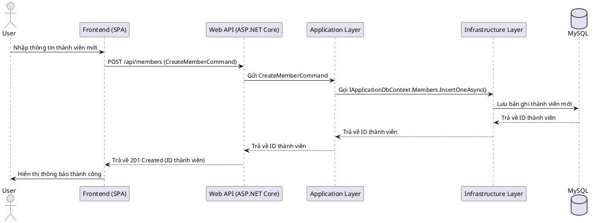
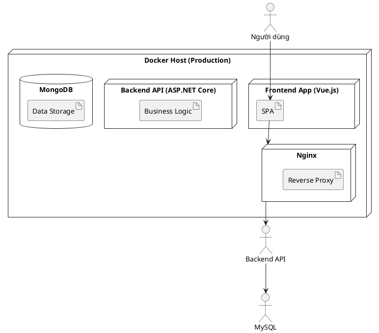

# Thiết Kế Hệ Thống

## 1. Kiến trúc tổng quan
Hệ thống Cây Gia Phả được thiết kế theo kiến trúc Clean Architecture, phân tách rõ ràng các lớp trách nhiệm:
- **Domain Layer**: Chứa các thực thể (Entities), giá trị đối tượng (Value Objects), và các quy tắc nghiệp vụ cốt lõi.
- **Application Layer**: Chứa các trường hợp sử dụng (Use Cases), lệnh (Commands), truy vấn (Queries), và các giao diện (Interfaces) cho các dịch vụ bên ngoài.
- **Infrastructure Layer**: Chứa các triển khai cụ thể của các giao diện được định nghĩa trong Application Layer, bao gồm truy cập cơ sở dữ liệu (MySQL với Entity Framework Core), dịch vụ Identity, và các dịch vụ bên ngoài khác.
- **Web Layer (API)**: Điểm vào của ứng dụng, xử lý các yêu cầu HTTP, ánh xạ chúng tới các lệnh/truy vấn trong Application Layer, và trả về phản hồi.

## 2. Sơ đồ kiến trúc (PlantUML)
```plantuml
@startuml
!include https://raw.githubusercontent.com/plantuml-stdlib/C4-PlantUML/master/C4_Container.puml

Person(user, "End User", "Người dùng cuối")
System_Boundary(c1, "Hệ thống Cây Gia Phả") {
    Container(spa, "Single-Page App", "Vue.js + Vuetify", "Giao diện người dùng")
    Container(api, "Web API", "ASP.NET Core", "Xử lý logic nghiệp vụ")
    ContainerDb(db, "Database", "MySQL", "Lưu trữ dữ liệu gia phả")
}

Rel(user, spa, "Sử dụng", "HTTPS")
Rel(spa, api, "Gọi API", "HTTPS/JSON")
Rel(api, db, "Đọc/Ghi dữ liệu", "ADO.NET / EF Core")

@enduml
```

## 3. Sơ đồ Database (MySQL Schema)
Dữ liệu được lưu trữ trong MySQL, một cơ sở dữ liệu quan hệ. Dưới đây là thiết kế schema cơ bản cho các bảng chính, được quản lý bởi Entity Framework Core.

### `Families` Table
Lưu trữ thông tin về các dòng họ hoặc gia đình.
```sql
CREATE TABLE `Families` (
    `Id` VARCHAR(36) NOT NULL PRIMARY KEY, -- Sử dụng GUID làm khóa chính
    `Name` VARCHAR(255) NOT NULL,
    `Address` VARCHAR(255),
    `LogoUrl` VARCHAR(255),
    `Description` TEXT,
    `CreatedAt` DATETIME(6) NOT NULL,
    `UpdatedAt` DATETIME(6) NOT NULL
);
```
**Indexes:**
- `IX_Families_Name`: B-tree index on `Name` for search.

### `Members` Table
Lưu trữ thông tin chi tiết của từng thành viên.
```sql
CREATE TABLE `Members` (
    `Id` VARCHAR(36) NOT NULL PRIMARY KEY, -- Sử dụng GUID làm khóa chính
    `FamilyId` VARCHAR(36) NOT NULL,
    `FullName` VARCHAR(255) NOT NULL,
    `GivenName` VARCHAR(255),
    `Dob` DATETIME(6),
    `Dod` DATETIME(6),
    `Status` VARCHAR(50),
    `AvatarUrl` VARCHAR(255),
    `ContactEmail` VARCHAR(255),
    `ContactPhone` VARCHAR(50),
    `Generation` INT NOT NULL,
    `OrderInFamily` INT,
    `Description` TEXT,
    `Metadata` JSON, -- Lưu trữ dữ liệu mở rộng dưới dạng JSON
    `CreatedAt` DATETIME(6) NOT NULL,
    `UpdatedAt` DATETIME(6) NOT NULL,
    CONSTRAINT `FK_Members_Families_FamilyId` FOREIGN KEY (`FamilyId`) REFERENCES `Families` (`Id`) ON DELETE CASCADE
);
```
**Indexes:**
- `IX_Members_FullName`: B-tree index on `FullName` for search.
- `IX_Members_FamilyId`: B-tree index on `FamilyId` for filtering.
- `IX_Members_Generation`: B-tree index on `Generation` for filtering.
- `IX_Members_ContactEmail`: B-tree index on `ContactEmail` for search.

### `Relationships` Table
Lưu trữ các mối quan hệ giữa các thành viên.
```sql
CREATE TABLE `Relationships` (
    `Id` VARCHAR(36) NOT NULL PRIMARY KEY, -- Sử dụng GUID làm khóa chính
    `FamilyId` VARCHAR(36) NOT NULL,
    `MemberId` VARCHAR(36) NOT NULL,
    `RelationType` VARCHAR(50) NOT NULL,
    `TargetMemberId` VARCHAR(36) NOT NULL,
    `StartDate` DATETIME(6),
    `EndDate` DATETIME(6),
    `Metadata` JSON, -- Lưu trữ dữ liệu mở rộng dưới dạng JSON
    `CreatedAt` DATETIME(6) NOT NULL,
    `UpdatedAt` DATETIME(6) NOT NULL,
    CONSTRAINT `FK_Relationships_Families_FamilyId` FOREIGN KEY (`FamilyId`) REFERENCES `Families` (`Id`) ON DELETE CASCADE,
    CONSTRAINT `FK_Relationships_Members_MemberId` FOREIGN KEY (`MemberId`) REFERENCES `Members` (`Id`) ON DELETE CASCADE,
    CONSTRAINT `FK_Relationships_Members_TargetMemberId` FOREIGN KEY (`TargetMemberId`) REFERENCES `Members` (`Id`) ON DELETE CASCADE
);
```
**Indexes:**
- `IX_Relationships_FamilyId`: B-tree index on `FamilyId` for filtering.
- `IX_Relationships_MemberId`: B-tree index on `MemberId` for filtering.
- `IX_Relationships_TargetMemberId`: B-tree index on `TargetMemberId` for filtering.
- `IX_Relationships_RelationType`: B-tree index on `RelationType` for filtering.

## 4. Sơ đồ Sequence (Ví dụ: Tạo thành viên mới)


## 5. Sơ đồ Component
```plantuml
@startuml
!include https://raw.githubusercontent.com/plantuml-stdlib/C4-PlantUML/master/C4_Component.puml

LAYOUT_WITH_LEGEND()

Person(user, "Người dùng cuối", "Người dùng tương tác với hệ thống để quản lý gia phả.")

System_Boundary(family_tree_system, "Hệ thống Cây Gia Phả") {
    Container(spa, "Single-Page App", "Vue.js + Vuetify", "Cung cấp giao diện người dùng.")
    Container(api, "Web API", "ASP.NET Core", "Cung cấp API cho SPA và các client khác.")
    ContainerDb(db, "Database", "MySQL", "Lưu trữ dữ liệu gia phả và người dùng.")

    Boundary(web_layer, "Web Layer") {
        Component(controllers, "Controllers", "ASP.NET Core MVC", "Xử lý HTTP requests, xác thực và điều hướng.")
    }
    Boundary(app_layer, "Application Layer") {
        Component(mediatr, "MediatR", "Library", "Điều phối Commands/Queries.")
        Component(handlers, "Command/Query Handlers", "C# Classes", "Chứa logic nghiệp vụ chính.")
        Component(interfaces, "Repository Interfaces", "C# Interfaces", "Định nghĩa hợp đồng cho Infrastructure.")
    }
    Boundary(infra_layer, "Infrastructure Layer") {
        Component(efcore_repo, "EF Core Repository", "C# Classes", "Triển khai truy cập dữ liệu MySQL với EF Core.")
        Component(identity_service, "Identity Service", "C# Classes", "Triển khai quản lý người dùng và JWT.")
    }
}

' Relationships
Rel(user, spa, "Sử dụng qua giao diện web")
Rel(spa, controllers, "Gọi API", "JSON/HTTPS")
Rel(controllers, mediatr, "Gửi Commands/Queries")
Rel(mediatr, handlers, "Điều phối đến")
Rel(handlers, interfaces, "Sử dụng")
Rel(mongodb_repo, db, "Đọc/Ghi dữ liệu")
Rel(identity_service, db, "Đọc/Ghi dữ liệu người dùng")
Rel(mongodb_repo, interfaces, "Triển khai")
Rel(identity_service, interfaces, "Triển khai")
@enduml
```
