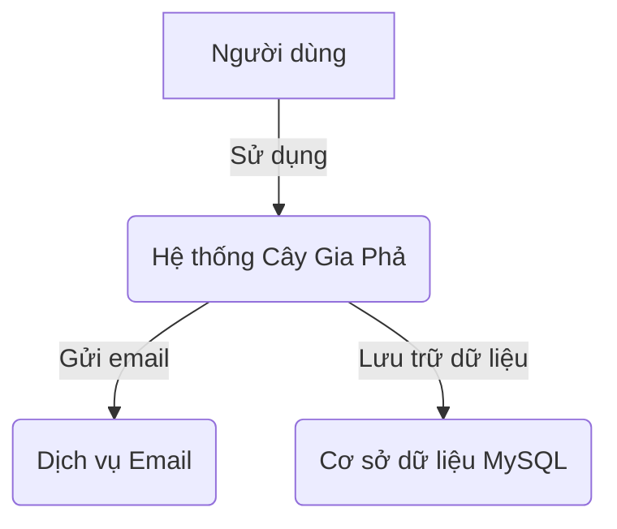
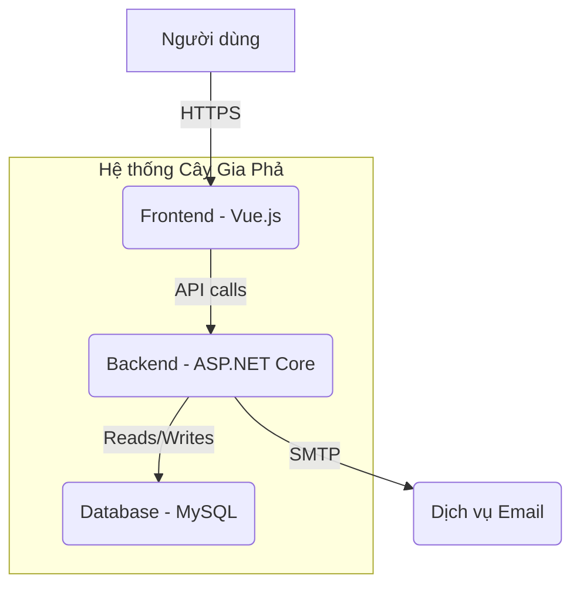
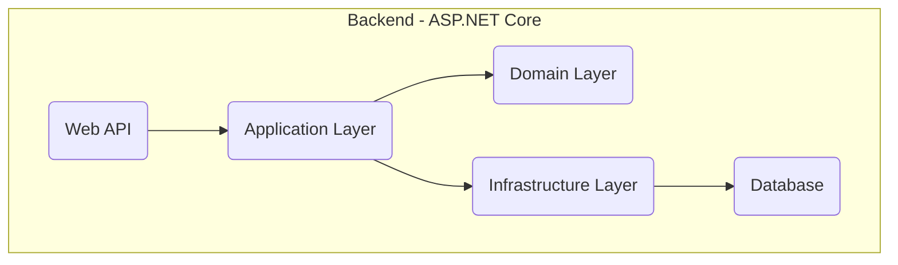
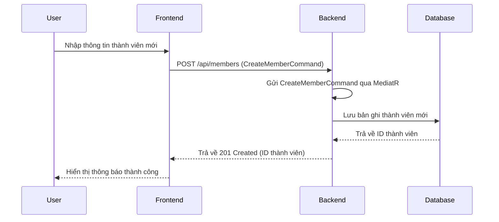

# Kiến Trúc Hệ Thống

Tài liệu này mô tả kiến trúc tổng quan của dự án Cây Gia Phả, sử dụng mô hình C4 để trực quan hóa.

## 1. Sơ đồ ngữ cảnh (Context Diagram - C1)

Sơ đồ này cho thấy cái nhìn tổng quan nhất về hệ thống, bao gồm người dùng và các hệ thống bên ngoài tương tác với nó.

-   **Người dùng**: Người quản lý gia phả, thành viên gia đình.
-   **Hệ thống Cây Gia Phả**: Ứng dụng web của chúng ta.
-   **Dịch vụ Email**: Hệ thống bên ngoài để gửi thông báo.
-   **Cơ sở dữ liệu MySQL**: Nơi lưu trữ tất cả dữ liệu của hệ thống.

## 2. Sơ đồ container (Container Diagram - C2)

Sơ đồ này chia nhỏ hệ thống thành các container (ứng dụng, database, etc.).

-   **Frontend**: Ứng dụng Single Page Application (SPA) bằng Vue.js, chạy trên trình duyệt của người dùng.
-   **Backend**: Ứng dụng API bằng ASP.NET Core, xử lý logic nghiệp vụ.
-   **Database**: Cơ sở dữ liệu MySQL để lưu trữ dữ liệu.

## 3. Sơ đồ thành phần (Component Diagram - C3)

Sơ đồ này chia nhỏ Backend thành các thành phần chính theo kiến trúc Clean Architecture.

-   **Web API (Web Layer)**: Điểm vào của ứng dụng, xử lý các yêu cầu HTTP, ánh xạ chúng tới các lệnh/truy vấn trong Application Layer, và trả về phản hồi.
-   **Application Layer**: Chứa các trường hợp sử dụng (Use Cases), lệnh (Commands), truy vấn (Queries), và các giao diện (Interfaces) cho các dịch vụ bên ngoài.
-   **Domain Layer**: Chứa các thực thể (Entities), giá trị đối tượng (Value Objects), và các quy tắc nghiệp vụ cốt lõi.
-   **Infrastructure Layer**: Chứa các triển khai cụ thể của các giao diện được định nghĩa trong Application Layer, bao gồm truy cập cơ sở dữ liệu (MySQL với Entity Framework Core), dịch vụ Identity, và các dịch vụ bên ngoài khác.

## 4. Luồng hoạt động chính

### 4.1. Luồng tạo thành viên mới

