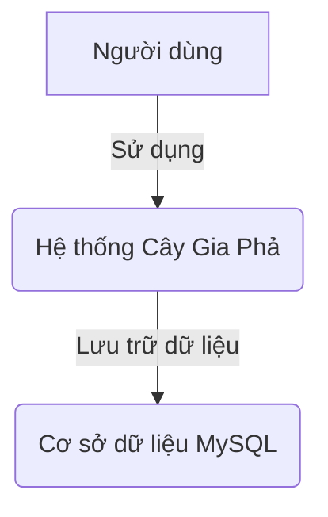
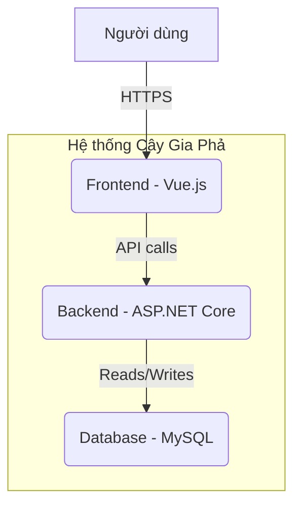
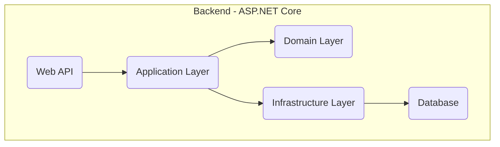
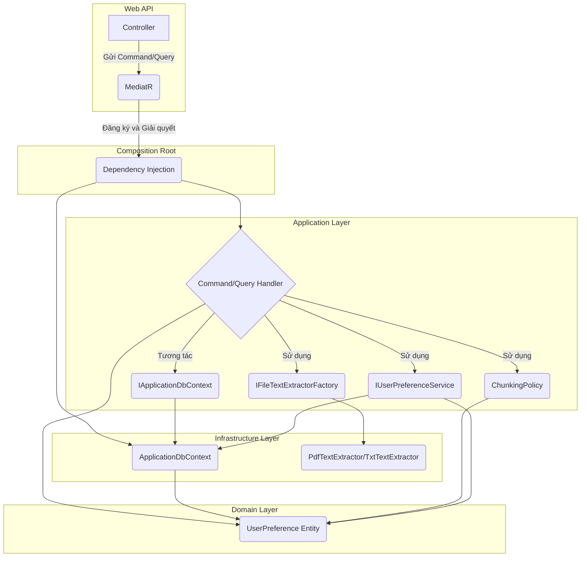
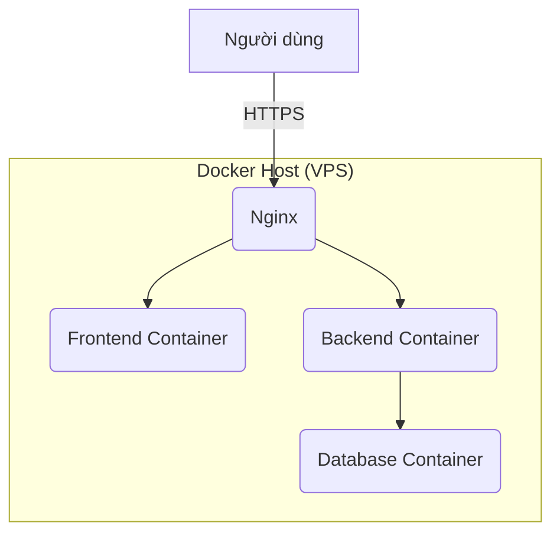

# Kiến Trúc Hệ Thống

## Mục lục

- [1. Sơ đồ ngữ cảnh (Context Diagram - C1)](#1-sơ-đồ-ngữ-cảnh-context-diagram---c1)
- [2. Sơ đồ container (Container Diagram - C2)](#2-sơ-đồ-container-container-diagram---c2)
- [3. Sơ đồ thành phần (Component Diagram - C3)](#3-sơ-đồ-thành-phần-component-diagram---c3)
- [4. Sơ đồ mã nguồn (Code Diagram - C4)](#4-sơ-đồ-mã-nguồn-code-diagram---c4)
- [5. Sơ đồ triển khai (Deployment View)](#5-sơ-đồ-triển-khai-deployment-view)
- [6. Xác thực & Phân quyền (Authentication & Authorization)](#6-xác-thực--phân-quyền-authentication--authorization)
- [7. Yêu cầu phi chức năng (Non-functional Requirements)](#7-yêu-cầu-phi-chức-năng-non-functional-requirements)
- [8. Liên kết tài liệu](#8-liên-kết-tài-liệu)

---

## 1. Sơ đồ ngữ cảnh (Context Diagram - C1)

Sơ đồ này cho thấy cái nhìn tổng quan nhất về hệ thống, bao gồm người dùng và các hệ thống bên ngoài tương tác với nó.



-   **Người dùng**: Người quản lý gia phả, thành viên gia đình.
-   **Hệ thống Cây Gia Phả**: Ứng dụng web của chúng ta.
-   **Cơ sở dữ liệu MySQL**: Nơi lưu trữ tất cả dữ liệu của hệ thống.

*Lưu ý: Dịch vụ Email hiện chưa được triển khai trong hệ thống. Đây là một tính năng tiềm năng trong tương lai để gửi thông báo cho người dùng.*

## 2. Sơ đồ container (Container Diagram - C2)

Sơ đồ này chia nhỏ hệ thống thành các container (ứng dụng, database, etc.).



-   **Frontend**: Ứng dụng Single Page Application (SPA) bằng Vue.js, chạy trên trình duyệt của người dùng.
-   **Backend**: Ứng dụng API bằng ASP.NET Core, xử lý logic nghiệp vụ.
-   **Database**: Cơ sở dữ liệu MySQL để lưu trữ dữ liệu.

## 3. Sơ đồ thành phần (Component Diagram - C3)

Sơ đồ này chia nhỏ Backend thành các thành phần chính theo kiến trúc Clean Architecture.



-   **Web API (Web Layer)**: Điểm vào của ứng dụng, xử lý các yêu cầu HTTP, ánh xạ chúng tới các dịch vụ nghiệp vụ (Business Services) trong Application Layer, và trả về phản hồi.
-   **Application Layer**: Chứa các trường hợp sử dụng (Use Cases), lệnh (Commands), truy vấn (Queries), các giao diện (Interfaces) cho các dịch vụ bên ngoài. **Đặc biệt, Application Layer áp dụng mô hình CQRS (Command Query Responsibility Segregation) với các `Command` (thực hiện thay đổi dữ liệu) và `Query` (truy vấn dữ liệu) được xử lý bởi các `Handler` tương ứng. Các `Handler` này sử dụng `IApplicationDbContext` để tương tác với dữ liệu và sử dụng `Result Pattern` để trả về kết quả thống nhất. Do tính chất thực dụng, Application Layer có tham chiếu đến `Microsoft.EntityFrameworkCore` và `Ardalis.Specification.EntityFrameworkCore` để tận dụng các extension methods tiện lợi.**
-   **Domain Layer**: Chứa các thực thể (Entities), giá trị đối tượng (Value Objects), và các quy tắc nghiệp vụ cốt lõi.
-   **Infrastructure Layer**: Chứa các triển khai cụ thể của các giao diện được định nghĩa trong Application Layer, bao gồm truy cập cơ sở dữ liệu (MySQL với Entity Framework Core), các dịch vụ lưu trữ tệp (Local, Cloudinary, S3), và các dịch vụ bên ngoài khác.
-   **User Preference Management**: Module này quản lý các tùy chọn cá nhân của người dùng như chủ đề, ngôn ngữ, cài đặt thông báo. Nó bao gồm các API để lưu trữ và truy xuất các tùy chọn này, sử dụng thực thể `UserPreference` và các enum `Theme`, `Language`.

## 4. Sơ đồ mã nguồn (Code Diagram - C4) (updated after refactor)

Ví dụ chi tiết về luồng CQRS (Command Query Responsibility Segregation) trong Application Layer, sử dụng MediatR và tương tác với `IApplicationDbContext`.



-   **Controller**: Nhận yêu cầu từ Frontend, tạo `Command` hoặc `Query` và gửi đến `MediatR`.
-   **MediatR**: Thư viện giúp điều phối `Command` hoặc `Query` đến `Handler` tương ứng.
-   **Composition Root (Dependency Injection)**: Nơi cấu hình và đăng ký tất cả các dịch vụ (services) và các thành phần (components) của ứng dụng. Đây là nơi duy nhất mà các layer khác nhau được kết nối với nhau thông qua Dependency Injection.
-   **Command/Query Handler**: Chứa logic nghiệp vụ để xử lý `Command` hoặc `Query`.
    -   `CommandHandler` thực hiện thay đổi dữ liệu thông qua `IApplicationDbContext`.
    -   `QueryHandler` truy vấn dữ liệu thông qua `IApplicationDbContext`.
    -   **Mới**: `ProcessFileCommandHandler` sử dụng `IFileTextExtractorFactory` để lấy trình trích xuất văn bản và `ChunkingPolicy` để chia nhỏ văn bản.
-   **IApplicationDbContext**: Interface định nghĩa các `DbSet` và phương thức lưu thay đổi, được triển khai bởi `ApplicationDbContext` trong Infrastructure Layer. **Do tính chất thực dụng, `IApplicationDbContext` sử dụng các kiểu dữ liệu và extension methods của `Microsoft.EntityFrameworkCore` để đơn giản hóa việc tương tác với cơ sở dữ liệu.**
-   **Entities**: Các đối tượng nghiệp vụ cốt lõi được định nghĩa trong Domain Layer. **Mới**: Bao gồm `TextChunk` và `UserPreference`.
-   **ApplicationDbContext**: Triển khai cụ thể của `IApplicationDbContext` trong Infrastructure Layer, sử dụng Entity Framework Core để tương tác với cơ sở dữ liệu.
-   **IFileTextExtractorFactory**: Interface trong Application Layer để lấy đúng trình trích xuất văn bản.
-   **PdfTextExtractor/TxtTextExtractor**: Triển khai cụ thể của `IFileTextExtractor` trong Infrastructure Layer để trích xuất văn bản từ PDF/TXT.
-   **ChunkingPolicy**: Domain Service chứa logic làm sạch và chia nhỏ văn bản thành các chunk.
-   **IUserPreferenceService**: Interface trong Application Layer để quản lý tùy chọn người dùng.


## 5. Sơ đồ triển khai (Deployment View)

Hệ thống được triển khai bằng Docker trên một máy chủ ảo (VPS). Trong môi trường phát triển cục bộ, Frontend có thể sử dụng Vite Proxy để kết nối với Backend.



-   **Nginx**: Reverse proxy, xử lý SSL và điều hướng request đến Frontend và Backend. Nginx cũng có thể phục vụ các tệp tĩnh của Frontend.
-   **Frontend Container**: Chứa ứng dụng Vue.js đã được build.
-   **Backend Container**: Chứa ứng dụng ASP.NET Core API.
-   **Database Container**: Chứa cơ sở dữ liệu MySQL.

### 🔄 Vite Proxy trong môi trường phát triển

Trong môi trường phát triển cục bộ, Frontend (chạy bằng Vite) sử dụng cơ chế proxy để chuyển tiếp các yêu cầu API từ `http://localhost:5173/api` đến Backend (ví dụ: `http://localhost:5000`). Điều này giúp tránh các vấn đề CORS và cho phép Frontend tương tác liền mạch với Backend đang chạy cục bộ hoặc trong Docker.

**Lưu ý:** Backend đã tắt `app.UseHttpsRedirection()` trong `Program.cs` để cho phép truy cập HTTP trong môi trường phát triển cục bộ.

**Cấu hình ví dụ trong `vite.config.ts`:**

```typescript
// frontend/vite.config.ts
import { defineConfig } from 'vite';

export default defineConfig({
  server: {
    proxy: {
      '/api': {
        target: 'http://localhost:5000', // Địa chỉ Backend đang chạy
        changeOrigin: true,
        rewrite: (path) => path.replace(/^\/api/, ''),
        // secure: false, // Không cần thiết nếu Backend chạy HTTP
      },
    },
  },
});
```

**Giải thích:**

*   `target`: Địa chỉ của Backend API.
*   `changeOrigin`: Đặt thành `true` để thay đổi `Host` header của request thành `target` host, cần thiết cho một số API.
*   `rewrite`: Viết lại đường dẫn request, loại bỏ `/api` khỏi URL trước khi gửi đến Backend.
*   `secure`: Không cần thiết nếu Backend chạy HTTP.

## 6. Xác thực & Phân quyền (Authentication & Authorization)

Hệ thống sử dụng **nhà cung cấp JWT** (ví dụ: Auth0) làm nhà cung cấp xác thực và quản lý người dùng, kết hợp với **JWT Bearer Token** để bảo vệ các API endpoint.

#### Luồng hoạt động

1.  **Frontend lấy Token:** Frontend tương tác với Auth0 để thực hiện quá trình đăng nhập và nhận về JWT (Access Token, ID Token).
2.  **Gửi Token đến Backend:** Frontend gửi kèm Access Token trong header `Authorization` (dưới dạng `Bearer <token>`) trong mỗi request API đến Backend.
3.  **Backend xác thực Token:** Backend nhận Access Token, giải mã và xác thực chữ ký của token, kiểm tra các claims (thông tin người dùng, quyền hạn) và thời hạn hiệu lực của token dựa trên cấu hình Auth0.
4.  **Phân quyền:** Sau khi xác thực thành công, Backend sử dụng thông tin từ Access Token (đặc biệt là các custom claim về `roles` từ Auth0 Action) để kiểm tra quyền hạn của người dùng đối với tài nguyên hoặc hành động được yêu cầu.

#### Cấu hình JWT

*   **Cấu hình Backend**: 
    *   Backend đọc cấu hình JWT từ phần `JwtSettings` trong `appsettings.json` (hoặc `appsettings.Development.json` cho môi trường phát triển).
    *   **Cấu hình cục bộ (Local Development)**: Đối với môi trường phát triển cục bộ, bạn có thể đặt các biến này trong `backend/src/Web/appsettings.Development.json`.
        ```json
        // backend/src/Web/appsettings.Development.json
        {
          "JwtSettings": {
            "Authority": "YOUR_JWT_AUTHORITY", // Authority của nhà cung cấp JWT (ví dụ: https://dev-g76tq00gicwdzk3z.us.auth0.com)
            "Audience": "YOUR_JWT_AUDIENCE",   // Audience của ứng dụng (ví dụ: http://localhost:5000)
            "Namespace": "https://familytree.com/" // Namespace cho các custom claims (nếu có)
          }
        }
        ```
*   **Cấu hình Frontend**: 
    *   Frontend đọc cấu hình JWT từ các biến môi trường trong file `.env.development` (hoặc `.env.production`).
    *   **Biến môi trường**: 
        ```
        # frontend/.env.development
        VITE_JWT_AUTHORITY="YOUR_JWT_AUTHORITY"
        VITE_JWT_AUDIENCE="YOUR_JWT_AUDIENCE"
        VITE_AUTH0_CLIENT_ID="YOUR_AUTH0_CLIENT_ID" # Chỉ cần nếu sử dụng Auth0
        ```
*   **Cấu hình nhà cung cấp JWT (ví dụ: Auth0 Dashboard)**: 
    *   **API**: Tạo một API trong Auth0 Dashboard với **Identifier (Audience)** là `YOUR_JWT_AUDIENCE` (ví dụ: `http://localhost:5000`).
    *   **Actions**: Cấu hình một Auth0 Action để thêm `roles` vào JWT token dưới dạng custom claim (ví dụ: `https://familytree.com/roles`).

#### Khả năng thay thế

Kiến trúc cho phép thay thế nhà cung cấp JWT (ví dụ: Auth0) bằng các IdP khác (ví dụ: Keycloak, Firebase Auth) mà không cần thay đổi lớn ở Backend. Chỉ cần cập nhật cấu hình `JwtSettings` và triển khai `IClaimsTransformation` liên quan, đồng thời đảm bảo rằng `ExternalId` của người dùng được quản lý nhất quán. `ExternalId` là trường được sử dụng để liên kết hồ sơ người dùng nội bộ với ID của người dùng từ nhà cung cấp xác thực bên ngoài (trước đây là `Auth0UserId`).

## 7. Yêu cầu phi chức năng (Non-functional Requirements)

-   **Bảo mật**: Sử dụng HTTPS, mã hóa mật khẩu, và tuân thủ các nguyên tắc bảo mật của OWASP.
-   **Logging**: Sử dụng `ILogger` của .NET Core để ghi log, kết hợp với `try/catch` và `source` tracking trong `Result Pattern` để theo dõi chi tiết lỗi và stack trace.
-   **Monitoring**: (Chưa triển khai) Sẽ tích hợp Prometheus và Grafana để theo dõi hiệu năng hệ thống.
-   **Scaling**: Hệ thống được thiết kế để có thể scale theo chiều ngang bằng cách tăng số lượng container cho Backend và Frontend.

## 8. Liên kết tài liệu

-   [Tham chiếu API](./api-reference.md)
-   [Product Backlog](../project/backlog.md)
-   [Hướng dẫn Kiểm thử](./testing-guide.md)
