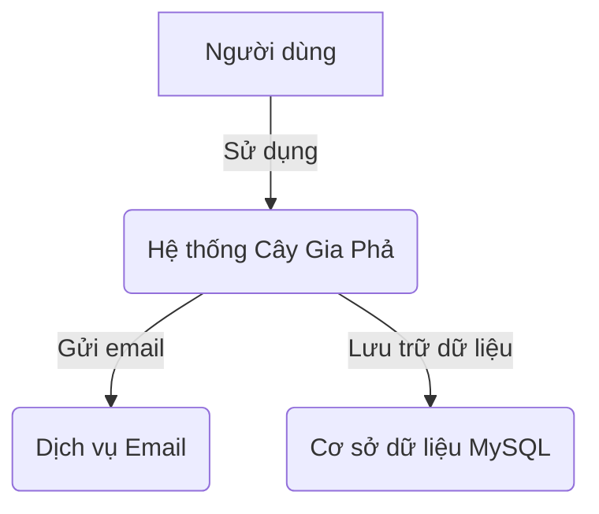
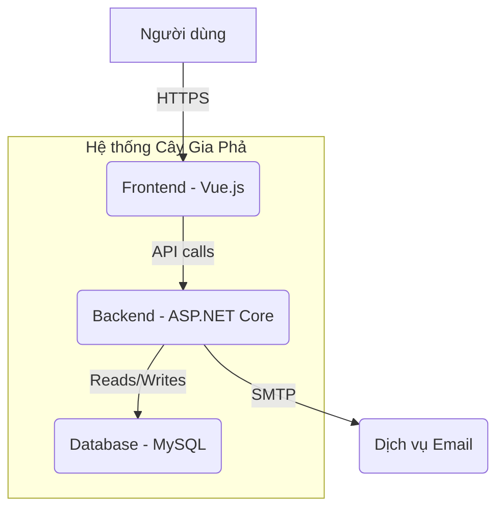
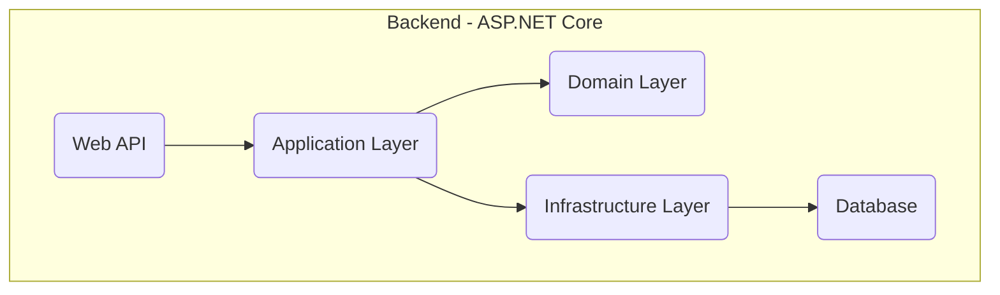
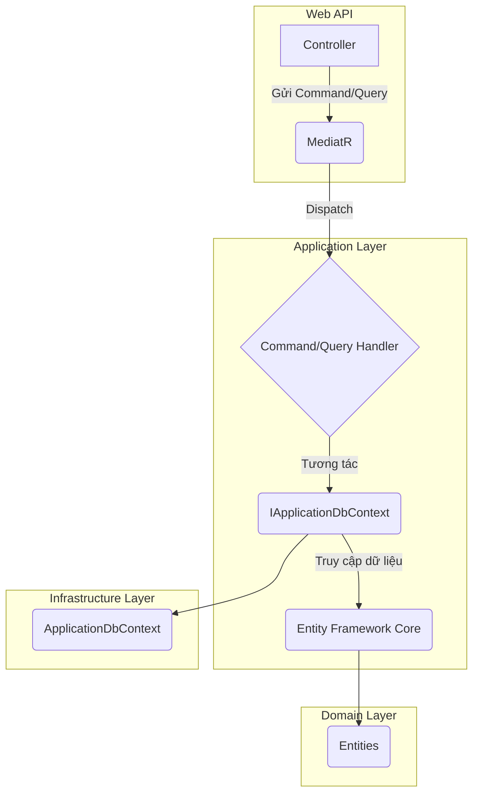
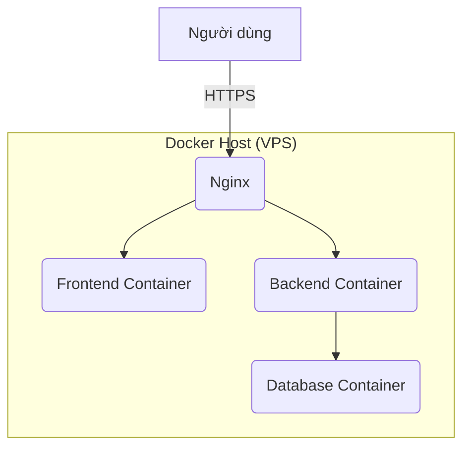

# Kiến Trúc Hệ Thống

## Mục lục

- [1. Sơ đồ ngữ cảnh (Context Diagram - C1)](#1-sơ-đồ-ngữ-cảnh-context-diagram---c1)
- [2. Sơ đồ container (Container Diagram - C2)](#2-sơ-đồ-container-container-diagram---c2)
- [3. Sơ đồ thành phần (Component Diagram - C3)](#3-sơ-đồ-thành-phần-component-diagram---c3)
- [4. Sơ đồ mã nguồn (Code Diagram - C4)](#4-sơ-đồ-mã-nguồn-code-diagram---c4)
- [5. Sơ đồ triển khai (Deployment View)](#5-sơ-đồ-triển-khai-deployment-view)
- [6. Xác thực & Phân quyền (Authentication & Authorization)](#6-xác-thực--phân-quyền-authentication--authorization)
- [7. Yêu cầu phi chức năng (Non-functional Requirements)](#7-yêu-cầu-phi-chức-năng-non-functional-requirements)
- [8. Liên kết tài liệu](#8-liên-kết-tài-liệu)

---

## 1. Sơ đồ ngữ cảnh (Context Diagram - C1)

Sơ đồ này cho thấy cái nhìn tổng quan nhất về hệ thống, bao gồm người dùng và các hệ thống bên ngoài tương tác với nó.



-   **Người dùng**: Người quản lý gia phả, thành viên gia đình.
-   **Hệ thống Cây Gia Phả**: Ứng dụng web của chúng ta.
-   **Dịch vụ Email**: Hệ thống bên ngoài để gửi thông báo.
-   **Cơ sở dữ liệu MySQL**: Nơi lưu trữ tất cả dữ liệu của hệ thống.

## 2. Sơ đồ container (Container Diagram - C2)

Sơ đồ này chia nhỏ hệ thống thành các container (ứng dụng, database, etc.).



-   **Frontend**: Ứng dụng Single Page Application (SPA) bằng Vue.js, chạy trên trình duyệt của người dùng.
-   **Backend**: Ứng dụng API bằng ASP.NET Core, xử lý logic nghiệp vụ.
-   **Database**: Cơ sở dữ liệu MySQL để lưu trữ dữ liệu.

## 3. Sơ đồ thành phần (Component Diagram - C3)

Sơ đồ này chia nhỏ Backend thành các thành phần chính theo kiến trúc Clean Architecture.



-   **Web API (Web Layer)**: Điểm vào của ứng dụng, xử lý các yêu cầu HTTP, ánh xạ chúng tới các dịch vụ nghiệp vụ (Business Services) trong Application Layer, và trả về phản hồi.
-   **Application Layer**: Chứa các trường hợp sử dụng (Use Cases), lệnh (Commands), truy vấn (Queries), các giao diện (Interfaces) cho các dịch vụ bên ngoài. **Đặc biệt, Application Layer áp dụng mô hình CQRS (Command Query Responsibility Segregation) với các `Command` (thực hiện thay đổi dữ liệu) và `Query` (truy vấn dữ liệu) được xử lý bởi các `Handler` tương ứng. Các `Handler` này sử dụng `Repository Pattern` để tương tác với dữ liệu và sử dụng `Result Pattern` để trả về kết quả thống nhất.** (updated after refactor)
-   **Domain Layer**: Chứa các thực thể (Entities), giá trị đối tượng (Value Objects), và các quy tắc nghiệp vụ cốt lõi.
-   **Infrastructure Layer**: Chứa các triển khai cụ thể của các giao diện được định nghĩa trong Application Layer, bao gồm truy cập cơ sở dữ liệu (MySQL với Entity Framework Core), dịch vụ Identity, và các dịch vụ bên ngoài khác.

## 4. Sơ đồ mã nguồn (Code Diagram - C4) (updated after refactor)

Ví dụ chi tiết về luồng CQRS (Command Query Responsibility Segregation) trong Application Layer, sử dụng MediatR và tương tác với `IApplicationDbContext`.



-   **Controller**: Nhận yêu cầu từ Frontend, tạo `Command` hoặc `Query` và gửi đến `MediatR`.
-   **MediatR**: Thư viện giúp điều phối `Command` hoặc `Query` đến `Handler` tương ứng.
-   **Command/Query Handler**: Chứa logic nghiệp vụ để xử lý `Command` hoặc `Query`.
    -   `CommandHandler` thực hiện thay đổi dữ liệu thông qua `IApplicationDbContext`.
    -   `QueryHandler` truy vấn dữ liệu thông qua `IApplicationDbContext`.
-   **IApplicationDbContext**: Interface định nghĩa các DbSet và phương thức lưu thay đổi, được triển khai bởi `ApplicationDbContext` trong Infrastructure Layer.
-   **Entity Framework Core**: ORM được sử dụng để tương tác với cơ sở dữ liệu.
-   **Entities**: Các đối tượng nghiệp vụ cốt lõi được định nghĩa trong Domain Layer.


### 🔄 CQRS (Command, Query, Handler)

*(Updated to match current refactor: Application Layer's CQRS implementation)*

CQRS (Command Query Responsibility Segregation) là một kiến trúc tách biệt các hoạt động đọc (Queries) và ghi (Commands) dữ liệu. Điều này giúp tối ưu hóa hiệu suất, khả năng mở rộng và bảo trì của ứng dụng.

#### Mục đích

*   **Tách biệt trách nhiệm:** Các mô hình đọc và ghi được tối ưu hóa độc lập.
*   **Hiệu suất:** Queries có thể được tối ưu hóa để đọc nhanh, trong khi Commands tập trung vào tính nhất quán của dữ liệu.
*   **Khả năng mở rộng:** Có thể scale các phần đọc và ghi độc lập.

#### Luồng hoạt động

1.  **Command/Query:** Yêu cầu từ Web API được đóng gói thành một `Command` (để thay đổi trạng thái) hoặc `Query` (để lấy dữ liệu).
2.  **Mediator:** `MediatR` library được sử dụng để gửi `Command` hoặc `Query` đến `Handler` tương ứng.
3.  **Handler:** `Handler` chứa logic nghiệp vụ để xử lý `Command` hoặc `Query`.
    *   `CommandHandler` thực hiện thay đổi dữ liệu thông qua Repository và Unit of Work.
    *   `QueryHandler` truy vấn dữ liệu thông qua Repository và trả về kết quả.
4.  **Result Pattern:** Kết quả của `Handler` thường được trả về dưới dạng `Result<T>` để xử lý lỗi và thành công một cách nhất quán.

#### Code Example

**1. Command (Tạo mới một Family)**

```csharp
// backend/src/Application/Families/Commands/CreateFamily/CreateFamilyCommand.cs
public record CreateFamilyCommand(string Name, string Description) : IRequest<Result<Guid>>;

public class CreateFamilyCommandValidator : AbstractValidator<CreateFamilyCommand>
{
    public CreateFamilyCommandValidator()
    {
        RuleFor(x => x.Name)
            .NotEmpty().WithMessage("Tên dòng họ không được để trống.")
            .MaximumLength(200).WithMessage("Tên dòng họ không được vượt quá 200 ký tự.");
    }
}
```

**2. Query (Lấy danh sách Families)**

```csharp
// backend/src/Application/Families/Queries/GetFamilies/GetFamiliesQuery.cs
public record GetFamiliesQuery : IRequest<Result<List<FamilyDto>>>;
```

**3. Command Handler (Xử lý CreateFamilyCommand)**

```csharp
// backend/src/Application/Families/Commands/CreateFamily/CreateFamilyCommandHandler.cs
public class CreateFamilyCommandHandler : IRequestHandler<CreateFamilyCommand, Result<Guid>>
{
    private readonly IApplicationDbContext _context;
    private readonly IMapper _mapper;

    public CreateFamilyCommandHandler(IApplicationDbContext context, IMapper mapper)
    {
        _context = context;
        _mapper = mapper;
    }

    public async Task<Result<Guid>> Handle(CreateFamilyCommand request, CancellationToken cancellationToken)
    {
        var entity = new Family
        {
            Name = request.Name,
            Description = request.Description
        };

        _context.Families.Add(entity);
        await _context.SaveChangesAsync(cancellationToken);

        return Result<Guid>.Success(entity.Id);
    }
}
```

**4. Query Handler (Xử lý GetFamiliesQuery)**

```csharp
// backend/src/Application/Families/Queries/GetFamilies/GetFamiliesQueryHandler.cs
public class GetFamiliesQueryHandler : IRequestHandler<GetFamiliesQuery, Result<List<FamilyDto>>>
{
    private readonly IApplicationDbContext _context;
    private readonly IMapper _mapper;

    public GetFamiliesQueryHandler(IApplicationDbContext context, IMapper mapper)
    {
        _context = context;
        _mapper = mapper;
    }

    public async Task<Result<List<FamilyDto>>> Handle(GetFamiliesQuery request, CancellationToken cancellationToken)
    {
        var entities = await _context.Families
            .AsNoTracking()
            .ProjectTo<FamilyDto>(_mapper.ConfigurationProvider)
            .ToListAsync(cancellationToken);

        return Result<List<FamilyDto>>.Success(entities);
    }
}
```

#### Best Practice / Note

*   **Commands** nên là bất biến (immutable) và chỉ chứa dữ liệu cần thiết để thực hiện một hành động.
*   **Queries** cũng nên là bất biến và chỉ chứa dữ liệu cần thiết để truy vấn.
*   **Handlers** nên là nhỏ gọn, tập trung vào một nhiệm vụ duy nhất và không chứa logic nghiệp vụ phức tạp (nên đặt trong Domain Layer hoặc Domain Services).
*   Sử dụng **MediatR** để tách rời việc gửi yêu cầu và xử lý yêu cầu, giúp giảm sự phụ thuộc giữa các thành phần.

## 5. Sơ đồ triển khai (Deployment View)

Hệ thống được triển khai bằng Docker trên một máy chủ ảo (VPS). Trong môi trường phát triển cục bộ, Frontend có thể sử dụng Vite Proxy để kết nối với Backend.



-   **Nginx**: Reverse proxy, xử lý SSL và điều hướng request đến Frontend và Backend. Nginx cũng có thể phục vụ các tệp tĩnh của Frontend.
-   **Frontend Container**: Chứa ứng dụng Vue.js đã được build.
-   **Backend Container**: Chứa ứng dụng ASP.NET Core API.
-   **Database Container**: Chứa cơ sở dữ liệu MySQL.

### 🔄 Vite Proxy trong môi trường phát triển

*(Updated to match current refactor: Frontend development setup)*

Trong môi trường phát triển cục bộ, Frontend (chạy bằng Vite) sử dụng cơ chế proxy để chuyển tiếp các yêu cầu API từ `http://localhost:5173/api` đến Backend (ví dụ: `http://localhost:8080` hoặc `https://localhost:5001`). Điều này giúp tránh các vấn đề CORS và cho phép Frontend tương tác liền mạch với Backend đang chạy cục bộ hoặc trong Docker.

**Cấu hình ví dụ trong `vite.config.ts`:**

```typescript
// frontend/vite.config.ts
import { defineConfig } from 'vite';

export default defineConfig({
  server: {
    proxy: {
      '/api': {
        target: 'http://localhost:8080', // Hoặc 'https://localhost:5001' nếu Backend chạy HTTPS
        changeOrigin: true,
        rewrite: (path) => path.replace(/^\/api/, ''),
        secure: false, // Chỉ dùng khi Backend chạy HTTPS với chứng chỉ tự ký
      },
    },
  },
});
```

**Giải thích:**

*   `target`: Địa chỉ của Backend API.
*   `changeOrigin`: Đặt thành `true` để thay đổi `Host` header của request thành `target` host, cần thiết cho một số API.
*   `rewrite`: Viết lại đường dẫn request, loại bỏ `/api` khỏi URL trước khi gửi đến Backend.
*   `secure`: Đặt thành `false` nếu Backend sử dụng HTTPS với chứng chỉ tự ký (self-signed certificate) trong môi trường phát triển, để tránh lỗi SSL/TLS.

## 6. Xác thực & Phân quyền (Authentication & Authorization)

Hệ thống sử dụng **JWT Bearer Token** để xác thực và được thiết kế để không phụ thuộc vào nhà cung cấp xác thực (Identity Provider - IdP).

#### Luồng hoạt động

1.  **Frontend lấy Token:** Frontend chịu trách nhiệm tương tác với IdP (ví dụ: Auth0) để lấy JWT (JSON Web Token).
2.  **Gửi Token đến Backend:** Frontend gửi kèm JWT trong header `Authorization` (dưới dạng `Bearer <token>`) trong mỗi request API đến Backend.
3.  **Backend xác thực Token:** Backend nhận JWT, giải mã và xác thực chữ ký của token, kiểm tra các claims (thông tin người dùng, quyền hạn) và thời hạn hiệu lực của token.
4.  **Phân quyền:** Sau khi xác thực thành công, Backend sử dụng thông tin từ JWT để kiểm tra quyền hạn của người dùng đối với tài nguyên hoặc hành động được yêu cầu.

#### Cấu hình Auth0 (Ví dụ)

*   **Nhà cung cấp hiện tại**: Auth0 (được trừu tượng hóa qua `IAuthProvider` và triển khai mock `Auth0Provider` cho môi trường phát triển không cần DB).
*   **Cấu hình trong `appsettings.json` hoặc `appsettings.Development.json`:**

    ```json
    "Auth0": {
      "Domain": "https://YOUR_AUTH0_DOMAIN.auth0.com/",
      "Audience": "YOUR_AUTH0_AUDIENCE"
    }
    ```

*   **Cấu hình trong `backend/src/Web/DependencyInjection.cs`:**

    ```csharp
    builder.Services.AddAuthentication(options =>
    {
        options.DefaultAuthenticateScheme = JwtBearerDefaults.AuthenticationScheme;
        options.DefaultChallengeScheme = JwtBearerDefaults.AuthenticationScheme;
    })
        .AddJwtBearer(options =>
        {
            options.Authority = builder.Configuration["Auth0:Domain"];
            options.Audience = builder.Configuration["Auth0:Audience"];
            options.RequireHttpsMetadata = false; // Đặt là false trong môi trường phát triển nếu không dùng HTTPS
        });

    builder.Services.AddAuthorizationBuilder();
    ```

    **Lưu ý về `options.RequireHttpsMetadata = false;`:**
    *   Trong môi trường phát triển, khi Backend có thể chạy trên HTTP hoặc HTTPS với chứng chỉ tự ký, việc đặt `RequireHttpsMetadata = false` là cần thiết để cho phép xác thực JWT hoạt động mà không yêu cầu IdP phải cung cấp metadata qua HTTPS. **Tuyệt đối không đặt `false` trong môi trường Production.**

#### Khả năng thay thế

Kiến trúc cho phép thay thế Auth0 bằng các IdP khác (ví dụ: Keycloak, Firebase Auth) mà không cần thay đổi lớn ở Backend. Chỉ cần cập nhật triển khai `IAuthProvider` và cấu hình liên quan.

## 7. Yêu cầu phi chức năng (Non-functional Requirements)

-   **Bảo mật**: Sử dụng HTTPS, mã hóa mật khẩu, và tuân thủ các nguyên tắc bảo mật của OWASP.
-   **Logging**: Sử dụng `ILogger` của .NET Core để ghi log, kết hợp với `try/catch` và `source` tracking trong `Result Pattern` để theo dõi chi tiết lỗi và stack trace.
-   **Monitoring**: (Chưa triển khai) Sẽ tích hợp Prometheus và Grafana để theo dõi hiệu năng hệ thống.
-   **Scaling**: Hệ thống được thiết kế để có thể scale theo chiều ngang bằng cách tăng số lượng container cho Backend và Frontend.

## 8. Liên kết tài liệu

-   [Tham chiếu API](./api-reference.md)
-   [Product Backlog](../project/backlog.md)
-   [Hướng dẫn Kiểm thử](./testing-guide.md)
