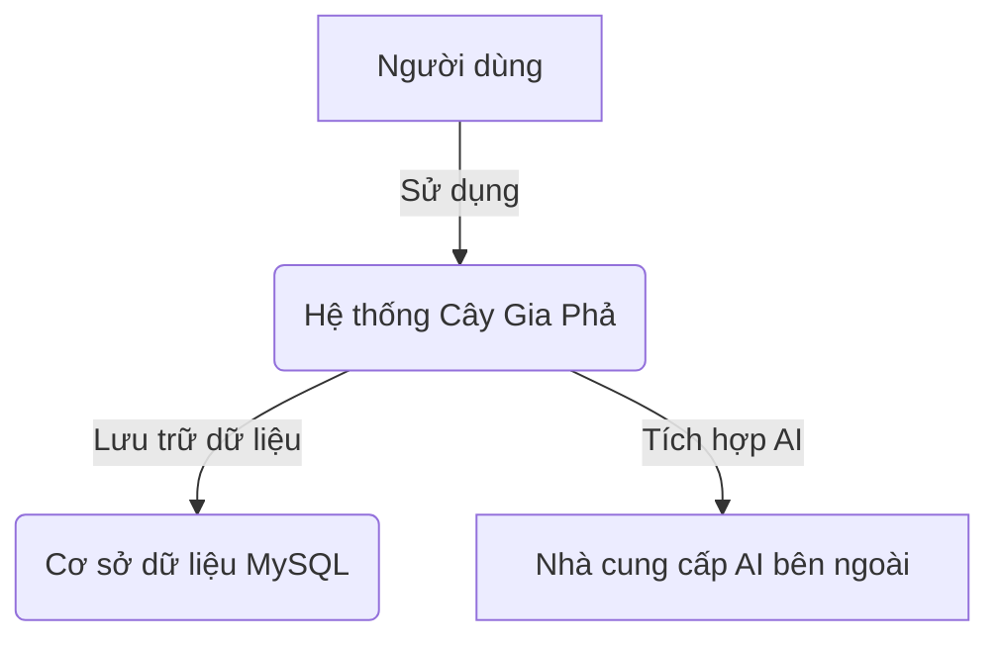
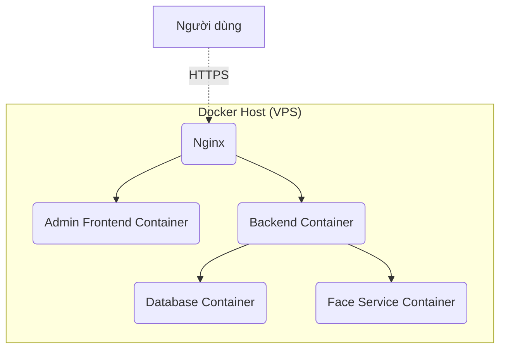

# Kiến Trúc Hệ Thống

## Mục lục

- [1. Sơ đồ ngữ cảnh (Context Diagram - C1)](#1-sơ-đồ-ngữ-cảnh-context-diagram---c1)
- [2. Sơ đồ container (Container Diagram - C2)](#2-sơ-đồ-container-container-diagram---c2)
- [3. Sơ đồ thành phần (Component Diagram - C3)](#3-sơ-đồ-thành-phần-component-diagram---c3)
- [4. Sơ đồ mã nguồn (Code Diagram - C4)](#4-sơ-đồ-mã-nguồn-code-diagram---c4)
- [5. Sơ đồ triển khai (Deployment View)](#5-sơ-đồ-triển-khai-deployment-view)
- [6. Xác thực & Phân quyền (Authentication & Authorization)](#6-xác-thực--phân-quyền-authentication--authorization)
- [7. Yêu cầu phi chức năng (Non-functional Requirements)](#7-yêu-cầu-phi-chức-năng-non-functional-requirements)
- [8. Liên kết tài liệu](#8-liên-kết-tài-liệu)

---
Dự án được tổ chức theo cấu trúc monorepo, bao gồm các ứng dụng chính (backend, frontend admin) và các dịch vụ phụ trợ (face-service), cùng với các gói chia sẻ (shared-types). Cấu trúc này giúp quản lý mã nguồn hiệu quả và tái sử dụng các thành phần.

## 1. Sơ đồ ngữ cảnh (Context Diagram - C1)

Sơ đồ này cho thấy cái nhìn tổng quan nhất về hệ thống, bao gồm người dùng và các hệ thống bên ngoài tương tác với nó.



-   **Người dùng**: Người quản lý gia phả, thành viên gia đình tương tác với hệ thống qua giao diện web.
-   **Hệ thống Cây Gia Phả**: Ứng dụng web của chúng ta, bao gồm backend, frontend và các dịch vụ liên quan.
-   **Cơ sở dữ liệu MySQL**: Nơi lưu trữ tất cả dữ liệu nghiệp vụ của hệ thống.
-   **Nhà cung cấp AI bên ngoài**: Các dịch vụ như Google Gemini, OpenAI được sử dụng cho các tính năng thông minh.

## 2. Sơ đồ container (Container Diagram - C2)

Sơ đồ này chia nhỏ hệ thống thành các container (ứng dụng, database, etc.) có thể triển khai độc lập.

```mermaid
graph TD
    subgraph "Hệ thống Cây Gia Phả"
        A(Frontend - Vue.js) -->|API calls (HTTPS)| B(Backend - ASP.NET Core)
        B -->|Reads/Writes| C(Database - MySQL)
        B -->|Giao tiếp (HTTP/gRPC)| D(Face Service - Python)
    end

    E[Người dùng] -->|Sử dụng trình duyệt| A
```

-   **Frontend**: Ứng dụng Single Page Application (SPA) bằng Vue.js, chạy trên trình duyệt của người dùng, cung cấp giao diện quản trị.
-   **Backend**: Ứng dụng API bằng ASP.NET Core, xử lý logic nghiệp vụ, xác thực và tương tác với các dịch vụ khác.
-   **Database**: Cơ sở dữ liệu MySQL để lưu trữ dữ liệu lâu dài.
-   **Face Service**: Một dịch vụ tùy chọn viết bằng Python, chuyên xử lý các tác vụ nhận dạng khuôn mặt.

## 3. Sơ đồ thành phần (Component Diagram - C3)

Sơ đồ này chia nhỏ Backend thành các thành phần chính theo kiến trúc Clean Architecture.

```mermaid
graph TD
    subgraph "Backend - ASP.NET Core"
        A[Web API (Controllers)] -->|Gửi Commands/Queries| B(Application Layer - MediatR)
        B -->|Sử dụng| C(Domain Layer)
        B -->|Sử dụng Interfaces| D(Infrastructure Layer)
        D --> E[Database (MySQL)]
        D --> F[Dịch vụ bên ngoài]
    end
```

-   **Web API (Web Layer)**: Là cửa ngõ của ứng dụng, chứa các API Controllers. Nó tiếp nhận các yêu cầu HTTP, tạo ra các đối tượng `Command` hoặc `Query`, và gửi chúng đi thông qua `MediatR` để được xử lý bởi Application Layer.
-   **Application Layer**: Chứa toàn bộ logic nghiệp vụ. Nó định nghĩa các `Command` (thao tác ghi), `Query` (thao tác đọc), và các `Handler` tương ứng để xử lý chúng (CQRS Pattern). Lớp này cũng định nghĩa các `interface` cho các dịch vụ mà nó cần (ví dụ: `IApplicationDbContext`, `IUser`), nhưng không quan tâm đến chi tiết triển khai của chúng.
-   **Domain Layer**: Lõi của hệ thống, chứa các `Entities` (ví dụ: `Family`, `Member`), `Value Objects`, và các quy tắc nghiệp vụ cơ bản không phụ thuộc vào bất kỳ lớp nào khác.
-   **Infrastructure Layer**: Cung cấp các triển khai cụ thể cho các `interface` được định nghĩa trong Application Layer. Ví dụ: `ApplicationDbContext` (dùng EF Core để truy cập MySQL), dịch vụ gửi email, dịch vụ lưu trữ file, v.v.

## 4. Sơ đồ mã nguồn (Code Diagram - C4)

Ví dụ chi tiết về luồng xử lý CQRS, cho thấy sự tương tác giữa các thành phần mã nguồn cụ thể.


-   **Controller**: Nhận yêu cầu HTTP, tạo `Command` hoặc `Query`, và gửi cho `MediatR` để xử lý.
-   **MediatR**: Đóng vai trò trung gian, tìm và gọi `Handler` tương ứng đã được đăng ký cho mỗi `Command` hoặc `Query`.
-   **Composition Root (Dependency Injection)**: Là nơi tất cả các dịch vụ và phụ thuộc được đăng ký (thường trong `Program.cs` hoặc các file `DependencyInjection.cs`). Đây là nơi duy nhất các lớp "biết" về nhau, giúp giữ cho kiến trúc découple.
-   **Command/Query Handler**: Nơi chứa logic nghiệp vụ chính.
    -   Sử dụng `IApplicationDbContext` để truy cập cơ sở dữ liệu.
    -   Sử dụng `IUser` để lấy thông tin người dùng hiện tại (ví dụ: `Id`, `Email`) cho việc xác thực hoặc ghi log.
    -   Sử dụng `IMapper` (AutoMapper) để ánh xạ giữa Entities và DTOs.
    -   Sử dụng `IAiService` để thực hiện các tác vụ liên quan đến AI.
-   **IApplicationDbContext**: Là một `interface` trong Application Layer, được `ApplicationDbContext` (sử dụng EF Core) trong Infrastructure Layer triển khai để cung cấp kết nối đến database.
-   **IUser**: `Interface` định nghĩa cách lấy thông tin người dùng hiện tại, được triển khai trong Infrastructure.
-   **Domain Entities/Events**: Các đối tượng nghiệp vụ cốt lõi và các sự kiện domain (ví dụ: `MemberCreatedEvent`) được sử dụng bởi các Handler.

## 5. Sơ đồ triển khai (Deployment View)

Hệ thống được triển khai bằng Docker trên một máy chủ ảo (VPS), sử dụng Nginx làm reverse proxy.



-   **Nginx**: Đóng vai trò reverse proxy, xử lý SSL termination, và điều hướng các request đến container Backend hoặc Frontend tương ứng.
-   **Admin Frontend Container**: Chứa ứng dụng Vue.js đã được build và được phục vụ bởi một web server tĩnh (có thể là Nginx).
-   **Backend Container**: Chứa ứng dụng ASP.NET Core API.
-   **Database Container**: Chứa cơ sở dữ liệu MySQL.
-   **Face Service Container**: Container tùy chọn cho dịch vụ nhận dạng khuôn mặt.

## 6. Xác thực & Phân quyền (Authentication & Authorization)

Hệ thống sử dụng **JWT Bearer Token** từ một nhà cung cấp xác thực bên ngoài (ví dụ: Auth0, Firebase Auth, Keycloak) để bảo vệ các API endpoint.

#### Luồng hoạt động

1.  **Frontend lấy Token:** Frontend xử lý quá trình đăng nhập với nhà cung cấp xác thực và nhận về một `Access Token` (JWT).
2.  **Gửi Token đến Backend:** Frontend gửi kèm `Access Token` trong header `Authorization` (dạng `Bearer <token>`) trong mỗi request API đến Backend.
3.  **Backend xác thực Token:**
    *   Backend nhận token và xác thực nó (chữ ký, thời hạn, issuer, audience) dựa trên cấu hình trong `JwtSettings`.
    *   Sau khi xác thực, các `claims` trong token được dùng để tạo `ClaimsPrincipal` cho người dùng.
4.  **Truy cập thông tin người dùng:** Dịch vụ `IUser` được sử dụng trong toàn ứng dụng (đặc biệt là ở Application Layer) để truy xuất thông tin của người dùng đã xác thực (như `Id`, `Email`, `ExternalId`) từ `ClaimsPrincipal`.
5.  **Phân quyền (Authorization):**
    *   **Theo vai trò**: Các `[Authorize(Roles = "Admin")]` attribute được dùng trên các controller/endpoint để giới hạn quyền truy cập dựa trên vai trò có trong token.
    *   **Theo nghiệp vụ**: Logic phân quyền phức tạp hơn (ví dụ: "chỉ chủ sở hữu của gia đình mới được sửa đổi") được xử lý bên trong các `Command Handler` bằng cách sử dụng `IUser` để lấy ID người dùng hiện tại và so sánh với dữ liệu nghiệp vụ.

Kiến trúc này giúp tách biệt logic xác thực (do nhà cung cấp bên ngoài xử lý) khỏi logic nghiệp vụ của ứng dụng.

## 7. Yêu cầu phi chức năng (Non-functional Requirements)

-   **Bảo mật**: Sử dụng HTTPS, mã hóa mật khẩu, và tuân thủ các nguyên tắc bảo mật của OWASP.
-   **Logging**: Sử dụng `Serilog` để ghi log có cấu trúc, giúp việc theo dõi và chẩn đoán lỗi dễ dàng hơn.
-   **Hiệu suất**: Sử dụng CQRS để tối ưu hóa các truy vấn đọc. Các truy vấn đọc phức tạp có thể sử dụng Dapper hoặc các câu SQL thô để bypass EF Core nhằm tăng tốc độ.
-   **Khả năng mở rộng**: Hệ thống được thiết kế để có thể scale theo chiều ngang bằng cách tăng số lượng container cho Backend và Frontend.

## 8. Liên kết tài liệu

-   [Mô hình Dữ liệu](./data-model.md)
-   [Tham chiếu API](./api-reference.md)
-   [Hướng dẫn Phát triển Backend](./backend-guide.md)
