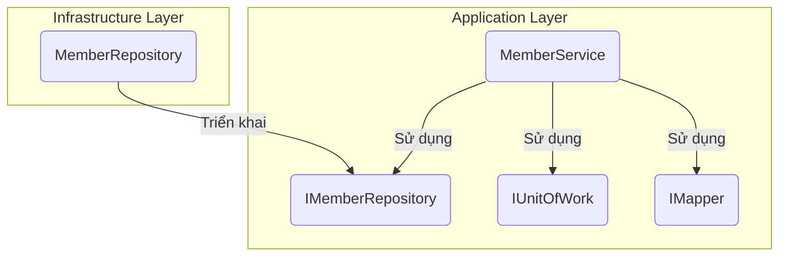

# Kiến Trúc Hệ Thống

## Mục lục

- [1. Sơ đồ ngữ cảnh (Context Diagram - C1)](#1-sơ-đồ-ngữ-cảnh-context-diagram---c1)
- [2. Sơ đồ container (Container Diagram - C2)](#2-sơ-đồ-container-container-diagram---c2)
- [3. Sơ đồ thành phần (Component Diagram - C3)](#3-sơ-đồ-thành-phần-component-diagram---c3)
- [4. Sơ đồ mã nguồn (Code Diagram - C4)](#4-sơ-đồ-mã-nguồn-code-diagram---c4)
- [5. Sơ đồ triển khai (Deployment View)](#5-sơ-đồ-triển-khai-deployment-view)
- [6. Xác thực & Phân quyền (Authentication & Authorization)](#6-xác-thực--phân-quyền-authentication--authorization)
- [7. Yêu cầu phi chức năng (Non-functional Requirements)](#7-yêu-cầu-phi-chức-năng-non-functional-requirements)
- [8. Liên kết tài liệu](#8-liên-kết-tài-liệu)

---

## 1. Sơ đồ ngữ cảnh (Context Diagram - C1)

Sơ đồ này cho thấy cái nhìn tổng quan nhất về hệ thống, bao gồm người dùng và các hệ thống bên ngoài tương tác với nó.

-   **Người dùng**: Người quản lý gia phả, thành viên gia đình.
-   **Hệ thống Cây Gia Phả**: Ứng dụng web của chúng ta.
-   **Dịch vụ Email**: Hệ thống bên ngoài để gửi thông báo.
-   **Cơ sở dữ liệu MySQL**: Nơi lưu trữ tất cả dữ liệu của hệ thống.

## 2. Sơ đồ container (Container Diagram - C2)

Sơ đồ này chia nhỏ hệ thống thành các container (ứng dụng, database, etc.).

-   **Frontend**: Ứng dụng Single Page Application (SPA) bằng Vue.js, chạy trên trình duyệt của người dùng.
-   **Backend**: Ứng dụng API bằng ASP.NET Core, xử lý logic nghiệp vụ.
-   **Database**: Cơ sở dữ liệu MySQL để lưu trữ dữ liệu.

## 3. Sơ đồ thành phần (Component Diagram - C3)

Sơ đồ này chia nhỏ Backend thành các thành phần chính theo kiến trúc Clean Architecture.

-   **Web API (Web Layer)**: Điểm vào của ứng dụng, xử lý các yêu cầu HTTP, ánh xạ chúng tới các lệnh/truy vấn trong Application Layer, và trả về phản hồi.
-   **Application Layer**: Chứa các trường hợp sử dụng (Use Cases), lệnh (Commands), truy vấn (Queries), và các giao diện (Interfaces) cho các dịch vụ bên ngoài.
-   **Domain Layer**: Chứa các thực thể (Entities), giá trị đối tượng (Value Objects), và các quy tắc nghiệp vụ cốt lõi.
-   **Infrastructure Layer**: Chứa các triển khai cụ thể của các giao diện được định nghĩa trong Application Layer, bao gồm truy cập cơ sở dữ liệu (MySQL với Entity Framework Core), dịch vụ Identity, và các dịch vụ bên ngoài khác.

## 4. Sơ đồ mã nguồn (Code Diagram - C4)

Ví dụ chi tiết về `MemberService` trong Application Layer.

-   `MemberService`: Chứa logic nghiệp vụ để quản lý thành viên.
-   `IMemberRepository`: Interface định nghĩa các phương thức truy cập dữ liệu thành viên.
-   `MemberRepository`: Triển khai cụ thể của `IMemberRepository` sử dụng Entity Framework Core.

## 5. Sơ đồ triển khai (Deployment View)

Hệ thống được triển khai bằng Docker trên một máy chủ ảo (VPS).

-   **Nginx**: Reverse proxy, xử lý SSL và điều hướng request.
-   **Frontend Container**: Chứa ứng dụng Vue.js đã được build.
-   **Backend Container**: Chứa ứng dụng ASP.NET Core API.
-   **Database Container**: Chứa cơ sở dữ liệu MySQL.

## 6. Xác thực & Phân quyền (Authentication & Authorization)

Hệ thống sử dụng **JWT Bearer Token** và được thiết kế để không phụ thuộc vào nhà cung cấp xác thực.

-   **Nhà cung cấp hiện tại**: Auth0.
-   **Luồng hoạt động**: Frontend chịu trách nhiệm lấy token từ Auth0 và gửi kèm mỗi request API trong header `Authorization`.
-   **Khả năng thay thế**: Kiến trúc cho phép thay thế Auth0 bằng các provider khác (Keycloak, Firebase Auth) mà không cần thay đổi lớn ở Backend, chỉ cần cập nhật cấu hình.

## 7. Yêu cầu phi chức năng (Non-functional Requirements)

-   **Bảo mật**: Sử dụng HTTPS, mã hóa mật khẩu, và tuân thủ các nguyên tắc bảo mật của OWASP.
-   **Logging**: Sử dụng Serilog để ghi log ra file và console.
-   **Monitoring**: (Chưa triển khai) Sẽ tích hợp Prometheus và Grafana để theo dõi hiệu năng hệ thống.
-   **Scaling**: Hệ thống được thiết kế để có thể scale theo chiều ngang bằng cách tăng số lượng container cho Backend và Frontend.

## 8. Liên kết tài liệu

-   [Tham chiếu API](./api-reference.md)
-   [Product Backlog](../project/backlog.md)
-   [Hướng dẫn Kiểm thử](./testing-guide.md)
