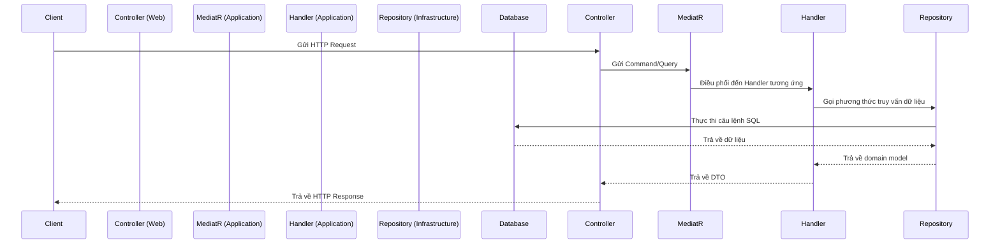

# Hướng dẫn Backend

## Mục lục

- [1. Giới thiệu](#1-giới-thiệu)
- [2. Yêu cầu môi trường](#2-yêu-cầu-môi-trường)
- [3. Cấu trúc Dự án](#3-cấu-trúc-dự-án)
- [4. Luồng Request](#4-luồng-request)
- [5. Dependency Injection](#5-dependency-injection)
- [6. Middleware](#6-middleware)
- [7. Xác thực & Phân quyền](#7-xác-thực--phân-quyền)
- [8. Repository Pattern](#8-repository-pattern)
- [9. Database Migration](#9-database-migration)
- [10. Hướng dẫn Kiểm thử](#10-hướng-dẫn-kiểm-thử)
- [11. Logging & Monitoring](#11-logging--monitoring)
- [12. Coding Style](#12-coding-style)
- [13. Best Practices](#13-best-practices)
- [14. Tài liệu liên quan](#14-tài-liệu-liên-quan)

---

## 1. Giới thiệu

Backend của dự án được xây dựng bằng **ASP.NET Core 8** và tuân thủ theo **Clean Architecture**. Kiến trúc này giúp tách biệt các mối quan tâm, dễ dàng bảo trì và mở rộng.

## 2. Yêu cầu môi trường

-   **.NET 8 SDK**
-   **Docker** (để chạy database)
-   **Công cụ CLI**: `dotnet-ef` để quản lý migration.

## 3. Cấu trúc Dự án

Dự án được chia thành các project chính:

```
backend/
├── src/
│   ├── Domain/         # Entities, Value Objects, Enums, Domain Events
│   ├── Application/    # Logic nghiệp vụ, DTOs, Interfaces
│   ├── Infrastructure/ # Triển khai Interfaces (Repositories, Services)
│   └── Web/            # API Controllers, Cấu hình ASP.NET Core
└── tests/
    ├── Application.UnitTests/
    └── Infrastructure.IntegrationTests/
```

## 4. Luồng Request

Một request từ client sẽ đi qua các lớp như sau:



## 5. Dependency Injection

Sử dụng built-in DI container của ASP.NET Core. Các services được đăng ký trong `DependencyInjection.cs` của mỗi project và gọi trong `Program.cs` của project `Web`.

**Ví dụ (`Web/Program.cs`):**

```csharp
builder.Services
    .AddApplicationServices()
    .AddInfrastructureServices(builder.Configuration)
    .AddWebServices();
```

## 6. Middleware

-   **Error Handling**: Middleware `UseExceptionHandler` bắt tất cả exception chưa được xử lý và trả về một response lỗi chuẩn theo [ProblemDetails](https://tools.ietf.org/html/rfc7807).
-   **Authentication & Authorization**: `UseAuthentication` và `UseAuthorization` để xác thực và phân quyền.

## 7. Xác thực & Phân quyền

-   **Cơ chế**: Sử dụng **JWT Bearer Token**.
-   **Provider hiện tại**: **Auth0**. Tuy nhiên, hệ thống được thiết kế để dễ dàng thay thế bằng các provider khác (Keycloak, Firebase Auth) bằng cách triển khai một `IAuthService` mới.
-   **Luồng JWT**: Client lấy token từ Auth0 và gửi trong header `Authorization` của mỗi request.

## 8. Repository Pattern

-   **Interface**: Định nghĩa trong `Application` layer.
-   **Triển khai**: Trong `Infrastructure` layer, sử dụng Entity Framework Core.

**Kiểm thử Repository với In-Memory Database:**

```csharp
// Trong file test
var options = new DbContextOptionsBuilder<ApplicationDbContext>()
    .UseInMemoryDatabase(databaseName: "TestDb")
    .Options;

_context = new ApplicationDbContext(options);
_repository = new MemberRepository(_context);
```

## 9. Database Migration

Sử dụng `dotnet-ef` để quản lý schema.

-   **Tạo migration:**

    ```bash
    dotnet ef migrations add InitialCreate --project src/Infrastructure -s src/Web
    ```

-   **Cập nhật database:**

    ```bash
    dotnet ef database update --project src/Infrastructure -s src/Web
    ```

## 10. Hướng dẫn Kiểm thử

-   **Unit Tests**: `Application.UnitTests`
-   **Integration Tests**: `Infrastructure.IntegrationTests`

-   **Chạy tất cả test:**

    ```bash
    dotnet test
    ```

## 11. Logging & Monitoring

-   **Logging**: Sử dụng `ILogger` của .NET và **Serilog** để ghi log ra console và file.
-   **Monitoring**: (Chưa triển khai) Sẽ tích hợp **OpenTelemetry** để thu thập metrics và traces.

## 12. Coding Style

-   Sử dụng `dotnet format` để duy trì code style nhất quán.
-   Tuân thủ [Microsoft C# Coding Conventions](https://docs.microsoft.com/en-us/dotnet/csharp/fundamentals/coding-style/coding-conventions).

## 13. Best Practices

-   Luôn inject dependency qua interface.
-   Sử dụng `CancellationToken` trong các phương thức async.
-   Áp dụng **Unit of Work pattern** khi cần thực hiện nhiều thao tác trong một transaction.
-   Sử dụng `async/await` một cách nhất quán.

## 14. Tài liệu liên quan

-   [Kiến trúc tổng quan](./architecture.md)
-   [Hướng dẫn API](./api-reference.md)
-   [Hướng dẫn Kiểm thử](./testing-guide.md)