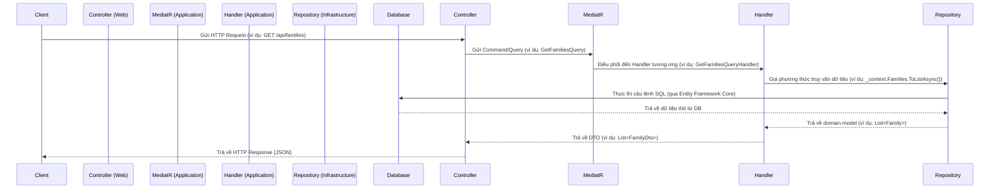

# Hướng dẫn Backend

## Mục lục

- [1. Giới thiệu](#1-giới-thiệu)
- [2. Yêu cầu môi trường](#2-yêu-cầu-môi-trường)
- [3. Cấu trúc Dự án](#3-cấu-trúc-dự-án)
- [4. Luồng Request](#4-luồng-request)
- [5. Dependency Injection](#5-dependency-injection)
- [6. Middleware](#6-middleware)
- [7. Xác thực & Phân quyền](#7-xác-thực--phân-quyền)
- [8. Tương tác Dữ liệu với Entity Framework Core](#8-tương-tác-dữ-liệu-với-entity-framework-core-updated-after-refactor)
  - [8.1. Specification Pattern](#81-specification-pattern-updated-after-refactor)
- [9. Database Migration](#9-database-migration)
- [10. Hướng dẫn Kiểm thử](#10-hướng-dẫn-kiểm-thử)
- [11. Logging & Monitoring](#11-logging--monitoring)
- [12. Coding Style](#12-coding-style)
- [13. Best Practices](#13-best-practices)
- [14. Tài liệu liên quan](#14-tài-liệu-liên-quan)

---

## 1. Giới thiệu

Backend của dự án được xây dựng bằng **ASP.NET Core 8** và tuân thủ theo **Clean Architecture**. Kiến trúc này giúp tách biệt các mối quan tâm, dễ dàng bảo trì và mở rộng.

## 2. Yêu cầu môi trường

-   **.NET 8 SDK**
-   **Docker** (để chạy database)
-   **Công cụ CLI**: `dotnet-ef` để quản lý migration.

## 3. Cấu trúc Dự án

Dự án được chia thành các project chính, tuân thủ theo nguyên tắc của Clean Architecture:

```
backend/
├── src/
│   ├── Domain/         # Chứa các thực thể (Entities), giá trị đối tượng (Value Objects), định nghĩa các quy tắc nghiệp vụ cốt lõi, và Domain Events. Đây là trái tim của ứng dụng, độc lập với các lớp khác.
│   ├── Application/    # Chứa logic nghiệp vụ chính của ứng dụng (Use Cases), các DTOs (Data Transfer Objects), các giao diện (Interfaces) cho các dịch vụ bên ngoài, và các Commands/Queries/Handlers theo mô hình CQRS.
│   ├── Infrastructure/ # Chứa các triển khai cụ thể của các giao diện được định nghĩa trong Application Layer. Bao gồm truy cập cơ sở dữ liệu (Entity Framework Core), dịch vụ Identity, và các dịch vụ bên ngoài khác.
│   └── Web/            # Là lớp trình bày (Presentation Layer), chứa các API Controllers, cấu hình ASP.NET Core, và là điểm vào của ứng dụng.
└── tests/
    ├── Application.UnitTests/ # Chứa các Unit Tests cho Application Layer.
    └── Infrastructure.IntegrationTests/ # Chứa các Integration Tests cho Infrastructure Layer và tương tác với Database.
```
## 4. Luồng Request

Một request từ client sẽ đi qua các lớp của Clean Architecture như sau:



**Giải thích chi tiết:**

1.  **Client gửi HTTP Request**: Người dùng tương tác với Frontend, Frontend gửi một yêu cầu HTTP (GET, POST, PUT, DELETE) đến Backend API.
2.  **Controller (Web Layer) nhận Request**: Controller trong lớp `Web` nhận yêu cầu, thực hiện các kiểm tra ban đầu (ví dụ: validation của request model) và chuyển đổi request thành một `Command` hoặc `Query`.
3.  **MediatR (Application Layer) gửi Command/Query**: Controller sử dụng `MediatR` để gửi `Command` hoặc `Query` đến Application Layer. `MediatR` đóng vai trò là một mediator, giúp tách rời Controller khỏi việc biết Handler cụ thể nào sẽ xử lý yêu cầu.
4.  **Handler (Application Layer) xử lý Command/Query**: `MediatR` tìm và điều phối yêu cầu đến `Handler` tương ứng. `Handler` chứa logic nghiệp vụ chính, sử dụng các dịch vụ và Repository để thực hiện công việc.
    *   **Command Handler**: Xử lý các yêu cầu thay đổi trạng thái (tạo, cập nhật, xóa). Nó thường tương tác với Repository để lưu trữ dữ liệu và sử dụng Unit of Work để đảm bảo tính nhất quán của transaction.
    *   **Query Handler**: Xử lý các yêu cầu truy vấn dữ liệu. Nó thường tương tác với Repository để lấy dữ liệu và ánh xạ dữ liệu đó sang DTO trước khi trả về.
5.  **Repository (Infrastructure Layer) truy cập dữ liệu**: `Handler` gọi các phương thức trên interface Repository (được định nghĩa trong Domain hoặc Application Layer). Triển khai cụ thể của Repository (trong Infrastructure Layer) sẽ tương tác với cơ sở dữ liệu (sử dụng Entity Framework Core).
6.  **Database thực thi**: Entity Framework Core chuyển đổi các thao tác của Repository thành các câu lệnh SQL và thực thi trên cơ sở dữ liệu MySQL.
7.  **Database trả về dữ liệu**: Cơ sở dữ liệu trả về kết quả cho Repository.
8.  **Repository trả về Domain Model**: Repository chuyển đổi dữ liệu thô từ DB thành các Domain Model (Entities) và trả về cho Handler.
9.  **Handler trả về DTO**: Handler ánh xạ Domain Model sang DTO và trả về cho Controller.
10. **Controller trả về HTTP Response**: Controller nhận DTO từ Handler, định dạng thành JSON và gửi lại cho Client dưới dạng HTTP Response.

## 5. Dependency Injection

Sử dụng built-in DI container của ASP.NET Core để quản lý vòng đời của các services và inject chúng vào các thành phần cần thiết. Việc đăng ký services được tổ chức theo từng lớp (layer) để dễ quản lý và tuân thủ Clean Architecture.

#### Cách đăng ký Services

Các services được đăng ký trong các phương thức mở rộng (extension methods) `Add[Layer]Services()` của mỗi project (Application, Infrastructure, Web) và được gọi trong `Program.cs` của project `Web`.

**Ví dụ (`Web/Program.cs`):**

```csharp
// backend/src/Web/Program.cs

builder.Services
    .AddApplicationServices()    // Đăng ký services từ Application Layer
    .AddInfrastructureServices(builder.Configuration) // Đăng ký services từ Infrastructure Layer
    .AddWebServices();           // Đăng ký services từ Web Layer
```

**Giải thích:**

*   `AddApplicationServices()`: Đăng ký tất cả các services, Handlers, Validators, và AutoMapper profiles từ Application Layer. Ví dụ: `MediatR`, `FluentValidation`.
*   `AddInfrastructureServices()`: Đăng ký các triển khai cụ thể của các interfaces từ Application Layer, như `IApplicationDbContext` (với Entity Framework Core), `IIdentityService`, và các Repository.
*   `AddWebServices()`: Đăng ký các services dành riêng cho Web Layer, như `IUser` (để lấy thông tin người dùng hiện tại), `HttpContextAccessor`, và cấu hình Swagger/OpenAPI.

#### Vòng đời của Services (Service Lifetimes)

ASP.NET Core DI hỗ trợ ba loại vòng đời:

*   **Singleton**: Một instance duy nhất được tạo ra và sử dụng trong suốt vòng đời của ứng dụng.
    ```csharp
    services.AddSingleton<IMySingletonService, MySingletonService>();
    ```
*   **Scoped**: Một instance được tạo ra một lần cho mỗi request HTTP. Phù hợp cho các services cần duy trì trạng thái trong một request (ví dụ: `DbContext`).
    ```csharp
    services.AddScoped<IMyScopedService, MyScopedService>();
    ```
*   **Transient**: Một instance mới được tạo ra mỗi khi service được yêu cầu. Phù hợp cho các services nhẹ, không trạng thái.
    ```csharp
    services.AddTransient<IMyTransientService, MyTransientService>();
    ```

**Best Practice:** Luôn inject dependency qua interface để tăng tính linh hoạt và dễ kiểm thử.

## 6. Middleware

ASP.NET Core sử dụng một pipeline các middleware để xử lý các HTTP request. Mỗi middleware có thể thực hiện một tác vụ cụ thể (ví dụ: logging, authentication, routing) và sau đó chuyển request cho middleware tiếp theo trong pipeline.

#### Error Handling Middleware

*   **`UseExceptionHandler`**: Middleware này được cấu hình để bắt tất cả các exception chưa được xử lý (unhandled exceptions) trong ứng dụng. Thay vì trả về lỗi 500 mặc định của server, nó sẽ trả về một response lỗi chuẩn hóa theo định dạng `ProblemDetails` (RFC 7807) hoặc cấu trúc `Result Pattern` của chúng ta. Điều này giúp client dễ dàng xử lý lỗi một cách nhất quán.

    **Cấu hình trong `Program.cs`:**

    ```csharp
    // backend/src/Web/Program.cs
    app.UseExceptionHandler(options => { }); // Sử dụng CustomExceptionHandler đã đăng ký
    ```

    **`CustomExceptionHandler`**: Một triển khai tùy chỉnh của `IExceptionHandler` để định dạng phản hồi lỗi theo `Result Pattern`.

#### Authentication & Authorization Middleware

*   **`UseAuthentication`**: Middleware này chịu trách nhiệm xác thực người dùng. Nó đọc thông tin xác thực từ request (ví dụ: JWT Bearer Token từ header `Authorization`), xác minh tính hợp lệ của nó và tạo ra một `ClaimsPrincipal` đại diện cho người dùng đã xác thực.
*   **`UseAuthorization`**: Middleware này chịu trách nhiệm phân quyền. Sau khi người dùng được xác thực, `UseAuthorization` sẽ kiểm tra xem người dùng có quyền truy cập vào tài nguyên hoặc thực hiện hành động được yêu cầu hay không, dựa trên các chính sách phân quyền đã được định nghĩa (ví dụ: `[Authorize]` attribute).

    **Cấu hình trong `Program.cs`:**

    ```csharp
    // backend/src/Web/Program.cs
    app.UseAuthentication();
    app.UseAuthorization();
    ```

    **Lưu ý:** `UseAuthentication` phải được gọi trước `UseAuthorization` trong pipeline.

## 7. Xác thực & Phân quyền

-   **Cơ chế**: Sử dụng **JWT Bearer Token**.
-   **Provider hiện tại**: **Auth0**. Tuy nhiên, hệ thống được thiết kế để dễ dàng thay thế bằng các provider khác (Keycloak, Firebase Auth) bằng cách triển khai một `IAuthService` mới.
-   **Luồng JWT**: Client lấy token từ Auth0 và gửi trong header `Authorization` của mỗi request.

Để biết thêm chi tiết về luồng xác thực, cấu hình và các cân nhắc bảo mật, vui lòng tham khảo phần [Xác thực & Phân quyền trong Kiến trúc tổng quan](./architecture.md#6-xác-thực--phân-quyền-authentication--authorization).

## 8. Tương tác Dữ liệu với Entity Framework Core (updated after refactor)

Trong dự án này, chúng ta sử dụng **Entity Framework Core (EF Core)** để tương tác với cơ sở dữ liệu. Thay vì sử dụng các triển khai Repository Pattern tường minh (explicit Repository Pattern) với các lớp Repository riêng biệt, chúng ta tương tác trực tiếp với `DbContext` thông qua interface `IApplicationDbContext` trong Application Layer. Cách tiếp cận này tận dụng các tính năng sẵn có của EF Core như `DbSet<TEntity>` để hoạt động như một Repository hiệu quả.

#### Mục đích

*   **Đơn giản hóa:** Giảm số lượng lớp và interface cần thiết, làm cho codebase gọn gàng hơn.
*   **Tận dụng EF Core:** Sử dụng trực tiếp các tính năng mạnh mẽ của EF Core như LINQ, Change Tracking, và các phương thức CRUD có sẵn trên `DbSet<TEntity>`.
*   **Dễ kiểm thử:** `DbContext` có thể dễ dàng được mock hoặc sử dụng với In-Memory Database cho mục đích kiểm thử.

#### IApplicationDbContext

`IApplicationDbContext` là interface được định nghĩa trong Application Layer, kế thừa từ `DbContext` của EF Core. Nó cung cấp quyền truy cập vào các `DbSet` cho các thực thể (Entities) của chúng ta.

**Ví dụ (`Application/Common/Interfaces/IApplicationDbContext.cs`):**

```csharp
public interface IApplicationDbContext
{
    DbSet<Family> Families { get; }
    DbSet<Member> Members { get; }
    DbSet<Event> Events { get; }

    Task<int> SaveChangesAsync(CancellationToken cancellationToken);
}
```

#### Sử dụng trong Handlers

Các Command và Query Handlers trong Application Layer sẽ inject `IApplicationDbContext` và sử dụng trực tiếp các `DbSet` để thực hiện các thao tác CRUD.

**Ví dụ sử dụng trong Handler (CreateFamilyCommand):**

```csharp
// backend/src/Application/Families/Commands/CreateFamily/CreateFamilyCommandHandler.cs
public class CreateFamilyCommandHandler : IRequestHandler<CreateFamilyCommand, Result<Guid>>
{
    private readonly IApplicationDbContext _context;

    public CreateFamilyCommandHandler(IApplicationDbContext context)
    {
        _context = context;
    }

    public async Task<Result<Guid>> Handle(CreateFamilyCommand request, CancellationToken cancellationToken)
    {
        var entity = new Family { Name = request.Name, Description = request.Description };

        _context.Families.Add(entity); // Thêm thực thể trực tiếp vào DbSet
        await _context.SaveChangesAsync(cancellationToken); // Lưu thay đổi

        return Result<Guid>.Success(entity.Id);
    }
}
```

#### Unit of Work Pattern

Trong dự án này, `ApplicationDbContext` của Entity Framework Core đóng vai trò là Unit of Work. Phương thức `SaveChangesAsync()` trên `DbContext` sẽ commit tất cả các thay đổi đã được theo dõi trong một giao dịch duy nhất.

**Ví dụ sử dụng trong Handler (CreateFamilyCommand):**

```csharp
// backend/src/Application/Families/Commands/CreateFamily/CreateFamilyCommandHandler.cs
public class CreateFamilyCommandHandler : IRequestHandler<CreateFamilyCommand, Result<Guid>>
{
    private readonly IApplicationDbContext _context; // IApplicationDbContext kế thừa từ DbContext

    public CreateFamilyCommandHandler(IApplicationDbContext context)
    {
        _context = context;
    }

    public async Task<Result<Guid>> Handle(CreateFamilyCommand request, CancellationToken cancellationToken)
    {
        var entity = new Family { Name = request.Name, Description = request.Description };

        _context.Families.Add(entity);
        await _context.SaveChangesAsync(cancellationToken); // SaveChangesAsync hoạt động như Commit của Unit of Work

        return Result<Guid>.Success(entity.Id);
    }
}
```

#### Kiểm thử với In-Memory Database

Để kiểm thử các Handlers tương tác với dữ liệu, chúng ta có thể sử dụng In-Memory Database của Entity Framework Core.

**Ví dụ trong Unit Test:**

```csharp
// Trong file test (ví dụ: backend/tests/Application.UnitTests/Common/TestDbContextFactory.cs)

// Tạo một DbContext sử dụng In-Memory Database cho mục đích test
var options = new DbContextOptionsBuilder<ApplicationDbContext>()
    .UseInMemoryDatabase(databaseName: Guid.NewGuid().ToString()) // Sử dụng tên DB duy nhất cho mỗi test
    .Options;

var context = new ApplicationDbContext(options);
context.Database.EnsureCreated(); // Đảm bảo database được tạo

// Sử dụng context trực tiếp trong test
var handler = new CreateFamilyCommandHandler(context);
var command = new CreateFamilyCommand("Test Family", "Description");
var result = await handler.Handle(command, CancellationToken.None);

// ... kiểm tra kết quả ...

// Sau khi test, có thể xóa database
context.Database.EnsureDeleted();
context.Dispose();
```

## 8.1. Specification Pattern (updated after refactor)

Specification Pattern là một mẫu thiết kế giúp đóng gói logic nghiệp vụ để lọc hoặc truy vấn dữ liệu. Thay vì nhúng các điều kiện lọc trực tiếp vào các Query Handlers, chúng ta có thể định nghĩa chúng dưới dạng các "specification" có thể tái sử dụng. Điều này giúp giữ cho Query Handlers gọn gàng, dễ đọc và dễ kiểm thử hơn.

#### Mục đích

*   **Tách biệt mối quan tâm:** Tách biệt logic lọc dữ liệu khỏi logic nghiệp vụ chính trong Query Handlers.
*   **Tái sử dụng:** Các specification có thể được tái sử dụng trên nhiều Query Handlers hoặc các ngữ cảnh khác nhau.
*   **Dễ kiểm thử:** Mỗi specification có thể được kiểm thử độc lập.
*   **Dễ đọc:** Làm cho các truy vấn dữ liệu trở nên rõ ràng và dễ hiểu hơn.

#### Triển khai trong dự án

Trong dự án này, chúng ta sử dụng thư viện `Ardalis.Specification` để triển khai Specification Pattern. Thư viện này cung cấp một cách mạnh mẽ để định nghĩa các tiêu chí truy vấn, bao gồm lọc, sắp xếp, phân trang và bao gồm các mối quan hệ.

Thay vì một `Specification` tổng hợp, chúng ta tạo các `Specification` nhỏ hơn, tập trung vào một tiêu chí lọc hoặc sắp xếp cụ thể. Các `Specification` này sau đó được áp dụng trực tiếp trong `Query Handler`.

**Ví dụ về các Specification nhỏ hơn (`Application/Events/Specifications/EventSearchTermSpecification.cs`):**

```csharp
public class EventSearchTermSpecification : Specification<Event>
{
    public EventSearchTermSpecification(string? searchTerm)
    {
        if (!string.IsNullOrEmpty(searchTerm))
        {
            Query.Where(e => e.Name.Contains(searchTerm) || (e.Description != null && e.Description.Contains(searchTerm)));
        }
    }
}
```

**Ví dụ về Specification cho sắp xếp (`Application/Events/Specifications/EventOrderingSpecification.cs`):**

```csharp
public class EventOrderingSpecification : Specification<Event>
{
    public EventOrderingSpecification(string? sortBy, string? sortOrder)
    {
        if (!string.IsNullOrEmpty(sortBy))
        {
            switch (sortBy.ToLower())
            {
                case "name":
                    if (sortOrder == "desc")
                        Query.OrderByDescending(e => e.Name);
                    else
                        Query.OrderBy(e => e.Name);
                    break;
                case "startdate":
                    if (sortOrder == "desc")
                        Query.OrderByDescending(e => e.StartDate);
                    else
                        Query.OrderBy(e => e.StartDate);
                    break;
                case "created":
                    if (sortOrder == "desc")
                        Query.OrderByDescending(e => e.Created);
                    else
                        Query.OrderBy(e => e.Created);
                    break;
                default:
                    Query.OrderBy(e => e.StartDate); // Default sort
                    break;
            }
        }
        else
        {
            Query.OrderBy(e => e.StartDate); // Default sort if no sortBy is provided
        }
    }
}
```

**Ví dụ về Specification cho Quan hệ (`Application/Relationships/Specifications/RelationshipBySourceMemberIdSpecification.cs`):**

```csharp
public class RelationshipBySourceMemberIdSpecification : Specification<Relationship>
{
    public RelationshipBySourceMemberIdSpecification(Guid? sourceMemberId)
    {
        if (sourceMemberId.HasValue)
        {
            Query.Where(r => r.SourceMemberId == sourceMemberId.Value);
        }
    }
}
```

**Ví dụ sử dụng các Specification trong Query Handler (`Application/Events/Queries/SearchEvents/SearchEventsQueryHandler.cs`):**

```csharp
public class SearchEventsQueryHandler : IRequestHandler<SearchEventsQuery, Result<PaginatedList<EventDto>>>
{
    private readonly IApplicationDbContext _context;
    private readonly IMapper _mapper;

    public SearchEventsQueryHandler(IApplicationDbContext context, IMapper mapper)
    {
        _context = context;
        _mapper = mapper;
    }

    public async Task<Result<PaginatedList<EventDto>>> Handle(SearchEventsQuery request, CancellationToken cancellationToken)
    {
        var query = _context.Events.AsQueryable();

        // Apply individual specifications for filtering
        query = query.WithSpecification(new EventSearchTermSpecification(request.SearchQuery));
        query = query.WithSpecification(new EventDateRangeSpecification(request.StartDate, request.EndDate));
        query = query.WithSpecification(new EventTypeSpecification(request.Type));
        query = query.WithSpecification(new EventByFamilyIdSpecification(request.FamilyId));
        query = query.WithSpecification(new EventByMemberIdSpecification(request.MemberId));

        // Apply ordering specification
        query = query.WithSpecification(new EventOrderingSpecification(request.SortBy, request.SortOrder));

        var paginatedList = await query
            .ProjectTo<EventDto>(_mapper.ConfigurationProvider)
            .PaginatedListAsync(request.Page, request.ItemsPerPage);

        return Result<PaginatedList<EventDto>>.Success(paginatedList);
    }
}
```

## 9. Database Migration

Sử dụng **Entity Framework Core Migrations** với công cụ `dotnet-ef` để quản lý schema của cơ sở dữ liệu. Migrations cho phép bạn định nghĩa cấu trúc database thông qua code (Code-First approach) và dễ dàng cập nhật schema khi có thay đổi trong mô hình dữ liệu.

#### 1. Tạo Migration ban đầu (Initial Migration)

Khi bạn bắt đầu dự án hoặc sau khi định nghĩa các Entity đầu tiên, bạn cần tạo một migration ban đầu để tạo tất cả các bảng và cấu trúc database.

```bash
# Đảm bảo bạn đang ở thư mục gốc của project backend
dotnet ef migrations add InitialCreate --project src/Infrastructure --startup-project src/Web
```

*   `InitialCreate`: Tên của migration. Bạn có thể đặt tên khác có ý nghĩa.
*   `--project src/Infrastructure`: Chỉ định project chứa `DbContext` và các migration files.
*   `--startup-project src/Web`: Chỉ định project khởi động (Web API) để `dotnet ef` có thể tìm thấy cấu hình và chuỗi kết nối.

#### 2. Tạo Migration cho các thay đổi sau này

Khi bạn thay đổi các Entity (thêm thuộc tính, thay đổi quan hệ, v.v.), bạn cần tạo một migration mới để cập nhật schema database.

```bash
# Đảm bảo bạn đang ở thư mục gốc của project backend
dotnet ef migrations add AddNewFieldToMember --project src/Infrastructure --startup-project src/Web
```

#### 3. Cập nhật Database

Sau khi tạo migration, bạn cần áp dụng nó vào database. Lệnh này sẽ thực thi các thay đổi schema được định nghĩa trong migration.

```bash
# Đảm bảo bạn đang ở thư mục gốc của project backend
dotnet ef database update --project src/Infrastructure --startup-project src/Web
```

**Lưu ý:**

*   Luôn chạy `dotnet ef database update` sau khi tạo migration mới để đảm bảo database của bạn được đồng bộ với code.
*   Trong môi trường phát triển, khi sử dụng In-Memory Database, migrations sẽ không được áp dụng. `ApplicationDbContextInitialiser` sẽ tự động xử lý việc tạo database trong trường hợp này.

## 10. Hướng dẫn Kiểm thử

Kiểm thử là một phần quan trọng của quá trình phát triển phần mềm, giúp đảm bảo chất lượng và độ tin cậy của ứng dụng. Dự án này áp dụng các loại kiểm thử chính sau:

#### 1. Unit Tests

*   **Mục đích**: Kiểm tra các đơn vị mã nguồn nhỏ nhất (ví dụ: một phương thức, một class) một cách độc lập, tách biệt khỏi các phụ thuộc bên ngoài (như database, hệ thống file, API).
*   **Phạm vi**: Tập trung vào logic nghiệp vụ trong Application Layer và Domain Layer.
*   **Project**: `backend/tests/Application.UnitTests`
*   **Cách chạy**: 

    ```bash
    # Chạy tất cả Unit Tests
    dotnet test backend/tests/Application.UnitTests
    
    # Hoặc chạy tất cả test trong toàn bộ solution
    dotnet test
    ```

*   **Best Practice**: Sử dụng các mock framework (ví dụ: Moq) để giả lập các phụ thuộc, đảm bảo Unit Test chỉ kiểm tra đơn vị mã nguồn đang xét.

#### 2. Integration Tests

*   **Mục đích**: Kiểm tra sự tương tác giữa các thành phần khác nhau của hệ thống (ví dụ: Application Layer với Infrastructure Layer, hoặc API với Database). Integration Tests đảm bảo rằng các thành phần hoạt động cùng nhau một cách chính xác.
*   **Phạm vi**: Tập trung vào Infrastructure Layer và các luồng end-to-end qua API.
*   **Project**: `backend/tests/Infrastructure.IntegrationTests`
*   **Cách chạy**: 

    ```bash
    # Chạy tất cả Integration Tests
    dotnet test backend/tests/Infrastructure.IntegrationTests
    
    # Hoặc chạy tất cả test trong toàn bộ solution
    dotnet test
    ```

*   **Best Practice**: Sử dụng In-Memory Database hoặc Testcontainers để tạo môi trường database độc lập cho mỗi lần chạy test, đảm bảo tính nhất quán và tốc độ.

#### 3. Test Coverage

*   **Mục đích**: Đo lường tỷ lệ phần trăm mã nguồn được thực thi bởi các bài kiểm thử. Test Coverage cao giúp tăng cường sự tự tin vào chất lượng mã nguồn.
*   **Cách tạo báo cáo**: 

    ```bash
    # Chạy test và tạo báo cáo coverage
    dotnet test --collect:"XPlat Code Coverage" -- DataCollectionRunSettings.DataCollectionFile="$(SolutionDir)backend/tests/coverlet.runsettings"
    
    # Sau đó, bạn có thể sử dụng ReportGenerator để tạo báo cáo HTML
    # dotnet tool install -g dotnet-reportgenerator-globaltool
    # reportgenerator -reports:"path/to/coverage.xml" -targetdir:"coverage_report"
    ```

*   **Ngưỡng Coverage**: Đặt mục tiêu coverage hợp lý (ví dụ: 80% cho logic nghiệp vụ quan trọng) nhưng không nên coi coverage là mục tiêu duy nhất. Chất lượng test quan trọng hơn số lượng.

## 11. Logging & Monitoring

Logging và Monitoring là các khía cạnh quan trọng để theo dõi hoạt động của ứng dụng, phát hiện lỗi và đánh giá hiệu suất.

#### 1. Logging

*   **Công cụ**: Sử dụng `ILogger` của .NET Core làm abstraction cho logging, và **Serilog** làm implementation. Serilog là một thư viện logging mạnh mẽ, linh hoạt, cho phép ghi log ra nhiều sink khác nhau (console, file, database, các hệ thống log tập trung).
*   **Cấu hình**: Serilog được cấu hình trong `Program.cs` hoặc thông qua `appsettings.json`.
*   **Mục đích**: Ghi lại các sự kiện quan trọng của ứng dụng (thông tin, cảnh báo, lỗi, debug) để hỗ trợ debug, phân tích hành vi người dùng và theo dõi các vấn đề.
*   **Best Practice**: 
    *   Sử dụng các cấp độ log phù hợp (Information, Warning, Error, Debug, Verbose).
    *   Tránh ghi log thông tin nhạy cảm.
    *   Sử dụng structured logging để dễ dàng tìm kiếm và phân tích log.

#### 2. Monitoring (Chưa triển khai)

*   **Kế hoạch**: Sẽ tích hợp **OpenTelemetry** để thu thập metrics (số liệu), traces (dấu vết) và logs. OpenTelemetry là một bộ công cụ mã nguồn mở cung cấp một cách chuẩn hóa để thu thập dữ liệu telemetry từ các ứng dụng.
*   **Mục đích**: 
    *   **Metrics**: Thu thập các số liệu về hiệu suất (CPU, RAM, số lượng request, thời gian phản hồi) để theo dõi sức khỏe của hệ thống.
    *   **Traces**: Theo dõi luồng của một request qua nhiều services và components, giúp xác định nguyên nhân gốc rễ của các vấn đề về hiệu suất hoặc lỗi trong hệ thống phân tán.
*   **Công cụ tích hợp**: Dự kiến tích hợp với Prometheus (để lưu trữ metrics) và Grafana (để trực quan hóa metrics và traces).

## 12. Coding Style

-   Sử dụng `dotnet format` để duy trì code style nhất quán.
-   Tuân thủ [Microsoft C# Coding Conventions](https://docs.microsoft.com/en-us/dotnet/csharp/fundamentals/coding-style/coding-conventions).

## 13. Best Practices

Để duy trì chất lượng mã nguồn cao, dễ bảo trì và mở rộng, hãy tuân thủ các nguyên tắc và thực tiễn tốt nhất sau:

*   **Luôn inject dependency qua interface**: Thay vì inject trực tiếp các class cụ thể, hãy inject qua interface. Điều này giúp giảm sự phụ thuộc chặt chẽ (tight coupling), tăng tính linh hoạt và khả năng kiểm thử của code.

    **Ví dụ:**
    ```csharp
    // Tốt
    public class MyService(IMyDependency dependency) { /* ... */ }

    // Không tốt
    public class MyService(MyConcreteDependency dependency) { /* ... */ }
    ```

*   **Sử dụng `CancellationToken` trong các phương thức async**: Khi làm việc với các thao tác bất đồng bộ (`async/await`), luôn truyền và kiểm tra `CancellationToken`. Điều này cho phép hủy bỏ các thao tác đang chạy dở một cách duyên dáng, giúp cải thiện hiệu suất và khả năng phản hồi của ứng dụng, đặc biệt trong các tình huống timeout hoặc khi người dùng hủy yêu cầu.

    **Ví dụ:**
    ```csharp
    public async Task<Result<List<FamilyDto>>> Handle(GetFamiliesQuery request, CancellationToken cancellationToken)
    {
        // ...
        await _context.Families.ToListAsync(cancellationToken);
        // ...
    }
    ```

*   **Áp dụng Unit of Work pattern**: Khi cần thực hiện nhiều thao tác thêm, sửa, xóa trong một transaction duy nhất để đảm bảo tính nhất quán của dữ liệu, hãy sử dụng Unit of Work. Trong Entity Framework Core, `DbContext` đóng vai trò là Unit of Work, và `SaveChangesAsync()` sẽ commit tất cả các thay đổi.

*   **Sử dụng `async/await` một cách nhất quán**: Luôn sử dụng `async` và `await` cho các thao tác I/O-bound để giải phóng thread và cải thiện khả năng mở rộng của ứng dụng. Tránh `async void` (trừ các event handler) và `Task.Result` hoặc `Task.Wait()` vì chúng có thể dẫn đến deadlock.

*   **Sử dụng `Result Pattern` cho các thao tác nghiệp vụ**: Thay vì throw exception cho các trường hợp lỗi nghiệp vụ (ví dụ: không tìm thấy tài nguyên, dữ liệu không hợp lệ), hãy trả về một đối tượng `Result<T>` để chỉ rõ thành công hay thất bại và cung cấp thông tin lỗi chi tiết. Điều này giúp luồng code rõ ràng hơn và dễ dàng xử lý lỗi ở phía gọi.

*   **Validation đầu vào**: Luôn xác thực dữ liệu đầu vào ở biên của ứng dụng (ví dụ: trong các Command/Query Validators sử dụng FluentValidation) để đảm bảo dữ liệu hợp lệ trước khi xử lý logic nghiệp vụ.

*   **Tách biệt mối quan tâm (Separation of Concerns)**: Tuân thủ chặt chẽ Clean Architecture bằng cách đảm bảo mỗi lớp chỉ có một trách nhiệm duy nhất và không phụ thuộc vào các lớp bên ngoài nó.

*   **Sử dụng DTOs (Data Transfer Objects)**: Luôn ánh xạ Domain Entities sang DTOs khi trả về dữ liệu cho client hoặc khi nhận dữ liệu từ client. Điều này giúp bảo vệ Domain Model khỏi việc bị lộ ra ngoài và cho phép tùy chỉnh cấu trúc dữ liệu cho từng trường hợp sử dụng.

*   **Sử dụng `Result Pattern` nhất quán cho các thao tác nghiệp vụ (updated after refactor)**:
    *   Tất cả các `Command` và `Query` handlers nên trả về một đối tượng `Result<T>` (hoặc `Result<Unit>` cho các thao tác không trả về dữ liệu) để chỉ rõ thành công hay thất bại và cung cấp thông tin lỗi chi tiết.
    *   Các `Controller` nên kiểm tra `Result.IsSuccess` và trả về các `ActionResult` phù hợp (ví dụ: `Ok(result.Value)`, `BadRequest(result.Error)`, `NotFound(result.Error)`). Điều này giúp chuẩn hóa việc xử lý phản hồi API và tránh việc throw exceptions không cần thiết.

## 14. Tài liệu liên quan

-   [Kiến trúc tổng quan](./architecture.md)
-   [Hướng dẫn API](./api-reference.md)
-   [Hướng dẫn Kiểm thử](./testing-guide.md)