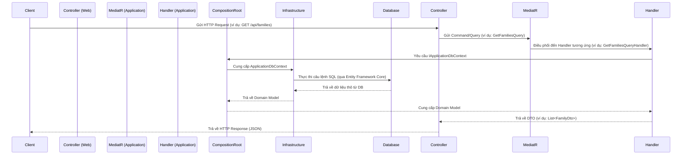

# Hướng dẫn Backend

## Mục lục

- [1. Giới thiệu](#1-giới-thiệu)
- [2. Yêu cầu môi trường](#2-yêu-cầu-môi-trường)
- [3. Cấu trúc Dự án](#3-cấu-trúc-dự-án)
- [4. Luồng Request](#4-luồng-request)
- [5. Dependency Injection](#5-dependency-injection)
- [6. Middleware](#6-middleware)
- [7. Xác thực & Phân quyền](#7-xác-thực--phân-quyền)
- [8. Tương tác Dữ liệu với Entity Framework Core](#8-tương-tác-dữ-liệu-với-entity-framework-core-updated-after-refactor)
  - [8.1. Specification Pattern](#81-specification-pattern-updated-after-refactor)
- [9. Validation](#9-validation)
- [10. Ghi nhật ký Hoạt động Người dùng (User Activity Logging)](#10-ghi-nhật-ký-hoạt-động-người-dùng-user-activity-logging)
- [11. Hướng dẫn Kiểm thử](#11-hướng-dẫn-kiểm-thử)
- [12. Logging & Monitoring](#12-logging--monitoring)
- [13. Coding Style](#13-coding-style)
- [14. Best Practices](#14-best-practices)
- [15. Tài liệu liên quan](#15-tài-liệu-liên-quan)

---

## 1. Giới thiệu

Backend của dự án được xây dựng bằng **ASP.NET Core 8** và tuân thủ theo **Clean Architecture**. Kiến trúc này giúp tách biệt các mối quan tâm, dễ dàng bảo trì và mở rộng.

## 2. Yêu cầu môi trường

-   **.NET 8 SDK**
-   **Docker** (để chạy database)
-   **Công cụ CLI**: `dotnet-ef` để quản lý migration.

## 3. Cấu trúc Dự án

Dự án được chia thành các project chính, tuân thủ theo nguyên tắc của Clean Architecture:

```
backend/
├── src/
│   ├── Domain/         # Chứa các thực thể (Entities), giá trị đối tượng (Value Objects), định nghĩa các quy tắc nghiệp vụ cốt lõi, và Domain Events. Đây là trái tim của ứng dụng, độc lập với các lớp khác.
│   ├── Application/    # Chứa logic nghiệp vụ chính của ứng dụng (Use Cases), các DTOs (Data Transfer Objects), các giao diện (Interfaces) cho các dịch vụ bên ngoài, và các Commands/Queries/Handlers theo mô hình CQRS. Bao gồm cả các UserActivities và FamilyTreeService.
│   ├── Infrastructure/ # Chứa các triển khai cụ thể của các giao diện được định nghĩa trong Application Layer. Bao gồm truy cập cơ sở dữ liệu (Entity Framework Core), dịch vụ Identity, và các dịch vụ bên ngoài khác.
│   ├── CompositionRoot/ # Nơi cấu hình Dependency Injection, kết nối các lớp Application và Infrastructure.
│   └── Web/            # Là lớp trình bày (Presentation Layer), chứa các API Controllers, cấu hình ASP.NET Core, và là điểm vào của ứng dụng.
└── tests/
    ├── Application.UnitTests/ # Chứa các Unit Tests cho Application Layer.
    └── Infrastructure.IntegrationTests/ # Chứa các Integration Tests cho Infrastructure Layer và tương tác với Database.
```
## 4. Luồng Request

Một request từ client sẽ đi qua các lớp của Clean Architecture như sau:



**Giải thích chi tiết:**

1.  **Client gửi HTTP Request**: Người dùng tương tác với Frontend, Frontend gửi một yêu cầu HTTP (GET, POST, PUT, DELETE) đến Backend API.
2.  **Controller (Web Layer) nhận Request**: Controller trong lớp `Web` nhận yêu cầu, thực hiện các kiểm tra ban đầu (ví dụ: validation của request model) và chuyển đổi request thành một `Command` hoặc `Query`.
3.  **MediatR (Application Layer) gửi Command/Query**: Controller sử dụng `MediatR` để gửi `Command` hoặc `Query` đến Application Layer. `MediatR` đóng vai trò là một mediator, giúp tách rời Controller khỏi việc biết Handler cụ thể nào sẽ xử lý yêu cầu.
4.  **Handler (Application Layer) xử lý Command/Query**: `MediatR` tìm và điều phối yêu cầu đến `Handler` tương ứng. `Handler` chứa logic nghiệp vụ chính, sử dụng các dịch vụ và `IApplicationDbContext` để thực hiện công việc.
    *   **Command Handler**: Xử lý các yêu cầu thay đổi trạng thái (tạo, cập nhật, xóa). Nó thường tương tác với `IApplicationDbContext` để lưu trữ dữ liệu và sử dụng Unit of Work để đảm bảo tính nhất quán của transaction.
    *   **Query Handler**: Xử lý các yêu cầu truy vấn dữ liệu. Nó thường tương tác với `IApplicationDbContext` để lấy dữ liệu và ánh xạ dữ liệu đó sang DTO trước khi trả về.
5.  **Composition Root (Dependency Injection)**: Tại đây, `IApplicationDbContext` (được định nghĩa trong Application Layer) được cung cấp triển khai cụ thể là `ApplicationDbContext` (từ Infrastructure Layer) thông qua Dependency Injection.
6.  **Infrastructure Layer truy cập dữ liệu**: `ApplicationDbContext` (trong Infrastructure Layer) tương tác với cơ sở dữ liệu (sử dụng Entity Framework Core).
7.  **Database thực thi**: Entity Framework Core chuyển đổi các thao tác của `ApplicationDbContext` thành các câu lệnh SQL và thực thi trên cơ sở dữ liệu MySQL.
8.  **Database trả về dữ liệu**: Cơ sở dữ liệu trả về kết quả cho `ApplicationDbContext`.
9.  **`ApplicationDbContext` trả về Domain Model**: `ApplicationDbContext` chuyển đổi dữ liệu thô từ DB thành các Domain Model (Entities) và trả về cho Handler.
10. **Handler trả về DTO**: Handler ánh xạ Domain Model sang DTO và trả về cho Controller.
11. **Controller trả về HTTP Response**: Controller nhận DTO từ Handler, định dạng thành JSON và gửi lại cho Client dưới dạng HTTP Response.

## 5. Dependency Injection

Sử dụng built-in DI container của ASP.NET Core để quản lý vòng đời của các services và inject chúng vào các thành phần cần thiết. Việc đăng ký services được tổ chức theo từng lớp (layer) để dễ quản lý và tuân thủ Clean Architecture.

#### Cách đăng ký Services

Các services được đăng ký trong các phương thức mở rộng (extension methods) `Add[Layer]Services()` của mỗi project (Application, Infrastructure) và được gọi trong `AddCompositionRootServices()` của project `CompositionRoot`. Cuối cùng, `Program.cs` của project `Web` sẽ gọi `AddCompositionRootServices()`.

**Ví dụ (`Web/Program.cs`):**

```csharp
// backend/src/Web/Program.cs

builder.Services
    .AddCompositionRootServices(builder.Configuration); // Đăng ký tất cả services từ CompositionRoot
```

**Giải thích:**

*   `AddCompositionRootServices()`: Đăng ký tất cả các services từ Application Layer và Infrastructure Layer. Bao gồm `MediatR`, `FluentValidation`, `IApplicationDbContext` (với Entity Framework Core), `IIdentityService`, `IFileStorage` và các Repository.

#### Vòng đời của Services (Service Lifetimes)

ASP.NET Core DI hỗ trợ ba loại vòng đời:

*   **Singleton**: Một instance duy nhất được tạo ra và sử dụng trong suốt vòng đời của ứng dụng.
    ```csharp
    services.AddSingleton<IMySingletonService, MySingletonService>();
    ```
*   **Scoped**: Một instance được tạo ra một lần cho mỗi request HTTP. Phù hợp cho các services cần duy trì trạng thái trong một request (ví dụ: `DbContext`).
    ```csharp
    services.AddScoped<IMyScopedService, MyScopedService>();
    ```
*   **Transient**: Một instance mới được tạo ra mỗi khi service được yêu cầu. Phù hợp cho các services nhẹ, không trạng thái.
    ```csharp
    services.AddTransient<IMyTransientService, MyTransientService>();
    ```

**Best Practice:** Luôn inject dependency qua interface để tăng tính linh hoạt và dễ kiểm thử.

## 6. Middleware

ASP.NET Core sử dụng một pipeline các middleware để xử lý các HTTP request. Mỗi middleware có thể thực hiện một tác vụ cụ thể (ví dụ: logging, authentication, routing) và sau đó chuyển request cho middleware tiếp theo trong pipeline.

#### Error Handling Middleware

*   **`UseExceptionHandler`**: Middleware này được cấu hình để bắt tất cả các exception chưa được xử lý (unhandled exceptions) trong ứng dụng. Thay vì trả về lỗi 500 mặc định của server, nó sẽ trả về một response lỗi chuẩn hóa theo định dạng `ProblemDetails` (RFC 7807) hoặc cấu trúc `Result Pattern` của chúng ta. Điều này giúp client dễ dàng xử lý lỗi một cách nhất quán.

    **Cấu hình trong `Program.cs`:**

    ```csharp
    // backend/src/Web/Program.cs
    app.UseExceptionHandler(options => { }); // Sử dụng CustomExceptionHandler đã đăng ký
    ```

    **`CustomExceptionHandler`**: Một triển khai tùy chỉnh của `IExceptionHandler` để định dạng phản hồi lỗi theo `Result Pattern`.

#### Authentication & Authorization Middleware

*   **`UseAuthentication`**: Middleware này chịu trách nhiệm xác thực người dùng. Nó đọc thông tin xác thực từ request (ví dụ: JWT Bearer Token từ header `Authorization`), xác minh tính hợp lệ của nó và tạo ra một `ClaimsPrincipal` đại diện cho người dùng đã xác thực.
*   **`UseAuthorization`**: Middleware này chịu trách nhiệm phân quyền. Sau khi người dùng được xác thực, `UseAuthorization` sẽ kiểm tra xem người dùng có quyền truy cập vào tài nguyên hoặc thực hiện hành động được yêu cầu hay không, dựa trên các chính sách phân quyền đã được định nghĩa (ví dụ: `[Authorize]` attribute).

    **Cấu hình trong `Program.cs`:**

    ```csharp
    // backend/src/Web/Program.cs
    app.UseAuthentication();
    app.UseAuthorization();
    ```

    **Lưu ý:** `UseAuthentication` phải được gọi trước `UseAuthorization` trong pipeline.

## 7. Xác thực & Phân quyền

-   **Cơ chế**: Sử dụng **JWT Bearer Token**.
-   **Provider hiện tại**: **Auth0**. Hệ thống được thiết kế để dễ dàng thay thế bằng các provider khác (Keycloak, Firebase Auth) bằng cách triển khai một `IAuthProvider` mới và sử dụng `ExternalId` để định danh người dùng.
-   **Triển khai Auth0Provider**: `backend/src/Infrastructure/Auth/Auth0Provider.cs` là triển khai của `IAuthProvider` sử dụng Auth0 Management API để quản lý người dùng (ví dụ: cập nhật hồ sơ).
-   **Cấu hình Auth0**: Các thông tin cấu hình Auth0 (Domain, Audience, ClientId, ClientSecret) được đọc từ `appsettings.json`.

    ```json
    "Auth0": {
      "Domain": "YOUR_AUTH0_DOMAIN",
      "Audience": "YOUR_AUTH0_AUDIENCE",
      "ClientId": "YOUR_M2M_CLIENT_ID",
      "ClientSecret": "YOUR_M2M_CLIENT_SECRET",
      "Namespace": "https://familytree.com/"
    }
    ```

-   **Luồng JWT**: Client lấy token từ Auth0 và gửi trong header `Authorization` của mỗi request.

Để biết thêm chi tiết về luồng xác thực, cấu hình và các cân nhắc bảo mật, vui lòng tham khảo phần [Xác thực & Phân quyền trong Kiến trúc tổng quan](./architecture.md#6-xác-thực--phân-quyền-authentication--authorization).

### 7.1. Cập nhật Hồ sơ Người dùng (User Profile Update)

Tài liệu này mô tả cách hệ thống xử lý việc cập nhật thông tin hồ sơ người dùng, với kiến trúc linh hoạt cho phép tích hợp nhiều nhà cung cấp xác thực (Auth Provider).

#### Tổng quan

Tính năng cập nhật hồ sơ người dùng cho phép người dùng thay đổi các thông tin cá nhân như tên, ảnh đại diện (avatar URL), và email (tùy thuộc vào cấu hình và quyền hạn). Kiến trúc được thiết kế để dễ dàng mở rộng hoặc thay thế nhà cung cấp xác thực mà không ảnh hưởng đến logic nghiệp vụ cốt lõi.

#### Kiến trúc

Hệ thống sử dụng **Strategy Pattern** để chọn nhà cung cấp xác thực phù hợp dựa trên cấu hình. `IAuthProvider` là interface chung định nghĩa các hoạt động xác thực và quản lý người dùng, trong khi các lớp cụ thể như `Auth0Provider` triển khai interface này cho từng nhà cung cấp.

##### Interface `IAuthProvider`

Interface này được định nghĩa trong `backend/src/Application/Common/Interfaces/IAuthProvider.cs` và bao gồm phương thức `UpdateUserProfileAsync`:

```csharp
// backend/src/Application/Common/Interfaces/IAuthProvider.cs
public interface IAuthProvider
{
    // ... các phương thức khác ...
    Task<Result> UpdateUserProfileAsync(string userId, UpdateUserProfileCommand request);
}
```

-   `userId`: ID của người dùng cần cập nhật (thường là `ExternalId`).
-   `request`: Đối tượng `UpdateUserProfileCommand` chứa các thông tin cần cập nhật.
-   `Result`: Đối tượng `Result` chuẩn của hệ thống, cho biết thao tác thành công hay thất bại.

##### `UpdateUserProfileCommand` DTO

Đối tượng này định nghĩa các trường thông tin có thể được cập nhật, nằm trong `backend/src/Application/Identity/Commands/UpdateUserProfile/UpdateUserProfileCommand.cs`:

```csharp
// backend/src/Application/Identity/Commands/UpdateUserProfile/UpdateUserProfileCommand.cs
public class UpdateUserProfileCommand : IRequest<Result>
{
    public string Id { get; set; } = null!;
    public string? Name { get; set; }
    public string? Avatar { get; set; }
    public string? Email { get; set; }
    public Dictionary<string, object>? UserMetadata { get; set; }
}
```

##### Triển khai `Auth0Provider`

`Auth0Provider` (trong `backend/src/Infrastructure/Auth/Auth0Provider.cs`) là triển khai thực tế của `IAuthProvider` và tương tác với **Auth0 Management API** để cập nhật hồ sơ người dùng.

#### Các trường được hỗ trợ cập nhật (qua Auth0 Management API):

-   `name`: Tên hiển thị của người dùng (ánh xạ tới `FullName` và `NickName` trong Auth0).
-   `avatar`: URL ảnh đại diện (ánh xạ tới `Picture` trong Auth0).
-   `email`: Địa chỉ email (cần kiểm tra quyền và trạng thái xác minh).
-   `user_metadata`: Dữ liệu tùy chỉnh của người dùng.

#### Xử lý lỗi và Bảo mật (trong triển khai thực tế):

-   **Rate Limit (HTTP 429)**: Auth0 Management API có giới hạn tần suất gọi. Triển khai thực tế cần có cơ chế retry với exponential backoff.
-   **Token Expiration**: Đảm bảo access token cho Management API luôn hợp lệ.
-   **Unauthorized (401)**: Xử lý khi không có quyền truy cập Management API.

#### Luồng cập nhật Hồ sơ Người dùng

1.  **Frontend gửi yêu cầu**: Frontend gửi một yêu cầu cập nhật hồ sơ người dùng đến Backend API (ví dụ: `PUT /api/UserProfiles/{userId}`).
2.  **Backend API nhận yêu cầu**: Controller nhận yêu cầu và gửi `UpdateUserProfileCommand` đến MediatR.
3.  **`UpdateUserProfileCommand`**: Chứa `userId` của người dùng cần cập nhật và `UpdateUserProfileCommand`.
4.  **`UpdateUserProfileCommandValidator`**: Sử dụng FluentValidation để xác thực dữ liệu đầu vào:
    -   `Id`: Không được trống.
    -   `Name`: Không quá 250 ký tự.
    -   `Email`: Phải là định dạng email hợp lệ.
    -   `Avatar`: Phải là URL hợp lệ.
5.  **`UpdateUserProfileCommandHandler`**: Xử lý logic cập nhật:
    -   **Kiểm tra quyền**: So sánh `userId` trong URL với `command.Id` trong body để đảm bảo người dùng chỉ cập nhật hồ sơ của chính họ. (Kiểm tra này được thực hiện trong Controller).
    -   Gọi `_authProvider.UpdateUserProfileAsync(userId, request)` để thực hiện cập nhật thông qua nhà cung cấp xác thực đã cấu hình.
    -   Cập nhật các trường `Name`, `Email`, `Avatar` trong thực thể `UserProfile` cục bộ.
    -   Trả về `Result` thành công hoặc thất bại.

#### Bảo mật và Kiểm soát Truy cập

-   **Chỉ cập nhật hồ sơ của chính mình**: `UserProfilesController` thực hiện kiểm tra nghiêm ngặt để đảm bảo `userId` trong URL khớp với `command.Id` trong request body, ngăn người dùng cập nhật hồ sơ của người khác.
-   **Giới hạn tần suất**: (Chưa triển khai trong mock, nhưng cần có trong triển khai thực tế) Có thể sử dụng middleware hoặc dịch vụ riêng để giới hạn số lần cập nhật trong một khoảng thời gian nhất định.
-   **Xác minh Email**: (Chưa triển khai trong mock) Trong triển khai thực tế, việc thay đổi email có thể yêu cầu xác minh lại email để đảm bảo bảo mật.
-   **Xác thực đầu vào**: `UpdateUserProfileCommandValidator` đảm bảo dữ liệu đầu vào hợp lệ trước khi xử lý.

#### Mở rộng với các Nhà cung cấp Xác thực khác

Để thêm một nhà cung cấp xác thực mới (ví dụ: Firebase, Azure AD):

1.  Tạo một lớp mới (ví dụ: `FirebaseProvider.cs`) triển khai interface `IAuthProvider`.
2.  Triển khai logic tương tác với API của nhà cung cấp đó trong lớp mới.
3.  Thêm một `case` mới vào `switch` statement trong `DependencyInjection.cs` để đăng ký `FirebaseProvider` khi `AuthProvider` trong cấu hình là `Firebase`.

#### Các lỗi Phổ biến và Mẫu Phản hồi

-   **401 Unauthorized**: Người dùng chưa được xác thực hoặc token không hợp lệ.
-   **403 Forbidden**: Người dùng đã xác thực nhưng không có quyền cập nhật hồ sơ của người khác.
-   **429 Too Many Requests**: Vượt quá giới hạn tần suất gọi API (từ nhà cung cấp xác thực).
-   **500 Internal Server Error**: Lỗi không mong muốn ở Backend hoặc từ nhà cung cấp xác thực.

Các phản hồi lỗi sẽ tuân theo [Cấu trúc Phản hồi Lỗi](#5-cấu-trúc-phản-hồi-lỗi-error-response) đã định nghĩa.

## 8. Tương tác Dữ liệu với Entity Framework Core

Trong dự án này, chúng ta sử dụng **Entity Framework Core (EF Core)** để tương tác với cơ sở dữ liệu. Thay vì sử dụng các triển khai Repository Pattern tường minh (explicit Repository Pattern) với các lớp Repository riêng biệt, chúng ta tương tác trực tiếp với `DbContext` thông qua interface `IApplicationDbContext` trong Application Layer. Cách tiếp cận này tận dụng các tính năng sẵn có của EF Core như `DbSet<TEntity>` để hoạt động như một Repository hiệu quả. **Do tính chất thực dụng, Application Layer có tham chiếu đến `Microsoft.EntityFrameworkCore` và `Ardalis.Specification.EntityFrameworkCore` để tận dụng các extension methods tiện lợi.**

#### Mục đích

*   **Đơn giản hóa:** Giảm số lượng lớp và interface cần thiết, làm cho codebase gọn gàng hơn.
*   **Tận dụng EF Core:** Sử dụng trực tiếp các tính năng mạnh mẽ của EF Core như LINQ, Change Tracking, và các phương thức CRUD có sẵn trên `DbSet<TEntity>`.
*   **Dễ kiểm thử:** `DbContext` có thể dễ dàng được mock hoặc sử dụng với In-Memory Database cho mục đích kiểm thử.

#### IApplicationDbContext

`IApplicationDbContext` là interface được định nghĩa trong Application Layer, kế thừa từ `DbContext` của EF Core. Nó cung cấp quyền truy cập vào các `DbSet` cho các thực thể (Entities) của chúng ta.

**Ví dụ (`Application/Common/Interfaces/IApplicationDbContext.cs`):**

```csharp
using Microsoft.EntityFrameworkCore;

public interface IApplicationDbContext
{
    DbSet<Family> Families { get; }
    DbSet<Member> Members { get; }
    DbSet<Event> Events { get; }
    DbSet<Relationship> Relationships { get; }
    DbSet<UserProfile> UserProfiles { get; }
    DbSet<FamilyUser> FamilyUsers { get; }
    DbSet<UserActivity> UserActivities { get; }

    Task<int> SaveChangesAsync(CancellationToken cancellationToken);
}
```

#### Cập nhật thực thể `UserProfile`

Thực thể `UserProfile` hiện bao gồm trường `Avatar` để lưu trữ URL ảnh đại diện của người dùng.

| Tên trường       | Kiểu dữ liệu | Mô tả                                      |
| :--------------- | :----------- | :----------------------------------------- |
| `Avatar`         | `string` (nullable) | URL của ảnh đại diện người dùng.         |

#### Cấu hình ánh xạ JsonDocument cho Metadata

Thuộc tính `Metadata` của thực thể `UserActivity` được lưu trữ dưới dạng JSON trong cơ sở dữ liệu. Điều này được cấu hình trong `ApplicationDbContext` bằng cách sử dụng `HasColumnType("json")`.

```csharp
// Trong ApplicationDbContext.cs (phương thức OnModelCreating)
builder.Entity<UserActivity>()
    .Property(ua => ua.Metadata)
    .HasColumnType("json");
```

#### Cập nhật thực thể `Family`

Thực thể `Family` hiện bao gồm các trường `TotalMembers` và `TotalGenerations` để theo dõi số liệu thống kê của gia đình. Các trường này được cập nhật tự động khi có thay đổi đối với các thành viên trong gia đình.

| Tên trường       | Kiểu dữ liệu | Mô tả                                      |
| :--------------- | :----------- | :----------------------------------------- |
| `TotalMembers`   | `int`        | Tổng số thành viên trong gia đình.         |
| `TotalGenerations`| `int`        | Tổng số thế hệ trong cây gia phả của gia đình. |

#### Sử dụng trong Handlers

Các Command và Query Handlers trong Application Layer sẽ inject `IApplicationDbContext` và sử dụng trực tiếp các `DbSet` để thực hiện các thao tác CRUD.

**Ví dụ sử dụng trong Handler (CreateFamilyCommand):**

```csharp
// backend/src/Application/Families/Commands/CreateFamily/CreateFamilyCommandHandler.cs
public class CreateFamilyCommandHandler : IRequestHandler<CreateFamilyCommand, Result<Guid>>
{
    private readonly IApplicationDbContext _context;

    public CreateFamilyCommandHandler(IApplicationDbContext context)
    {
        _context = context;
    }

    public async Task<Result<Guid>> Handle(CreateFamilyCommand request, CancellationToken cancellationToken)
    {
        var entity = new Family { Name = request.Name, Description = request.Description };

        _context.Families.Add(entity); // Thêm thực thể trực tiếp vào DbSet
        await _context.SaveChangesAsync(cancellationToken); // Lưu thay đổi

        return Result<Guid>.Success(entity.Id);
    }
}
```

#### Unit of Work Pattern

Trong dự án này, `ApplicationDbContext` của Entity Framework Core đóng vai trò là Unit of Work. Phương thức `SaveChangesAsync()` trên `DbContext` sẽ commit tất cả các thay đổi đã được theo dõi trong một giao dịch duy nhất.

**Ví dụ sử dụng trong Handler (CreateFamilyCommand):**

```csharp
// backend/src/Application/Families/Commands/CreateFamily/CreateFamilyCommandHandler.cs
public class CreateFamilyCommandHandler : IRequestHandler<CreateFamilyCommand, Result<Guid>>
{
    private readonly IApplicationDbContext _context; // IApplicationDbContext kế thừa từ DbContext

    public CreateFamilyCommandHandler(IApplicationDbContext context)
    {
        _context = context;
    }

    public async Task<Result<Guid>> Handle(CreateFamilyCommand request, CancellationToken cancellationToken)
    {
        var entity = new Family { Name = request.Name, Description = request.Description };

        _context.Families.Add(entity);
        await _context.SaveChangesAsync(cancellationToken); // SaveChangesAsync hoạt động như Commit của Unit of Work

        return Result<Guid>.Success(entity.Id);
    }
}
```

#### Kiểm thử với In-Memory Database

Để kiểm thử các Handlers tương tác với dữ liệu, chúng ta có thể sử dụng In-Memory Database của Entity Framework Core.

**Ví dụ trong Unit Test:**

```csharp
// Trong file test (ví dụ: backend/tests/Application.UnitTests/Common/TestDbContextFactory.cs)

// Tạo một DbContext sử dụng In-Memory Database cho mục đích test
var options = new DbContextOptionsBuilder<ApplicationDbContext>()
    .UseInMemoryDatabase(databaseName: Guid.NewGuid().ToString()) // Sử dụng tên DB duy nhất cho mỗi test
    .Options;

var context = new ApplicationDbContext(options);
context.Database.EnsureCreated(); // Đảm bảo database được tạo

// Sử dụng context trực tiếp trong test
var handler = new CreateFamilyCommandHandler(context);
var command = new CreateFamilyCommand("Test Family", "Description");
var result = await handler.Handle(command, CancellationToken.None);

// ... kiểm tra kết quả ...

// Sau khi test, có thể xóa database
context.Database.EnsureDeleted();
context.Dispose();
```

## 8.1. Specification Pattern

Specification Pattern là một mẫu thiết kế giúp đóng gói logic nghiệp vụ để lọc hoặc truy vấn dữ liệu. Thay vì nhúng các điều kiện lọc trực tiếp vào các Query Handlers, chúng ta có thể định nghĩa chúng dưới dạng các "specification" có thể tái sử dụng. Điều này giúp giữ cho Query Handlers gọn gàng, dễ đọc và dễ kiểm thử hơn.

#### Mục đích

*   **Tách biệt mối quan tâm:** Tách biệt logic lọc dữ liệu khỏi logic nghiệp vụ chính trong Query Handlers.
*   **Tái sử dụng:** Các specification có thể được tái sử dụng trên nhiều Query Handlers hoặc các ngữ cảnh khác nhau.
*   **Dễ kiểm thử:** Mỗi specification có thể được kiểm thử độc lập.
*   **Dễ đọc:** Làm cho các truy vấn dữ liệu trở nên rõ ràng và dễ hiểu hơn.

#### Triển khai trong dự án

Trong dự án này, chúng ta sử dụng thư viện `Ardalis.Specification` và `Ardalis.Specification.EntityFrameworkCore` để triển khai Specification Pattern. Thư viện này cung cấp một cách mạnh mẽ để định nghĩa các tiêu chí truy vấn, bao gồm lọc, sắp xếp, phân trang và bao gồm các mối quan hệ.

Thay vì một `Specification` tổng hợp, chúng ta tạo các `Specification` nhỏ hơn, tập trung vào một tiêu chí lọc hoặc sắp xếp cụ thể. Các `Specification` này sau đó được áp dụng trực tiếp trong `Query Handler`.

**Ví dụ về các Specification nhỏ hơn (`Application/Events/Specifications/EventSearchTermSpecification.cs`):**

```csharp
public class EventSearchTermSpecification : Specification<Event>
{
    public EventSearchTermSpecification(string? searchTerm)
    {
        if (!string.IsNullOrEmpty(searchTerm))
        {
            Query.Where(e => e.Name.Contains(searchTerm) || (e.Description != null && e.Description.Contains(searchTerm)));
        }
    }
}
```

**Ví dụ về Specification cho sắp xếp (`Application/Events/Specifications/EventOrderingSpecification.cs`):**

```csharp
public class EventOrderingSpecification : Specification<Event>
{
    public EventOrderingSpecification(string? sortBy, string? sortOrder)
    {
        if (!string.IsNullOrEmpty(sortBy))
        {
            switch (sortBy.ToLower())
            {
                case "name":
                    if (sortOrder == "desc")
                        Query.OrderByDescending(e => e.Name);
                    else
                        Query.OrderBy(e => e.Name);
                    break;
                case "startdate":
                    if (sortOrder == "desc")
                        Query.OrderByDescending(e => e.StartDate);
                    else
                        Query.OrderBy(e => e.StartDate);
                    break;
                case "created":
                    if (sortOrder == "desc")
                        Query.OrderByDescending(e => e.Created);
                    else
                        Query.OrderBy(e => e.Created);
                    break;
                default:
                    Query.OrderBy(e => e.StartDate); // Default sort
                    break;
            }
        }
        else
        {
            Query.OrderBy(e => e.StartDate); // Default sort if no sortBy is provided
        }
    }
}
```

**Ví dụ về Specification cho Quan hệ (`Application/Relationships/Specifications/RelationshipBySourceMemberIdSpecification.cs`):**

```csharp
public class RelationshipBySourceMemberIdSpecification : Specification<Relationship>
{
    public RelationshipBySourceMemberIdSpecification(Guid? sourceMemberId)
    {
        if (sourceMemberId.HasValue)
        {
            Query.Where(r => r.SourceMemberId == sourceMemberId.Value);
        }
    }
}
```

**Ví dụ sử dụng các Specification trong Query Handler (`Application/Events/Queries/SearchEvents/SearchEventsQueryHandler.cs`):**

```csharp
public class SearchEventsQueryHandler : IRequestHandler<SearchEventsQuery, Result<PaginatedList<EventDto>>>
{
    private readonly IApplicationDbContext _context;
    private readonly IMapper _mapper;

    public SearchEventsQueryHandler(IApplicationDbContext context, IMapper mapper)
    {
        _context = context;
        _mapper = mapper;
    }

    public async Task<Result<PaginatedList<EventDto>>> Handle(SearchEventsQuery request, CancellationToken cancellationToken)
    {
        var query = _context.Events.AsQueryable();

        // Apply individual specifications for filtering
        query = query.WithSpecification(new EventSearchTermSpecification(request.SearchQuery));
        query = query.WithSpecification(new EventDateRangeSpecification(request.StartDate, request.EndDate));
        query = query.WithSpecification(new EventTypeSpecification(request.Type));
        query = query.WithSpecification(new EventByFamilyIdSpecification(request.FamilyId));
        query = query.WithSpecification(new EventByMemberIdSpecification(request.MemberId));

        // Apply ordering specification
        query = query.WithSpecification(new EventOrderingSpecification(request.SortBy, request.SortOrder));

        var paginatedList = await query
            .ProjectTo<EventDto>(_mapper.ConfigurationProvider)
            .PaginatedListAsync(request.Page, request.ItemsPerPage);

        return Result<PaginatedList<EventDto>>.Success(paginatedList);
    }
}
```

## 9. Validation

Dự án sử dụng **FluentValidation** để xác thực các `Command` và `Query` trước khi chúng được xử lý bởi các `Handler`. Cơ chế này được tích hợp vào pipeline của MediatR thông qua một `ValidationBehaviour`.

### 9.1. Cách hoạt động

1.  **Tạo Validator**: Đối với mỗi `Command` hoặc `Query` cần xác thực, một class validator tương ứng kế thừa từ `AbstractValidator<T>` sẽ được tạo. Ví dụ, `CreateFamilyCommandValidator` cho `CreateFamilyCommand`.
2.  **Đăng ký tự động**: Tất cả các validator trong `Application` assembly sẽ được tự động đăng ký với DI container nhờ vào `services.AddValidatorsFromAssembly(...)` trong `Application/DependencyInjection.cs`.
3.  **Pipeline `ValidationBehaviour`**: `ValidationBehaviour` sẽ chặn tất cả các request, tìm validator tương ứng, và thực thi nó. Nếu có lỗi, nó sẽ ném ra một `ValidationException`.
4.  **Xử lý lỗi toàn cục**: `CustomExceptionHandler` sẽ bắt `ValidationException` và trả về một response `400 Bad Request` với danh sách các lỗi.

### 9.2. Các Validator hiện có

#### Family Commands

-   **`CreateFamilyCommandValidator`**:
    -   `Name`: Không được để trống, tối đa 200 ký tự.
-   **`UpdateFamilyCommandValidator`**:
    -   `Id`: Không được để trống.
    -   `Name`: Không được để trống, tối đa 200 ký tự.
-   **`DeleteFamilyCommandValidator`**:
    -   `Id`: Không được để trống.

#### Member Commands

-   **`CreateMemberCommandValidator`**:
    -   `FamilyId`: Không được để trống.
    -   `FirstName`: Không được để trống, tối đa 100 ký tự.
    -   `LastName`: Không được để trống, tối đa 100 ký tự.
-   **`UpdateMemberCommandValidator`**:
    -   `Id`: Không được để trống.
    -   `FamilyId`: Không được để trống.
    -   `FirstName`: Không được để trống, tối đa 100 ký tự.
    -   `LastName`: Không được để trống, tối đa 100 ký tự.
-   **`DeleteMemberCommandValidator`**:
    -   `Id`: Không được để trống.

#### Event Commands

-   **`CreateEventCommandValidator`**:
    -   `Name`: Không được để trống, tối đa 200 ký tự.
    -   `StartDate`: Không được để trống.
    -   `Description`: Tối đa 1000 ký tự.
    -   `Location`: Tối đa 200 ký tự.
    -   `Color`: Tối đa 20 ký tự.
-   **`UpdateEventCommandValidator`**:
    -   `Id`: Không được để trống.
    -   `Name`: Không được để trống, tối đa 200 ký tự.
    -   `StartDate`: Không được để trống.
    -   `Description`: Tối đa 1000 ký tự.
    -   `Location`: Tối đa 200 ký tự.
    -   `Color`: Tối đa 20 ký tự.
-   **`DeleteEventCommandValidator`**:
    -   `Id`: Không được để trống.

#### Relationship Commands

-   **`CreateRelationshipCommandValidator`**:
    -   `SourceMemberId`: Không được để trống.
    -   `TargetMemberId`: Không được để trống.
    -   `Type`: Không được để trống.
-   **`UpdateRelationshipCommandValidator`**:
    -   `Id`: Không được để trống.
    -   `SourceMemberId`: Không được để trống.
    -   `TargetMemberId`: Không được để trống.
    -   `Type`: Không được để trống.
-   **`DeleteRelationshipCommandValidator`**:
    -   `Id`: Không được để trống.

## 10. Quản lý Cây Gia Phả (Family Tree Management)

Để duy trì tính toàn vẹn và cung cấp thông tin chính xác về cây gia phả, hệ thống tự động tính toán và cập nhật các số liệu thống kê của gia đình như tổng số thành viên và tổng số thế hệ.

### 10.1. Dịch vụ `FamilyTreeService`

`FamilyTreeService` (`backend/src/Application/Services/FamilyTreeService.cs`) là một dịch vụ chịu trách nhiệm tính toán các số liệu thống kê liên quan đến cây gia phả.

-   **`IFamilyTreeService`** (`backend/src/Application/Common/Interfaces/IFamilyTreeService.cs`):
    -   Định nghĩa giao diện cho dịch vụ cây gia phả.
    -   Bao gồm các phương thức:
        -   `CalculateTotalMembers(Guid familyId)`: Tính tổng số thành viên trong một gia đình.
        -   `CalculateTotalGenerations(Guid familyId)`: Tính tổng số thế hệ trong cây gia phả của một gia đình (sử dụng thuật toán duyệt cây).
        -   `UpdateFamilyStats(Guid familyId)`: Cập nhật cả `TotalMembers` và `TotalGenerations` cho một gia đình cụ thể.

### 10.2. Tích hợp vào các Command Handlers

`FamilyTreeService` được inject vào các Command Handlers liên quan đến `Family` và `Member`. Sau mỗi thao tác tạo, cập nhật hoặc xóa thành viên/gia đình, phương thức `UpdateFamilyStats` sẽ được gọi để đảm bảo các số liệu thống kê của gia đình luôn được cập nhật.

-   **`CreateMemberCommandHandler`**
-   **`UpdateMemberCommandHandler`**
-   **`DeleteMemberCommandHandler`**
-   **`CreateFamilyCommandHandler`**
-   **`UpdateFamilyCommandHandler`**
-   **`DeleteFamilyCommandHandler`**

## 11. Ghi nhật ký Hoạt động Người dùng (User Activity Logging)

Tính năng ghi nhật ký hoạt động người dùng được triển khai để theo dõi các hành động quan trọng của người dùng trong hệ thống, phục vụ mục đích kiểm toán và cung cấp thông tin cho nguồn cấp dữ liệu hoạt động của người dùng.

### 10.1. Thực thể `UserActivity`

Thực thể `UserActivity` (`backend/src/Domain/Entities/UserActivity.cs`) lưu trữ chi tiết về mỗi hành động của người dùng.

| Tên trường      | Kiểu dữ liệu | Mô tả                                                              |
| :-------------- | :----------- | :----------------------------------------------------------------- |
| `Id`            | `Guid`       | ID duy nhất của hoạt động.                                         |
| `UserProfileId` | `Guid`       | ID của hồ sơ người dùng thực hiện hành động.                       |
| `UserProfile`   | `UserProfile`| Thuộc tính điều hướng đến hồ sơ người dùng.                        |
| `ActionType`    | `UserActionType`| Loại hành động được thực hiện (ví dụ: `Login`, `CreateFamily`).    |
| `TargetType`    | `TargetType` | Loại tài nguyên bị ảnh hưởng (ví dụ: `Family`, `Member`).          |
| `TargetId`      | `Guid`       | ID của tài nguyên bị ảnh hưởng.                                    |
| `Metadata`      | `JsonDocument`| Dữ liệu tùy chọn dưới dạng JSON để lưu trữ chi tiết bổ sung.       |
| `ActivitySummary`| `string`     | Tóm tắt hoạt động để hiển thị.                                     |
| `Created`       | `DateTime`   | Thời điểm hoạt động được ghi lại.                                  |

#### Enums liên quan

-   **`UserActionType`** (`backend/src/Domain/Enums/UserActionType.cs`): Định nghĩa các loại hành động:
    -   `Login`, `Logout`
    -   `CreateFamily`, `UpdateFamily`, `DeleteFamily`
    -   `CreateMember`, `UpdateMember`, `DeleteMember`
    -   `ChangeRole`
-   **`TargetType`** (`backend/src/Domain/Enums/TargetType.cs`): Định nghĩa các loại tài nguyên:
    -   `Family`, `Member`, `UserProfile`

### 10.2. Ghi lại Hoạt động (Record Activity)

Hoạt động được ghi lại bằng cách gửi `RecordActivityCommand` thông qua MediatR.

-   **`RecordActivityCommand`** (`backend/src/Application/UserActivities/Commands/RecordActivity/RecordActivityCommand.cs`):
    -   Chứa các thông tin cần thiết để tạo một `UserActivity` mới.
-   **`RecordActivityCommandHandler`** (`backend/src/Application/UserActivities/Commands/RecordActivity/RecordActivityCommandHandler.cs`):
    -   Nhận `RecordActivityCommand`, tạo thực thể `UserActivity` và lưu vào cơ sở dữ liệu.
    -   Việc lưu được thực hiện bất đồng bộ (`await _context.SaveChangesAsync()`) để không chặn luồng chính.

### 10.3. Truy vấn Hoạt động Gần đây (Get Recent Activities)

Để lấy danh sách các hoạt động gần đây, sử dụng `GetRecentActivitiesQuery`.

-   **`GetRecentActivitiesQuery`** (`backend/src/Application/UserActivities/Queries/GetRecentActivities/GetRecentActivitiesQuery.cs`):
    -   Cho phép lọc theo `Limit`, `TargetType`, `TargetId`, `FamilyId`.
-   **`GetRecentActivitiesQueryHandler`** (`backend/src/Application/UserActivities/Queries/GetRecentActivities/GetRecentActivitiesQueryHandler.cs`):
    -   Sử dụng `UserActivityByUserSpec` để lọc và sắp xếp các hoạt động.
    -   Thực thi kiểm soát truy cập: chỉ cho phép người dùng xem hoạt động của chính họ.
-   **`UserActivityDto`** (`backend/src/Application/UserActivities/Queries/UserActivityDto.cs`):
    -   DTO để truyền dữ liệu hoạt động người dùng.

### 10.4. Specification `UserActivityByUserSpec`

-   **`UserActivityByUserSpec`** (`backend/src/Application/UserActivities/Specifications/UserActivityByUserSpec.cs`):
    -   Lọc hoạt động theo `UserProfileId` và các tiêu chí tùy chọn khác.
    -   Sắp xếp theo `Created` giảm dần và giới hạn số lượng kết quả (`Take(limit)`) để tối ưu hiệu suất.

### 10.5. API Endpoint

-   **`UserActivitiesController`** (`backend/src/Web/Controllers/UserActivitiesController.cs`):
    -   Cung cấp endpoint `GET /api/activities/recent` để truy vấn các hoạt động gần đây.
    -   Hỗ trợ các tham số `limit`, `targetType`, `targetId`, `familyId` qua query string.
    -   Yêu cầu xác thực (`[Authorize]`).

## 11. Module AI (AI Module)

Module AI được thiết kế để hỗ trợ sinh tiểu sử (biography) cho các thành viên trong gia đình bằng cách sử dụng các nhà cung cấp AI khác nhau. Module này tuân thủ các nguyên tắc Clean Architecture, cho phép dễ dàng mở rộng và thay đổi nhà cung cấp AI.

### 11.1. Thực thể `AIBiography`

Thực thể `AIBiography` (`backend/src/Domain/Entities/AIBiography.cs`) lưu trữ thông tin về tiểu sử được sinh bởi AI.

| Tên trường       | Kiểu dữ liệu | Mô tả                                                              |
| :--------------- | :----------- | :----------------------------------------------------------------- |
| `Id`             | `Guid`       | ID duy nhất của tiểu sử.                                           |
| `MemberId`       | `Guid`       | ID của thành viên mà tiểu sử được sinh ra.                         |
| `Member`         | `Member`     | Thuộc tính điều hướng đến thành viên.                              |
| `Style`          | `BiographyStyle`| Kiểu giọng văn của tiểu sử (ví dụ: cảm động, lịch sử).             |
| `Content`        | `string`     | Nội dung tiểu sử được sinh ra.                                     |
| `Provider`       | `AIProviderType`| Nhà cung cấp AI được sử dụng.                                     |
| `UserPrompt`     | `string`     | Prompt gốc mà người dùng đã nhập (hoặc prompt tự động sinh).       |
| `GeneratedFromDB`| `bool`       | True nếu tiểu sử được sinh từ dữ liệu DB, false nếu từ UserPrompt. |
| `TokensUsed`     | `int`        | Số lượng token đã sử dụng để sinh tiểu sử.                         |
| `Metadata`       | `JsonDocument`| Dữ liệu tùy chọn dưới dạng JSON về quá trình sinh.                 |
| `CreatedAt`      | `DateTime`   | Thời điểm tiểu sử được sinh ra.                                    |

#### Enums liên quan

-   **`BiographyStyle`** (`backend/src/Domain/Enums/BiographyStyle.cs`): Định nghĩa các kiểu giọng văn:
    -   `Emotional`, `Historical`, `Storytelling`, `Formal`, `Informal`.
-   **`AIProviderType`** (`backend/src/Domain/Enums/AIProviderType.cs`): Định nghĩa các nhà cung cấp AI:
    -   `None`, `Gemini`, `OpenAI`, `LocalAI`.

### 11.2. Giao diện và DTOs

-   **`IAIContentGenerator`** (`backend/src/Application/Common/Interfaces/IAIContentGenerator.cs`):
    -   Giao diện cho các dịch vụ sinh nội dung AI. Có phương thức `GenerateContentAsync`.
-   **`IAIUsageTracker`** (`backend/src/Application/Common/Interfaces/IAIUsageTracker.cs`):
    -   Giao diện để theo dõi và quản lý việc sử dụng AI (giới hạn token, giới hạn lượt gọi hàng ngày).
-   **`AIRequest`** (`backend/src/Application/AI/Common/AIRequest.cs`):
    -   Chứa thông tin yêu cầu gửi đến AI provider (UserPrompt, Style, Language, MaxTokens, v.v.).
-   **`AIResult`** (`backend/src/Application/AI/Common/AIResult.cs`):
    -   Chứa kết quả trả về từ AI provider (Content, TokensUsed, Provider, GeneratedAt, ErrorMessage).
-   **`BiographyResultDto`** (`backend/src/Application/AI/Common/BiographyResultDto.cs`):
    -   DTO cho phản hồi API khi sinh tiểu sử.
-   **`AIProviderDto`** (`backend/src/Application/AI/Queries/AIProviderDto.cs`):
    -   DTO cho thông tin nhà cung cấp AI và trạng thái sử dụng.

### 11.3. Commands và Queries

-   **`GenerateBiographyCommand`** (`backend/src/Application/AI/Commands/GenerateBiography/GenerateBiographyCommand.cs`):
    -   Lệnh để yêu cầu sinh tiểu sử. Handler sẽ tổng hợp prompt từ DB nếu không có UserPrompt.
-   **`GenerateBiographyCommandHandler`** (`backend/src/Application/AI/Commands/GenerateBiography/GenerateBiographyCommandHandler.cs`):
    -   Xử lý lệnh `GenerateBiographyCommand`, gọi `IAIUsageTracker` và `IAIContentGenerator`.
-   **`GetLastUserPromptQuery`** (`backend/src/Application/AI/Queries/GetLastUserPrompt/GetLastUserPromptQuery.cs`):
    -   Truy vấn để lấy prompt người dùng gần nhất cho một thành viên.
-   **`GetLastUserPromptQueryHandler`** (`backend/src/Application/AI/Queries/GetLastUserPrompt/GetLastUserPromptQueryHandler.cs`):
    -   Xử lý truy vấn `GetLastUserPromptQuery`.
-   **`GetAIProvidersQuery`** (`backend/src/Application/AI/Queries/GetAIProviders/GetAIProvidersQuery.cs`):
    -   Truy vấn để lấy danh sách các nhà cung cấp AI và trạng thái sử dụng.
-   **`GetAIProvidersQueryHandler`** (`backend/src/Application/AI/Queries/GetAIProviders/GetAIProvidersQueryHandler.cs`):
    -   Xử lý truy vấn `GetAIProvidersQuery`.

### 11.4. Triển khai Infrastructure

-   **`AIConfig`** (`backend/src/Infrastructure/AI/AIConfig.cs`):
    -   Lớp cấu hình đọc từ `appsettings.json` để định nghĩa nhà cung cấp AI mặc định, API Keys, giới hạn token, v.v.
-   **`IAISettings`** (`backend/src/Application/Common/Interfaces/IAISettings.cs`):
    -   Giao diện cấu hình AI được định nghĩa trong Application Layer để tuân thủ Clean Architecture.
-   **Các `AIContentGenerator`** (`GeminiAIContentGenerator`, `OpenAIAIContentGenerator`, `LocalAIContentGenerator`):
    -   Triển khai `IAIContentGenerator` cho từng nhà cung cấp AI cụ thể.
-   **`AIUsageTracker`** (`backend/src/Infrastructure/AI/AIUsageTracker.cs`):
    -   Triển khai `IAIUsageTracker` để theo dõi và giới hạn việc sử dụng AI (sử dụng `MemoryCache` để lưu trữ tạm thời).

### 11.5. API Endpoints

-   **`AIController`** (`backend/src/Web/Controllers/AIController.cs`):
    -   `POST /api/ai/biography/{memberId}`: Sinh tiểu sử.
    -   `GET /api/ai/biography/last-prompt/{memberId}`: Lấy prompt cuối cùng.
    -   `GET /api/ai/biography/providers`: Liệt kê các nhà cung cấp AI.

## 12. Hướng dẫn Kiểm thử

## 13. Logging & Monitoring

Logging và Monitoring là các khía cạnh quan trọng để theo dõi hoạt động của ứng dụng, phát hiện lỗi và đánh giá hiệu suất.

#### 1. Logging

*   **Công cụ**: Sử dụng `ILogger` của .NET Core làm abstraction cho logging, và **Serilog** làm implementation. Serilog là một thư viện logging mạnh mẽ, linh hoạt, cho phép ghi log ra nhiều sink khác nhau (console, file, database, các hệ thống log tập trung).
*   **Cấu hình**: Serilog được cấu hình trong `Program.cs` hoặc thông qua `appsettings.json`.
*   **Mục đích**: Ghi lại các sự kiện quan trọng của ứng dụng (thông tin, cảnh báo, lỗi, debug) để hỗ trợ debug, phân tích hành vi người dùng và theo dõi các vấn đề.
*   **Best Practice**: 
    *   Sử dụng các cấp độ log phù hợp (Information, Warning, Error, Debug, Verbose).
    *   Tránh ghi log thông tin nhạy cảm.
    *   Sử dụng structured logging để dễ dàng tìm kiếm và phân tích log.

#### 2. Monitoring (Chưa triển khai)

*   **Kế hoạch**: Sẽ tích hợp **OpenTelemetry** để thu thập metrics (số liệu), traces (dấu vết) và logs. OpenTelemetry là một bộ công cụ mã nguồn mở cung cấp một cách chuẩn hóa để thu thập dữ liệu telemetry từ các ứng dụng.
*   **Mục đích**: 
    *   **Metrics**: Thu thập các số liệu về hiệu suất (CPU, RAM, số lượng request, thời gian phản hồi) để theo dõi sức khỏe của hệ thống.
    *   **Traces**: Theo dõi luồng của một request qua nhiều services và components, giúp xác định nguyên nhân gốc rễ của các vấn đề về hiệu suất hoặc lỗi trong hệ thống phân tán.
*   **Công cụ tích hợp**: Dự kiến tích hợp với Prometheus (để lưu trữ metrics) và Grafana (để trực quan hóa metrics và traces).

## 14. Coding Style

-   Sử dụng `dotnet format` để duy trì code style nhất quán.
-   Tuân thủ [Microsoft C# Coding Conventions](https://docs.microsoft.com/en-us/dotnet/csharp/fundamentals/coding-style/coding-conventions).

## 15. Best Practices

Để duy trì chất lượng mã nguồn cao, dễ bảo trì và mở rộng, hãy tuân thủ các nguyên tắc và thực tiễn tốt nhất sau:

*   **Luôn inject dependency qua interface**: Thay vì inject trực tiếp các class cụ thể, hãy inject qua interface. Điều này giúp giảm sự phụ thuộc chặt chẽ (tight coupling), tăng tính linh hoạt và khả năng kiểm thử của code.

    **Ví dụ:**
    ```csharp
    // Tốt
    public class MyService(IMyDependency dependency) { /* ... */ }

    // Không tốt
    public class MyService(MyConcreteDependency dependency) { /* ... */ }
    ```

*   **Sử dụng `CancellationToken` trong các phương thức async**: Khi làm việc với các thao tác bất đồng bộ (`async/await`), luôn truyền và kiểm tra `CancellationToken`. Điều này cho phép hủy bỏ các thao tác đang chạy dở một cách duyên dáng, giúp cải thiện hiệu suất và khả năng phản hồi của ứng dụng, đặc biệt trong các tình huống timeout hoặc khi người dùng hủy yêu cầu.

    **Ví dụ:**
    ```csharp
    public async Task<Result<List<FamilyDto>>> Handle(GetFamiliesQuery request, CancellationToken cancellationToken)
    {
        // ...
        await _context.Families.ToListAsync(cancellationToken);
        // ...
    }
    ```

*   **Áp dụng Unit of Work pattern**: Khi cần thực hiện nhiều thao tác thêm, sửa, xóa trong một transaction duy nhất để đảm bảo tính nhất quán của dữ liệu, hãy sử dụng Unit of Work. Trong Entity Framework Core, `DbContext` đóng vai trò là Unit of Work, và `SaveChangesAsync()` sẽ commit tất cả các thay đổi.

*   **Sử dụng `async/await` một cách nhất quán**: Luôn sử dụng `async` và `await` cho các thao tác I/O-bound để giải phóng thread và cải thiện khả năng mở rộng của ứng dụng. Tránh `async void` (trừ các event handler) và `Task.Result` hoặc `Task.Wait()` vì chúng có thể dẫn đến deadlock.

*   **Sử dụng `Result Pattern` cho các thao tác nghiệp vụ**: Thay vì throw exception cho các trường hợp lỗi nghiệp vụ (ví dụ: không tìm thấy tài nguyên, dữ liệu không hợp lệ), hãy trả về một đối tượng `Result<T>` để chỉ rõ thành công hay thất bại và cung cấp thông tin lỗi chi tiết. Điều này giúp luồng code rõ ràng hơn và dễ dàng xử lý lỗi ở phía gọi.

*   **Validation đầu vào**: Luôn xác thực dữ liệu đầu vào ở biên của ứng dụng (ví dụ: trong các Command/Query Validators sử dụng FluentValidation) để đảm bảo dữ liệu hợp lệ trước khi xử lý logic nghiệp vụ.

*   **Tách biệt mối quan tâm (Separation of Concerns)**: Tuân thủ chặt chẽ Clean Architecture bằng cách đảm bảo mỗi lớp chỉ có một trách nhiệm duy nhất và không phụ thuộc vào các lớp bên ngoài nó. **Lưu ý: Do tính chất thực dụng, Application Layer có tham chiếu đến `Microsoft.EntityFrameworkCore` và `Ardalis.Specification.EntityFrameworkCore` để tận dụng các extension methods tiện lợi, đây là một sự đánh đổi để đơn giản hóa code trong khi vẫn giữ được phần lớn lợi ích của Clean Architecture.**

*   **Sử dụng DTOs (Data Transfer Objects)**: Luôn ánh xạ Domain Entities sang DTOs khi trả về dữ liệu cho client hoặc khi nhận dữ liệu từ client. Điều này giúp bảo vệ Domain Model khỏi việc bị lộ ra ngoài và cho phép tùy chỉnh cấu trúc dữ liệu cho từng trường hợp sử dụng.

*   **Sử dụng `Result Pattern` nhất quán cho các thao tác nghiệp vụ (updated after refactor)**:
    *   Tất cả các `Command` và `Query` handlers nên trả về một đối tượng `Result<T>` (hoặc `Result<Unit>` cho các thao tác không trả về dữ liệu) để chỉ rõ thành công hay thất bại và cung cấp thông tin lỗi chi tiết.
    *   Các `Controller` nên kiểm tra `Result.IsSuccess` và trả về các `ActionResult` phù hợp (ví dụ: `Ok(result.Value)`, `BadRequest(result.Error)`, `NotFound(result.Error)`). Điều này giúp chuẩn hóa việc xử lý phản hồi API và tránh việc throw exceptions không cần thiết.

## 16. Tài liệu liên quan

-   [Kiến trúc tổng quan](./architecture.md)
-   [Hướng dẫn API](./api-reference.md)
-   [Hướng dẫn Kiểm thử](./testing-guide.md)