# Mô hình Dữ liệu và Schema Database

## Mục lục

- [1. Giới thiệu](#1-giới-thiệu)
- [2. Sơ đồ quan hệ thực thể (ERD)](#2-sơ-đồ-quan-hệ-thực-thể-erd)
- [3. Mô tả các bảng](#3-mô-tả-các-bảng)
- [3.1. Bảng User](#31-bảng-user)
  - [3.2. Bảng UserProfile](#32-bảng-userprofile)
  - [3.3. Bảng `FamilyUsers`](#33-bảng-familyusers)
  - [3.4. Enum `FamilyRole`](#34-enum-familyrole)
  - [3.5. Bảng `Families`](#35-bảng-families)
  - [3.6. Bảng `Members`](#36-bảng-members)
  - [3.7. Bảng `Faces`](#37-bảng-faces)
  - [3.8. Bảng `Events`](#38-bảng-events)
  - [3.9. Bảng `Relationships`](#39-bảng-relationships)
  - [3.10. Bảng `EventMembers`](#310-bảng-eventmembers)
  - [3.11. Bảng `UserPreferences`](#311-bảng-userpreferences)
  - [3.12. Bảng `FileMetadata`](#312-bảng-filemetadata)
  - [3.13. Bảng `FileUsage`](#313-bảng-fileusage)
  - [3.14. Bảng `UserActivities`](#314-bảng-useractivities)
  - [3.15. Enums](#315-enums)
  - [3.16. Value Objects](#316-value-objects)
  - [3.17. Constants](#317-constants)
- [4. Toàn vẹn và Ràng buộc Dữ liệu](#4-toàn-vẹn-và-ràng-buộc-dữ-liệu)
- [5. Hướng dẫn Mapping](#5-hướng-dẫn-mapping)
  - [5.1. Backend (Entity Framework Core)](#51-backend-entity-framework-core)
  - [5.2. Frontend (Vue.js)](#52-frontend-vuejs)
- [6. Ví dụ Dữ liệu JSON](#6-ví-dụ-dữ-liệu-json)

---

## 1. Giới thiệu

Tài liệu này mô tả chi tiết về mô hình dữ liệu, schema của database (MySQL), và các quy tắc ràng buộc nhằm đảm bảo tính nhất quán và toàn vẹn của dữ liệu trong hệ thống Cây Gia Phả.

## 2. Sơ đồ quan hệ thực thể (ERD)

```mermaid
erDiagram
    USER {
        string Id PK "ID duy nhất"
        string AuthProviderId "ID người dùng từ nhà cung cấp xác thực"
        string SubscriberId "ID người đăng ký Novu"
        string Email "Email người dùng"
        datetime Created "Thời gian tạo"
        string CreatedBy "Người tạo"
        datetime LastModified "Thời gian cập nhật cuối cùng"
        string LastModifiedBy "Người cập nhật cuối cùng"
    }

    USER_PROFILE {
        string UserId PK,FK "ID người dùng"
        string Name "Tên hiển thị"
        string FirstName "Tên riêng"
        string LastName "Họ"
        string Phone "Số điện thoại"
        string Avatar "URL ảnh đại diện"
        datetime Created "Thời gian tạo"
        string CreatedBy "Người tạo"
        datetime LastModified "Thời gian cập nhật cuối cùng"
        string LastModifiedBy "Người cập nhật cuối cùng"
    }

    USER_PREFERENCE {
        string UserId PK,FK "ID người dùng"
        int Theme "Chủ đề giao diện"
        int Language "Ngôn ngữ"
        datetime Created "Thời gian tạo"
        string CreatedBy "Người tạo"
        datetime LastModified "Thời gian cập nhật cuối cùng"
        string LastModifiedBy "Người cập nhật cuối cùng"
    }

    FAMILY {
        string Id PK "ID duy nhất"
        string Name "Tên gia đình"
        string Code "Mã gia đình"
        string Description "Mô tả"
        string AvatarUrl "URL ảnh đại diện"
        string Address "Địa chỉ"
        int Visibility "Chế độ hiển thị (Enum int)"
        int TotalMembers "Tổng số thành viên"
        int TotalGenerations "Tổng số thế hệ"
        datetime Created "Thời gian tạo"
        string CreatedBy "Người tạo"
        datetime LastModified "Thời gian cập nhật cuối cùng"
        string LastModifiedBy "Người cập nhật cuối cùng"
    }

    FAMILY_USER {
        string Id PK "ID duy nhất"
        string FamilyId PK,FK "ID gia đình"
        string UserId PK,FK "ID người dùng"
        int Role "Vai trò của người dùng trong gia đình (Enum int)"
        boolean IsDeleted "Cờ xóa mềm"
        string DeletedBy "Người xóa"
        datetime DeletedDate "Thời gian xóa"
    }

    MEMBER {
        string Id PK "ID duy nhất"
        string FamilyId FK "Khóa ngoại đến Families"
        string FirstName "Tên"
        string LastName "Họ"
        string Code "Mã thành viên"
        date DateOfBirth "Ngày sinh"
        date DateOfDeath "Ngày mất"
        int Gender "Giới tính (Enum int)"
        string AvatarUrl "URL ảnh đại diện"
        string Nickname "Biệt danh"
        string PlaceOfBirth "Nơi sinh"
        string PlaceOfDeath "Nơi mất"
        string Occupation "Nghề nghiệp"
        string Biography "Tiểu sử"
        boolean IsRoot "Là thành viên gốc của cây gia phả"
        datetime Created "Thời gian tạo"
        string CreatedBy "Người tạo"
        datetime LastModified "Thời gian cập nhật cuối cùng"
        string LastModifiedBy "Người cập nhật cuối cùng"
    }

    FACE {
        string Id PK "ID duy nhất"
        string MemberId FK "ID thành viên"
        string Thumbnail "URL ảnh thumbnail"
        json Embedding "Vector nhúng"
        datetime Created "Thời gian tạo"
        string CreatedBy "Người tạo"
        datetime LastModified "Thời gian cập nhật cuối cùng"
        string LastModifiedBy "Người cập nhật cuối cùng"
    }

    EVENT {
        string Id PK "ID duy nhất"
        string Name "Tên sự kiện"
        string Code "Mã sự kiện"
        string Description "Mô tả"
        datetime StartDate "Ngày bắt đầu"
        datetime EndDate "Ngày kết thúc"
        string Location "Địa điểm"
        string FamilyId FK "ID gia đình"
        int Type "Loại sự kiện (Enum int)"
        string Color "Mã màu"
        datetime Created "Thời gian tạo"
        string CreatedBy "Người tạo"
        datetime LastModified "Thời gian cập nhật cuối cùng"
        string LastModifiedBy "Người cập nhật cuối cùng"
    }

    RELATIONSHIP {
        string Id PK "ID duy nhất"
        string SourceMemberId FK "ID thành viên nguồn" 
        string TargetMemberId FK "ID thành viên đích"
        int Type "Loại quan hệ (Enum int)"
        int Order "Thứ tự (nếu có)"
        string FamilyId FK "ID gia đình"
        datetime Created "Thời gian tạo"
        string CreatedBy "Người tạo"
        datetime LastModified "Thời gian cập nhật cuối cùng"
        string LastModifiedBy "Người cập nhật cuối cùng"
    }

    EVENT_MEMBER {
        string Id PK "ID duy nhất"
        string EventId PK,FK "ID sự kiện"
        string MemberId PK,FK "ID thành viên"
        boolean IsDeleted "Cờ xóa mềm"
        string DeletedBy "Người xóa"
        datetime DeletedDate "Thời gian xóa"
    }

    FILE_METADATA {
        string Id PK "ID duy nhất"
        string FileName "Tên file"
        string Url "URL của file"
        int StorageProvider "Nhà cung cấp lưu trữ (Enum int)"
        string ContentType "Loại nội dung"
        long FileSize "Kích thước file (bytes)"
        datetime Created "Thời gian tạo"
        string CreatedBy "Người tạo"
        datetime LastModified "Thời gian cập nhật cuối cùng"
        string LastModifiedBy "Người cập nhật cuối cùng"
    }

    FILE_USAGE {
        string Id PK "ID duy nhất"
        string FileMetadataId FK "ID metadata tệp"
        string EntityType "Loại thực thể sử dụng"
        string EntityId "ID thực thể sử dụng"
        boolean IsDeleted "Cờ xóa mềm"
        string DeletedBy "Người xóa"
        datetime DeletedDate "Thời gian xóa"
    }

    USER_ACTIVITY {
        string Id PK "ID duy nhất"
        string UserId FK "ID người dùng"
        int ActionType "Loại hành động"
        int TargetType "Loại tài nguyên bị tác động"
        string TargetId "ID tài nguyên bị tác động"
        string GroupId "ID nhóm liên quan"
        json Metadata "Metadata bổ sung"
        string ActivitySummary "Tóm tắt hoạt động"
        datetime Created "Thời gian tạo"
        string CreatedBy "Người tạo"
        datetime LastModified "Thời gian cập nhật cuối cùng"
        string LastModifiedBy "Người cập nhật cuối cùng"
    }

    USER ||--o{ USER_PROFILE : "có hồ sơ"
    USER ||--o{ USER_PREFERENCE : "có tùy chọn"
    USER ||--o{ FAMILY_USER : "có vai trò trong"
    USER ||--o{ USER_ACTIVITY : "thực hiện"

    FAMILY ||--o{ FAMILY_USER : "có người dùng"
    FAMILY ||--o{ MEMBER : "có"
    FAMILY ||--o{ EVENT : "có"
    FAMILY ||--o{ RELATIONSHIP : "có quan hệ"

    MEMBER ||--o{ FACE : "có khuôn mặt"
    MEMBER ||--o{ RELATIONSHIP : "nguồn là"
    MEMBER ||--o{ RELATIONSHIP : "đích là"
    MEMBER ||--o{ EVENT_MEMBER : "liên quan đến"

    EVENT ||--o{ EVENT_MEMBER : "liên quan đến"

    FILE_METADATA ||--o{ FILE_USAGE : "có sử dụng"
```

## 3. Mô tả các bảng

### 3.1. Bảng User

Thực thể `User` là Aggregate Root chính, lưu trữ thông tin xác thực cơ bản của người dùng từ nhà cung cấp xác thực bên ngoài (ví dụ: Auth0).

| Tên trường       | Kiểu dữ liệu | Ràng buộc | Mô tả                                                              |
| :--------------- | :----------- | :-------- | :----------------------------------------------------------------- |
| `Id`             | `Guid`       | PK        | ID nội bộ duy nhất của người dùng.                                 |
| `AuthProviderId` | `string`     | NOT NULL  | ID duy nhất của người dùng từ nhà cung cấp xác thực (ví dụ: Auth0 'sub' claim). |
| `SubscriberId`   | `string`     | NULL      | ID của người đăng ký trên Novu Cloud để gửi/nhận thông báo.       |
| `Email`          | `string`     | NOT NULL  | Địa chỉ email của người dùng.                                      |
| `Created`        | `datetime`   | NOT NULL  | Thời gian tạo                                                      |
| `CreatedBy`      | `string`     | NULL      | Người tạo                                                          |
| `LastModified`   | `datetime`   | NULL      | Thời gian cập nhật cuối cùng                                       |
| `LastModifiedBy` | `string`     | NULL      | Người cập nhật cuối cùng                                           |

- **Mối quan hệ**: Một `User` có một `UserProfile`, một `UserPreference`, và có thể có nhiều `FamilyUser`, `UserActivity`.

### 3.2. Bảng UserProfile

Thực thể `UserProfile` lưu trữ thông tin hồ sơ chi tiết của người dùng, liên kết với thực thể `User`.

| Tên trường       | Kiểu dữ liệu | Ràng buộc | Mô tả                                                              |
| :--------------- | :----------- | :-------- | :----------------------------------------------------------------- |
| `UserId`         | `Guid`       | PK, FK    | ID của người dùng (khóa chính và khóa ngoại đến bảng `User`).     |
| `Name`           | `string`     | NOT NULL  | Tên hiển thị của người dùng.                                       |
| `FirstName`      | `string`     | NULL      | Tên riêng của người dùng.                                          |
| `LastName`       | `string`     | NULL      | Họ của người dùng.                                                 |
| `Phone`          | `string`     | NULL      | Số điện thoại của người dùng.                                      |
| `Avatar`         | `string` (nullable) | NULL      | URL của ảnh đại diện người dùng.                                   |
| `Created`        | `datetime`   | NOT NULL  | Thời gian tạo                                                      |
| `CreatedBy`      | `string`     | NULL      | Người tạo                                                          |
| `LastModified`   | `datetime`   | NULL      | Thời gian cập nhật cuối cùng                                       |
| `LastModifiedBy` | `string`     | NULL      | Người cập nhật cuối cùng                                           |

- **Foreign Keys**:
  - `UserId`: tham chiếu đến `User(Id)`.
- **Mối quan hệ**: Một `User` có một `UserProfile` (mối quan hệ 1-1).

### 3.3. Bảng `FamilyUsers`

Lưu trữ mối quan hệ nhiều-nhiều giữa `Family` và `User`, bao gồm vai trò của người dùng trong gia đình đó.

| Tên cột         | Kiểu dữ liệu | Ràng buộc | Mô tả                                  |
| :-------------- | :----------- | :-------- | :------------------------------------- |
| `Id`            | `Guid`       | PK        | ID duy nhất của mối quan hệ FamilyUser. |
| `FamilyId`      | `varchar(36)`| PK, FK    | ID của gia đình                        |
| `UserId`        | `varchar(36)`| PK, FK    | ID của người dùng                      |
| `Role`          | `int`        | NOT NULL  | Vai trò của người dùng trong gia đình (Enum int) |
| `IsDeleted`     | `boolean`    | NOT NULL  | Cờ xóa mềm                             |
| `DeletedBy`     | `string`     | NULL      | Người xóa                              |
| `DeletedDate`   | `datetime`   | NULL      | Thời gian xóa                          |

- **Foreign Keys**:
  - `FamilyId`: tham chiếu đến `Families(Id)`.
  - `UserId`: tham chiếu đến `User(Id)`.
- **Mối quan hệ**: Một `FamilyUser` liên kết một `Family` với một `User` và định nghĩa `Role` của `User` đó trong `Family`.

### 3.3. Enum `FamilyRole`

Định nghĩa các vai trò mà một người dùng có thể có trong một gia đình.

| Giá trị | Mô tả                                  |
| :------ | :------------------------------------- |
| `0`     | `Manager`: Người dùng có toàn quyền quản lý gia đình. |
| `1`     | `Viewer`: Người dùng có thể xem dữ liệu gia đình nhưng không thể sửa đổi. |

### 3.4. Bảng `Families`

Lưu trữ thông tin về các gia đình hoặc dòng họ.

| Tên cột      | Kiểu dữ liệu | Ràng buộc | Mô tả                  |
| :------------ | :----------- | :-------- | :--------------------- |
| `Id`          | `varchar(36)`| PK        | ID duy nhất của gia đình |
| `Name`        | `varchar(100)`| NOT NULL  | Tên gia đình           |
| `Code`        | `varchar(50)`| NOT NULL  | Mã gia đình            |
| `Description` | `text`       | NULL      | Mô tả về gia đình      |
| `AvatarUrl`   | `longtext`   | NULL      | URL ảnh đại diện của gia đình |
| `Address`     | `longtext`   | NULL      | Địa chỉ của gia đình   |
| `Visibility`  | `int`        | NOT NULL  | Chế độ hiển thị (Enum int: Public, Private) |
| `TotalMembers`| `int`        | NOT NULL  | Tổng số thành viên trong gia đình |
| `TotalGenerations`| `int`        | NOT NULL  | Tổng số thế hệ trong cây gia phả của gia đình. |
| `Created`        | `datetime`   | NOT NULL  | Thời gian tạo                                          |
| `CreatedBy`      | `string`     | NULL      | Người tạo                                              |
| `LastModified`   | `datetime`   | NULL      | Thời gian cập nhật cuối cùng                           |
| `LastModifiedBy` | `string`     | NULL      | Người cập nhật cuối cùng                               |

- **Mối quan hệ**: Một `Family` có thể có nhiều `Member` và nhiều `Event`.

### 3.6. Bảng `Members`

Lưu trữ thông tin chi tiết của từng thành viên. Các mối quan hệ giữa các thành viên được quản lý thông qua bảng `Relationships`.

| Tên cột         | Kiểu dữ liệu | Ràng buộc | Mô tả                   |
| :-------------- | :----------- | :-------- | :---------------------- |
| `Id`            | `varchar(36)`| PK        | ID duy nhất của thành viên |
| `FamilyId`      | `varchar(36)`| FK, NOT NULL | ID của gia đình mà thành viên thuộc về |
| `FirstName`     | `varchar(250)`| NOT NULL  | Tên                     |
| `LastName`      | `varchar(250)`| NOT NULL  | Họ                      |
| `Code`          | `varchar(50)`| NOT NULL  | Mã thành viên           |
| `DateOfBirth`   | `date`       | NULL      | Ngày sinh               |
| `DateOfDeath`   | `date`       | NULL      | Ngày mất                |
| `Gender`        | `int`        | NULL      | Giới tính (Enum int: Male, Female, Other) |
| `AvatarUrl`     | `longtext`   | NULL      | URL ảnh đại diện của thành viên |
| `Nickname`      | `varchar(100)`| NULL      | Biệt danh               |
| `PlaceOfBirth`  | `varchar(200)`| NULL      | Nơi sinh                |
| `PlaceOfDeath`  | `varchar(200)`| NULL      | Nơi mất                 |
| `Occupation`    | `varchar(100)`| NULL      | Nghề nghiệp             |
| `Biography`     | `longtext`   | NULL      | Tiểu sử của thành viên  |
| `IsRoot`        | `boolean`    | NOT NULL  | Là thành viên gốc của cây gia phả |
| `Created`        | `datetime`   | NOT NULL  | Thời gian tạo                                          |
| `CreatedBy`      | `string`     | NULL      | Người tạo                                              |
| `LastModified`   | `datetime`   | NULL      | Thời gian cập nhật cuối cùng                           |
| `LastModifiedBy` | `string`     | NULL      | Người cập nhật cuối cùng                               |

- **Foreign Keys**:
  - `FamilyId`: tham chiếu đến `Families(Id)`.
- **Mối quan hệ**: Một `Member` thuộc về một `Family`. Các mối quan hệ giữa các thành viên (cha, mẹ, vợ/chồng, v.v.) được định nghĩa và lưu trữ trong bảng `Relationships`.

### 3.7. Bảng `Faces`

Lưu trữ thông tin về khuôn mặt của các thành viên, bao gồm ảnh thumbnail và vector nhúng (embedding) để nhận diện.

| Tên cột         | Kiểu dữ liệu | Ràng buộc | Mô tả                                  |
| :-------------- | :----------- | :-------- | :------------------------------------- |
| `Id`            | `Guid`       | PK        | ID duy nhất của khuôn mặt              |
| `MemberId`      | `varchar(36)`| FK, NOT NULL | ID của thành viên liên quan            |
| `Thumbnail`     | `longtext`   | NULL      | URL hoặc base64 của ảnh thumbnail khuôn mặt |
| `Embedding`     | `json`       | NULL      | Vector nhúng của khuôn mặt (JSON array of doubles) |
| `Created`        | `datetime`   | NOT NULL  | Thời gian tạo                                          |
| `CreatedBy`      | `string`     | NULL      | Người tạo                                              |
| `LastModified`   | `datetime`   | NULL      | Thời gian cập nhật cuối cùng                           |
| `LastModifiedBy` | `string`     | NULL      | Người cập nhật cuối cùng                               |

- **Foreign Keys**:
  - `MemberId`: tham chiếu đến `Members(Id)`.
- **Mối quan hệ**: Một `Member` có thể có nhiều `Face`.

### 3.8. Bảng `Events`

Lưu trữ thông tin về các sự kiện quan trọng của gia đình.

| Tên cột         | Kiểu dữ liệu | Ràng buộc | Mô tả                   |
| :-------------- | :----------- | :-------- | :---------------------- |
| `Id`            | `varchar(36)`| PK        | ID duy nhất của sự kiện |
| `Name`          | `varchar(200)`| NOT NULL  | Tên sự kiện             |
| `Code`          | `varchar(50)`| NOT NULL  | Mã sự kiện              |
| `Description`   | `text`       | NULL      | Mô tả chi tiết          |
| `StartDate`     | `datetime`   | NULL      | Ngày bắt đầu            |
| `EndDate`       | `datetime`   | NULL      | Ngày kết thúc           |
| `Location`      | `varchar(200)`| NULL      | Địa điểm diễn ra        |
| `FamilyId`      | `varchar(36)`| FK, NULL  | ID của gia đình liên quan |
| `Type`          | `int`        | NOT NULL  | Loại sự kiện (Enum int: Birth, Marriage, Death, Other) |
| `Color`         | `varchar(20)`| NULL      | Mã màu để hiển thị      |
| `Created`        | `datetime`   | NOT NULL  | Thời gian tạo                                          |
| `CreatedBy`      | `string`     | NULL      | Người tạo                                              |
| `LastModified`   | `datetime`   | NULL      | Thời gian cập nhật cuối cùng                           |
| `LastModifiedBy` | `string`     | NULL      | Người cập nhật cuối cùng                               |

- **Foreign Keys**:
  - `FamilyId`: tham chiếu đến `Families(Id)`.
- **Mối quan hệ**: Một `Event` có thể liên quan đến một `Family`.

### 3.9. Bảng `Relationships`

Lưu trữ các mối quan hệ giữa các thành viên (ví dụ: cha, mẹ, vợ/chồng, con cái).

| Tên cột         | Kiểu dữ liệu | Ràng buộc | Mô tả                   |
| :-------------- | :----------- | :-------- | :---------------------- |
| `Id`            | `varchar(36)`| PK        | ID duy nhất của mối quan hệ |
| `SourceMemberId`| `varchar(36)`| FK, NOT NULL | ID của thành viên nguồn (ví dụ: cha/mẹ/vợ/chồng) |
| `TargetMemberId`| `varchar(36)`| FK, NOT NULL | ID của thành viên đích (ví dụ: con/vợ/chồng) |
| `Type`          | `int`        | NOT NULL  | Loại mối quan hệ (Enum int: Parent, Child, Spouse) |
| `Order`         | `int`        | NULL      | Thứ tự của mối quan hệ (nếu có) |
| `FamilyId`      | `varchar(36)`| FK, NOT NULL | ID của gia đình mà mối quan hệ thuộc về |
| `Created`        | `datetime`   | NOT NULL  | Thời gian tạo                                          |
| `CreatedBy`      | `string`     | NULL      | Người tạo                                              |
| `LastModified`   | `datetime`   | NULL      | Thời gian cập nhật cuối cùng                           |
| `LastModifiedBy` | `string`     | NULL      | Người cập nhật cuối cùng                               |

- **Foreign Keys**:
  - `SourceMemberId`: tham chiếu đến `Members(Id)`.
  - `TargetMemberId`: tham chiếu đến `Members(Id)`.
  - `FamilyId`: tham chiếu đến `Families(Id)`.
- **Mối quan hệ**: Một `Member` có thể là `SourceMember` hoặc `TargetMember` trong nhiều `Relationship`. Một `Relationship` thuộc về một `Family`.

### 3.10. Bảng `EventMembers`

Lưu trữ mối quan hệ nhiều-nhiều giữa `Event` và `Member`.

| Tên cột         | Kiểu dữ liệu | Ràng buộc | Mô tả                   |
| :-------------- | :----------- | :-------- | :---------------------- |
| `Id`            | `Guid`       | PK        | ID duy nhất của mối quan hệ EventMember. |
| `EventId`       | `varchar(36)`| PK, FK    | ID của sự kiện          |
| `MemberId`      | `varchar(36)`| PK, FK    | ID của thành viên       |
| `IsDeleted`     | `boolean`    | NOT NULL  | Cờ xóa mềm                             |
| `DeletedBy`     | `string`     | NULL      | Người xóa                              |
| `DeletedDate`   | `datetime`   | NULL      | Thời gian xóa                          |

- **Foreign Keys**:
  - `EventId`: tham chiếu đến `Events(Id)`.
  - `MemberId`: tham chiếu đến `Members(Id)`.
- **Mối quan hệ**: Một `EventMember` liên kết một `Event` với một `Member`.

### 3.11. Bảng `UserPreferences`

Lưu trữ tùy chọn cá nhân của người dùng.

| Tên cột         | Kiểu dữ liệu | Ràng buộc | Mô tả                                  |
| :-------------- | :----------- | :-------- | :------------------------------------- |
| `Id`            | `Guid`       | PK        | ID duy nhất của tùy chọn người dùng.   |
| `UserId`        | `varchar(36)`| FK, NOT NULL | ID của người dùng                      |
| `Theme`         | `int`        | NOT NULL  | Chủ đề giao diện (Enum int: Light, Dark) |
| `Language`      | `int`        | NOT NULL  | Ngôn ngữ (Enum int: English, Vietnamese) |
| `Created`       | `datetime`   | NOT NULL  | Thời gian tạo                          |
| `CreatedBy`     | `string`     | NULL      | Người tạo                              |
| `LastModified`  | `datetime`   | NULL      | Thời gian cập nhật cuối cùng           |
| `LastModifiedBy`| `string`     | NULL      | Người cập nhật cuối cùng               |

- **Foreign Keys**:
  - `UserId`: tham chiếu đến `User(Id)`.
- **Mối quan hệ**: Một `User` có một `UserPreference` (mối quan hệ 1-1).

### 3.12. Bảng `FileMetadata`

Lưu trữ siêu dữ liệu (metadata) của các tệp đã tải lên.

| Tên cột         | Kiểu dữ liệu | Ràng buộc | Mô tả                                  |
| :-------------- | :----------- | :-------- | :------------------------------------- |
| `Id`            | `varchar(36)`| PK        | ID duy nhất của metadata tệp           |
| `FileName`      | `varchar(255)`| NOT NULL  | Tên gốc của tệp                         |
| `Url`           | `varchar(2048)`| NOT NULL  | URL truy cập tệp (có thể là URL API)   |
| `StorageProvider`| `int`        | NOT NULL  | Nhà cung cấp lưu trữ (Enum int: Local, Cloudinary, S3) |
| `ContentType`   | `varchar(100)`| NOT NULL  | Loại nội dung của tệp (ví dụ: image/jpeg) |
| `FileSize`      | `bigint`     | NOT NULL  | Kích thước tệp theo byte               |
| `Created`       | `datetime`   | NOT NULL  | Thời gian tạo metadata                 |
| `CreatedBy`     | `string`     | NULL      | Người tạo                              |
| `LastModified`  | `datetime`   | NULL      | Thời gian cập nhật cuối cùng           |
| `LastModifiedBy`| `string`     | NULL      | Người cập nhật cuối cùng               |

- **Mối quan hệ**: Một `FileMetadata` có thể có nhiều `FileUsage` (cho biết tệp được sử dụng bởi các thực thể nào).

### 3.13. Bảng `FileUsage`

Lưu trữ thông tin về việc sử dụng các tệp đã tải lên bởi các thực thể khác trong hệ thống.

| Tên cột         | Kiểu dữ liệu | Ràng buộc | Mô tả                                  |
| :-------------- | :----------- | :-------- | :------------------------------------- |
| `Id`            | `Guid`       | PK        | ID duy nhất của việc sử dụng tệp.      |
| `FileMetadataId`| `varchar(36)`| FK, NOT NULL | ID của metadata tệp liên quan          |
| `EntityType`    | `string`     | NOT NULL  | Loại thực thể sử dụng tệp (ví dụ: Member, Family) |
| `EntityId`      | `varchar(36)`| NOT NULL  | ID của thực thể sử dụng tệp            |
| `IsDeleted`     | `boolean`    | NOT NULL  | Cờ xóa mềm                             |
| `DeletedBy`     | `string`     | NULL      | Người xóa                              |
| `DeletedDate`   | `datetime`   | NULL      | Thời gian xóa                          |

- **Foreign Keys**:
  - `FileMetadataId`: tham chiếu đến `FileMetadata(Id)`.
- **Mối quan hệ**: Một `FileMetadata` có thể có nhiều `FileUsage`.

### 3.14. Bảng `UserActivities`

Lưu trữ các hoạt động của người dùng.

| Tên cột         | Kiểu dữ liệu | Ràng buộc | Mô tả                                  |
| :-------------- | :----------- | :-------- | :------------------------------------- |
| `Id`            | `varchar(36)`| PK        | ID duy nhất của hoạt động              |
| `UserId`        | `varchar(36)`| FK, NOT NULL | ID của người dùng                      |
| `ActionType`    | `int`        | NOT NULL  | Loại hành động (Enum int)              |
| `TargetType`    | `int`        | NOT NULL  | Loại tài nguyên bị tác động (Enum int) |
| `TargetId`      | `string`     | NULL      | ID của tài nguyên bị tác động          |
| `GroupId`       | `varchar(36)`| NULL      | ID của nhóm liên quan (ví dụ: FamilyId) |
| `Metadata`      | `json`       | NULL      | Metadata bổ sung (JSON)                |
| `ActivitySummary`| `string`     | NOT NULL  | Tóm tắt hoạt động                      |
| `Created`       | `datetime`   | NOT NULL  | Thời gian tạo                          |
| `CreatedBy`     | `string`     | NULL      | Người tạo                              |
| `LastModified`  | `datetime`   | NULL      | Thời gian cập nhật cuối cùng           |
| `LastModifiedBy`| `string`     | NULL      | Người cập nhật cuối cùng               |

- **Foreign Keys**:
  - `UserId`: tham chiếu đến `User(Id)`.
- **Mối quan hệ**: Một `User` có thể có nhiều `UserActivity`.

### 3.15. Enums

Các Enums được sử dụng để định nghĩa các tập hợp giá trị cố định trong hệ thống, đảm bảo tính nhất quán và dễ quản lý.

*   `BiographyStyle`: Các kiểu phong cách tiểu sử.
*   `EventType`: Các loại sự kiện (ví dụ: Birth, Marriage, Death, Other).
*   `FamilyRole`: Vai trò của người dùng trong gia đình (Manager, Viewer, Admin).
*   `FamilyVisibility`: Chế độ hiển thị của gia đình (Public, Private).
*   `Gender`: Giới tính (Male, Female, Other).
*   `Language`: Ngôn ngữ (English, Vietnamese).
*   `RelationshipType`: Các loại mối quan hệ (ví dụ: Father, Mother, Husband, Wife).
*   `StorageProvider`: Nhà cung cấp lưu trữ (Local, Cloudinary, S3, AzureBlob).
*   `TargetType`: Định nghĩa các loại tài nguyên có thể là mục tiêu của một hành động người dùng.
*   `Theme`: Chủ đề giao diện (Light, Dark).
*   `UserActionType`: Định nghĩa các loại hành động mà người dùng có thể thực hiện.

### 3.16. Value Objects

Các Value Objects được sử dụng để nhóm các thuộc tính liên quan có ý nghĩa ngữ nghĩa và không có định danh duy nhất.

*   `BoundingBox`: Đại diện cho một hộp giới hạn, thường được sử dụng trong xử lý hình ảnh.

### 3.17. Constants

Các Constants được sử dụng để định nghĩa các giá trị không đổi trong toàn bộ ứng dụng.

*   `Policies`: Định nghĩa các chính sách ủy quyền.

## 4. Toàn vẹn và Ràng buộc Dữ liệu

Để đảm bảo tính chính xác và nhất quán của dữ liệu, hệ thống áp dụng các ràng buộc và quy tắc toàn vẹn dữ liệu sau:

*   **ID duy nhất**: Tất cả các khóa chính (`Id`) đều là `GUID` (Globally Unique Identifier) để đảm bảo tính duy nhất trên toàn hệ thống và dễ dàng trong việc phân tán dữ liệu.
*   **Khóa ngoại (Foreign Keys)**: Đảm bảo tính toàn vẹn tham chiếu giữa các bảng. Ví dụ, `FamilyId` trong bảng `Members` phải tồn tại trong bảng `Families`. Tương tự, `SourceMemberId` và `TargetMemberId` trong bảng `Relationships` phải tồn tại trong bảng `Members`.
*   **Ngày sinh/mất**: 
    *   `DateOfDeath` (nếu có) phải lớn hơn `DateOfBirth`.
    *   `DateOfBirth` và `DateOfDeath` không được ở trong tương lai.
*   **Giới tính**: Trường `Gender` nên được giới hạn trong một tập các giá trị cụ thể (ví dụ: `Male`, `Female`, `Other`) để đảm bảo tính nhất quán.
*   **Tên và Họ**: Các trường `FirstName` và `LastName` là bắt buộc (`NOT NULL`) để đảm bảo mỗi thành viên có thông tin cơ bản đầy đủ.
*   **Chế độ hiển thị (Visibility)**: Trường `Visibility` trong bảng `Families` nên được giới hạn trong các giá trị như `Public` hoặc `Private`.
*   **Loại sự kiện (Event Type)**: Trường `Type` trong bảng `Events` nên được giới hạn trong các giá trị cụ thể (ví dụ: `Birth`, `Marriage`, `Death`, `Other`).
*   **Loại mối quan hệ (Relationship Type)**: Trường `Type` trong bảng `Relationships` nên được giới hạn trong các giá trị cụ thể (ví dụ: `Parent`, `Child`, `Spouse`, `Sibling`).