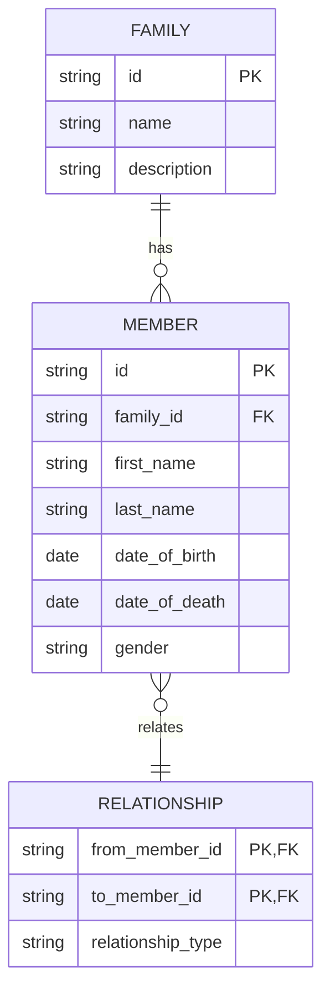

# Mô hình Dữ liệu và Schema Database

Tài liệu này mô tả về mô hình dữ liệu, schema của database, và các quan hệ giữa các bảng.

## 1. Sơ đồ quan hệ thực thể (ERD)

Sơ đồ ERD dưới đây mô tả các thực thể chính và mối quan hệ giữa chúng.

## 2. Mô tả các bảng

### 2.1. Bảng `Families`

Lưu trữ thông tin về các gia đình.

| Tên cột      | Kiểu dữ liệu | Ràng buộc | Mô tả                  |
| :------------ | :----------- | :-------- | :--------------------- |
| `id`          | `varchar(36)`| PK        | ID duy nhất của gia đình |
| `name`        | `varchar(100)`| NOT NULL  | Tên gia đình           |
| `description` | `text`       | NULL      | Mô tả về gia đình      |

### 2.2. Bảng `Members`

Lưu trữ thông tin về các thành viên trong gia đình.

| Tên cột         | Kiểu dữ liệu | Ràng buộc | Mô tả                   |
| :-------------- | :----------- | :-------- | :---------------------- |
| `id`            | `varchar(36)`| PK        | ID duy nhất của thành viên |
| `family_id`     | `varchar(36)`| FK        | ID của gia đình         |
| `first_name`    | `varchar(50)`| NOT NULL  | Tên                     |
| `last_name`     | `varchar(50)`| NOT NULL  | Họ                      |
| `date_of_birth` | `date`       | NULL      | Ngày sinh               |
| `date_of_death` | `date`       | NULL      | Ngày mất                |
| `gender`        | `varchar(10)`| NULL      | Giới tính (Male, Female) |

### 2.3. Bảng `Relationships`

Lưu trữ quan hệ giữa các thành viên.

| Tên cột             | Kiểu dữ liệu | Ràng buộc | Mô tả                        |
| :------------------ | :----------- | :-------- | :--------------------------- |
| `from_member_id`    | `varchar(36)`| PK, FK    | ID của thành viên gốc        |
| `to_member_id`      | `varchar(36)`| PK, FK    | ID của thành viên đích       |
| `relationship_type` | `varchar(20)`| NOT NULL  | Loại quan hệ (cha, mẹ, vợ, chồng) |

## 3. Ví dụ dữ liệu

**Bảng `Families`**

| id                                   | name          | description         |
| :----------------------------------- | :------------ | :------------------ |
| `f7b3b3b3-3b3b-3b3b-3b3b-3b3b3b3b3b3b` | Dòng họ Nguyễn | Dòng họ lớn ở Việt Nam |

**Bảng `Members`**

| id                                   | family_id                            | first_name | last_name | date_of_birth | gender |
| :----------------------------------- | :----------------------------------- | :--------- | :-------- | :------------ | :----- |
| `m1b3b3b3-3b3b-3b3b-3b3b-3b3b3b3b3b3b` | `f7b3b3b3-3b3b-3b3b-3b3b-3b3b3b3b3b3b` | Văn A      | Nguyễn    | 1950-01-01    | Male   |
| `m2b3b3b3-3b3b-3b3b-3b3b-3b3b3b3b3b3b` | `f7b3b3b3-3b3b-3b3b-3b3b-3b3b3b3b3b3b` | Thị B      | Trần      | 1952-02-02    | Female |

**Bảng `Relationships`**

| from_member_id                       | to_member_id                         | relationship_type |
| :----------------------------------- | :----------------------------------- | :---------------- |
| `m1b3b3b3-3b3b-3b3b-3b3b-3b3b3b3b3b3b` | `m2b3b3b3-3b3b-3b3b-3b3b-3b3b3b3b3b3b` | `husband`         |
