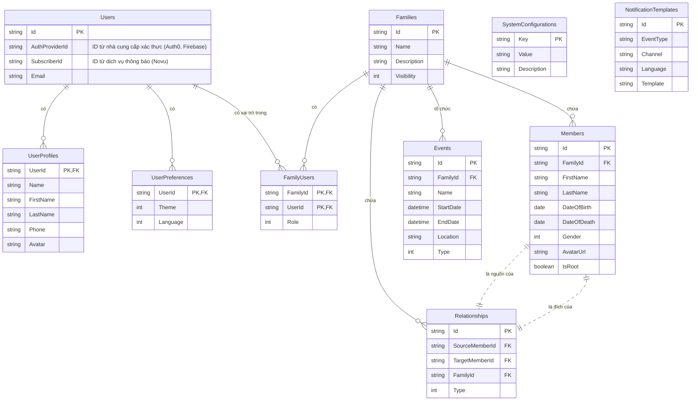

# Mô hình Dữ liệu và Schema Database

## Mục lục

- [1. Giới thiệu](#1-giới-thiệu)
- [2. Sơ đồ quan hệ thực thể (ERD)](#2-sơ-đồ-quan-hệ-thực-thể-erd)
- [3. Mô tả các bảng](#3-mô-tả-các-bảng)
  - [3.1. Bảng `Users`](#31-bảng-users)
  - [3.2. Bảng `UserProfiles`](#32-bảng-userprofiles)
  - [3.3. Bảng `UserPreferences`](#33-bảng-userpreferences)
  - [3.4. Bảng `Families`](#34-bảng-families)
  - [3.5. Bảng `FamilyUsers`](#35-bảng-familyusers)
  - [3.6. Bảng `Members`](#36-bảng-members)
  - [3.7. Bảng `Events`](#37-bảng-events)
  - [3.8. Bảng `Relationships`](#38-bảng-relationships)
  - [3.9. Bảng `SystemConfigurations`](#39-bảng-systemconfigurations)
  - [3.10. Bảng `NotificationTemplates`](#310-bảng-notificationtemplates)
- [4. Toàn vẹn và Ràng buộc Dữ liệu](#4-toàn-vẹn-và-ràng-buộc-dữ-liệu)

---

## 1. Giới thiệu

Tài liệu này mô tả chi tiết về mô hình dữ liệu, schema của database (MySQL), và các quy tắc ràng buộc nhằm đảm bảo tính nhất quán và toàn vẹn của dữ liệu trong hệ thống Dòng Họ Việt. Thiết kế này tuân thủ các nguyên tắc của Domain-Driven Design (DDD), với các Aggregate Root rõ ràng để quản lý vòng đời của các thực thể phụ thuộc.

## 2. Sơ đồ quan hệ thực thể (ERD)

## 3. Mô tả các bảng

### 3.1. Bảng `Users`

Lưu trữ thông tin xác thực cốt lõi của người dùng. Thực thể này là một **Aggregate Root**.

| Tên trường       | Kiểu dữ liệu | Ràng buộc | Mô tả                                                              |
| :--------------- | :----------- | :-------- | :----------------------------------------------------------------- |
| `Id`             | `Guid`       | PK        | ID nội bộ duy nhất của người dùng.                                 |
| `AuthProviderId` | `string`     | NOT NULL, Unique | ID từ nhà cung cấp xác thực bên ngoài (ví dụ: `sub` claim từ Auth0). Dùng để liên kết tài khoản. |
| `SubscriberId`   | `string`     | NULL      | ID của người dùng trên dịch vụ thông báo (ví dụ: Novu).        |
| `Email`          | `string`     | NOT NULL, Unique | Địa chỉ email của người dùng.                                      |

### 3.2. Bảng `UserProfiles`

Lưu trữ thông tin hồ sơ chi tiết, được liên kết 1-1 với `Users`.

| Tên trường       | Kiểu dữ liệu | Ràng buộc | Mô tả                                                              |
| :--------------- | :----------- | :-------- | :----------------------------------------------------------------- |
| `UserId`         | `Guid`       | PK, FK    | Khóa ngoại, tham chiếu đến `Users(Id)`.                            |
| `Name`           | `string`     | NOT NULL  | Tên hiển thị.                                                      |
| `FirstName`      | `string`     | NULL      | Tên riêng.                                                       |
| `LastName`       | `string`     | NULL      | Họ.                                                                |
| `Phone`          | `string`     | NULL      | Số điện thoại.                                                      |
| `Avatar`         | `string`     | NULL      | URL ảnh đại diện.                                                  |

### 3.3. Bảng `UserPreferences`

Lưu trữ các tùy chọn cá nhân của người dùng, liên kết 1-1 với `Users`.

| Tên trường       | Kiểu dữ liệu | Ràng buộc | Mô tả                                                              |
| :--------------- | :----------- | :-------- | :----------------------------------------------------------------- |
| `UserId` | `Guid` | PK, FK | Khóa ngoại, tham chiếu đến `Users(Id)`. |
| `Theme` | `int` | NOT NULL | Chủ đề giao diện (Enum: 0=Light, 1=Dark). |
| `Language` | `int` | NOT NULL | Ngôn ngữ (Enum: 0=English, 1=Vietnamese). |

### 3.4. Bảng `Families`

Thực thể trung tâm, đại diện cho một gia đình hoặc dòng họ. Đây là một **Aggregate Root** quan trọng, quản lý vòng đời của `Members` và `Relationships`.

| Tên cột      | Kiểu dữ liệu | Ràng buộc | Mô tả                  |
| :------------ | :----------- | :-------- | :--------------------- |
| `Id`          | `Guid`       | PK        | ID duy nhất của gia đình. |
| `Name`        | `string`     | NOT NULL  | Tên gia đình.           |
| `Description` | `string`     | NULL      | Mô tả về gia đình.      |
| `Visibility`  | `int`        | NOT NULL  | Chế độ hiển thị (Enum: 0=Public, 1=Private). |
| `Created`     | `datetime`   | NOT NULL  | Thời gian tạo.         |
| `CreatedBy`   | `string`     | NULL      | Người tạo.             |

### 3.5. Bảng `FamilyUsers`

Bảng nối, lưu trữ mối quan hệ nhiều-nhiều giữa `Users` và `Families`, xác định vai trò của người dùng trong mỗi gia đình.

| Tên cột         | Kiểu dữ liệu | Ràng buộc | Mô tả                                  |
| :-------------- | :----------- | :-------- | :------------------------------------- |
| `FamilyId`      | `Guid`       | PK, FK    | Tham chiếu đến `Families(Id)`.           |
| `UserId`        | `Guid`       | PK, FK    | Tham chiếu đến `Users(Id)`.              |
| `Role`          | `int`        | NOT NULL  | Vai trò (Enum: 0=Manager, 1=Viewer).    |

### 3.6. Bảng `Members`

Lưu trữ thông tin của từng thành viên. Thực thể này được quản lý bởi `Families` Aggregate Root.

| Tên cột         | Kiểu dữ liệu | Ràng buộc | Mô tả                   |
| :-------------- | :----------- | :-------- | :---------------------- |
| `Id`            | `Guid`       | PK        | ID duy nhất của thành viên. |
| `FamilyId`      | `Guid`       | FK, NOT NULL | ID của gia đình mà thành viên thuộc về. |
| `FirstName`     | `string`     | NOT NULL  | Tên.                    |
| `LastName`      | `string`     | NOT NULL  | Họ.                     |
| `DateOfBirth`   | `date`       | NULL      | Ngày sinh.              |
| `DateOfDeath`   | `date`       | NULL      | Ngày mất.               |
| `Gender`        | `int`        | NULL      | Giới tính (Enum: 0=Male, 1=Female, 2=Other). |
| `AvatarUrl`     | `string`     | NULL      | URL ảnh đại diện.       |
| `IsRoot`        | `boolean`    | NOT NULL  | Đánh dấu nếu là thành viên gốc của Dòng Họ Việt. |

### 3.7. Bảng `Events`

Lưu trữ thông tin về các sự kiện. Thực thể này được quản lý bởi `Families` Aggregate Root.

| Tên cột         | Kiểu dữ liệu | Ràng buộc | Mô tả                   |
| :-------------- | :----------- | :-------- | :---------------------- |
| `Id`            | `Guid`       | PK        | ID duy nhất của sự kiện. |
| `FamilyId`      | `Guid`       | FK, NOT NULL | ID của gia đình liên quan. |
| `Name`          | `string`     | NOT NULL  | Tên sự kiện.            |
| `StartDate`     | `datetime`   | NULL      | Ngày bắt đầu.           |
| `EndDate`       | `datetime`   | NULL      | Ngày kết thúc.          |
| `Location`      | `string`     | NULL      | Địa điểm diễn ra.       |
| `Type`          | `int`        | NOT NULL  | Loại sự kiện (Enum: 0=Birth, 1=Death, ...). |

### 3.8. Bảng `Relationships`

Lưu trữ các mối quan hệ giữa các thành viên. Thực thể này được quản lý bởi `Families` Aggregate Root.

| Tên cột         | Kiểu dữ liệu | Ràng buộc | Mô tả                   |
| :-------------- | :----------- | :-------- | :---------------------- |
| `Id`            | `Guid`       | PK        | ID duy nhất của mối quan hệ. |
| `SourceMemberId`| `Guid`       | FK, NOT NULL | ID của thành viên nguồn (ví dụ: cha). |
| `TargetMemberId`| `Guid`       | FK, NOT NULL | ID của thành viên đích (ví dụ: con). |
| `FamilyId`      | `Guid`       | FK, NOT NULL | ID của gia đình mà mối quan hệ thuộc về. |
| `Type`          | `int`        | NOT NULL  | Loại mối quan hệ (Enum: 0=Parent_Child, 1=Spouse). |

### 3.9. Bảng `SystemConfigurations`

Lưu trữ các cấu hình toàn hệ thống, có thể thay đổi trong quá trình vận hành mà không cần triển khai lại code.

| Tên cột      | Kiểu dữ liệu | Ràng buộc | Mô tả                  |
| :------------ | :----------- | :-------- | :--------------------- |
| `Key`         | `string`     | PK        | Khóa định danh duy nhất cho cấu hình. |
| `Value`       | `string`     | NOT NULL  | Giá trị của cấu hình.   |
| `Description` | `string`     | NULL      | Mô tả về cấu hình này. |

### 3.10. Bảng `NotificationTemplates`

Lưu trữ các mẫu thông báo cho các sự kiện khác nhau trên các kênh khác nhau.

| Tên cột      | Kiểu dữ liệu | Ràng buộc | Mô tả                  |
| :------------ | :----------- | :-------- | :--------------------- |
| `Id`          | `Guid`       | PK        | ID duy nhất của mẫu.  |
| `EventType`   | `string`     | NOT NULL  | Loại sự kiện kích hoạt thông báo (ví dụ: "MemberCreated"). |
| `Channel`     | `string`     | NOT NULL  | Kênh gửi thông báo (ví dụ: "Email", "InApp"). |
| `Language`    | `string`     | NOT NULL  | Ngôn ngữ của mẫu (ví dụ: "en", "vi"). |
| `Template`    | `string`     | NOT NULL  | Nội dung của mẫu thông báo, có thể chứa các biến. |

## 4. Toàn vẹn và Ràng buộc Dữ liệu

-   **Aggregate Roots**: Logic thay đổi dữ liệu phải được thực thi thông qua các phương thức của Aggregate Root (`Family`, `User`). Ví dụ, không thể tạo `Member` một cách độc lập mà phải gọi phương thức `family.AddMember()`. Điều này đảm bảo các quy tắc nghiệp vụ (invariants) được tuân thủ.
-   **Khóa ngoại (Foreign Keys)**: Đảm bảo tính toàn vẹn tham chiếu. Ví dụ, một `Member` không thể tồn tại nếu không thuộc về một `Family`.
-   **Ràng buộc Unique**: Các trường như `Users.Email`, `Users.AuthProviderId` phải là duy nhất để tránh trùng lặp dữ liệu.
-   **Xóa mềm (Soft Delete)**: Một số thực thể như `FamilyUser` có thể sử dụng cờ `IsDeleted` để đánh dấu đã xóa thay vì xóa vật lý khỏi cơ sở dữ liệu.
-   **Validation**: Logic xác thực (ví dụ: `DateOfDeath` phải sau `DateOfBirth`) được thực thi trong Domain Entities hoặc trong các `Command Validator`.