# Mô hình Dữ liệu và Schema Database

## Mục lục

- [1. Giới thiệu](#1-giới-thiệu)
- [2. Sơ đồ quan hệ thực thể (ERD)](#2-sơ-đồ-quan-hệ-thực-thể-erd)
- [3. Mô tả các bảng](#3-mô-tả-các-bảng)
  - [3.1. Bảng `Users`](#31-bảng-users)
  - [3.2. Bảng `UserProfiles`](#32-bảng-userprofiles)
  - [3.3. Bảng `UserPreferences`](#33-bảng-userpreferences)
  - [3.4. Bảng `Families`](#34-bảng-families)
  - [3.5. Bảng `FamilyUsers`](#35-bảng-familyusers)
  - [3.6. Bảng `Members`](#36-bảng-members)
  - [3.7. Bảng `Events`](#37-bảng-events)
  - [3.8. Bảng `Relationships`](#38-bảng-relationships)
  - [3.9. Bảng `UserPushTokens`](#39-bảng-userpushtokens)
  - [3.10. Bảng `UserActivities`](#310-bảng-useractivities)
  - [3.11. Bảng `FamilyFollows`](#311-bảng-familyfollows)
  - [3.12. Bảng `FamilyLimitConfigurations`](#312-bảng-familylimitconfigurations)
  - [3.13. Bảng `FamilyLinks`](#313-bảng-familylinks)
  - [3.14. Bảng `FamilyLocations`](#314-bảng-familylocations)
  - [3.15. Bảng `FamilyMedia`](#315-bảng-familymedia)
  - [3.16. Bảng `Locations`](#316-bảng-locations)
  - [3.17. Bảng `LocationLinks`](#317-bảng-locationlinks)
  - [3.18. Bảng `MediaLinks`](#318-bảng-medialinks)
  - [3.19. Bảng `MemberFaces`](#319-bảng-memberfaces)
  - [3.20. Bảng `EventMembers`](#320-bảng-eventmembers)
  - [3.21. Bảng `EventOccurrences`](#321-bảng-eventoccurrences)
  - [3.22. Bảng `PrivacyConfigurations`](#322-bảng-privacyconfigurations)
  - [3.23. Bảng `Prompts`](#323-bảng-prompts)
  - [3.24. Bảng `VoiceProfiles`](#324-bảng-voiceprofiles)
  - [3.25. Bảng `VoiceGenerations`](#325-bảng-voicegenerations)
  - [3.26. Bảng `FamilyDicts`](#326-bảng-familydicts)
  - [3.27. Bảng `MemoryItems`](#327-bảng-memoryitems)
  - [3.28. Bảng `MemoryMedia`](#328-bảng-memorymedia)
  - [3.29. Bảng `MemoryPersons`](#329-bảng-memorypersons)
  - [3.30. Bảng `NotificationDeliveries`](#330-bảng-notificationdeliveries)
- [4. Toàn vẹn và Ràng buộc Dữ liệu](#4-toàn-vẹn-và-ràng-buộc-dữ-liệu)

---

## 1. Giới thiệu

Tài liệu này mô tả chi tiết về mô hình dữ liệu, schema của database (MySQL), và các quy tắc ràng buộc nhằm đảm bảo tính nhất quán và toàn vẹn của dữ liệu trong hệ thống Dòng Họ Việt. Thiết kế này tuân thủ các nguyên tắc của Domain-Driven Design (DDD), với các Aggregate Root rõ ràng để quản lý vòng đời của các thực thể phụ thuộc.

## 2. Sơ đồ quan hệ thực thể (ERD)

```mermaid
erDiagram
    Users {
        string Id PK
        string AuthProviderId "ID từ nhà cung cấp xác thực (Auth0, Firebase)"
        string SubscriberId "ID từ dịch vụ thông báo (Novu)"
        string Email
    }

    UserProfiles {
        string UserId PK, FK
        string Name
        string FirstName
        string LastName
        string Phone
        string Avatar
    }

    UserPreferences {
        string UserId PK, FK
        int Theme
        int Language
    }

    UserPushTokens {
        string UserId FK
        string ExpoPushToken
        string Platform
        string DeviceId
        boolean IsActive
    }

    UserActivities {
        string UserId FK
        string ActionType
        string TargetType
        string TargetId
        string GroupId FK
        json Metadata
        string ActivitySummary
    }

    Families {
        string Id PK
        string Name
        string Description
        int Visibility
    }

    FamilyUsers {
        string FamilyId PK, FK
        string UserId PK, FK
        int Role
    }

    FamilyFollows {
        string UserId PK, FK
        string FamilyId PK, FK
        boolean IsFollowing
        boolean NotifyDeathAnniversary
        boolean NotifyBirthday
        boolean NotifyEvent
    }

    FamilyLimitConfigurations {
        string FamilyId PK, FK
        int MaxMembers
        int MaxStorageMb
        int AiChatMonthlyLimit
        int AiChatMonthlyUsage
    }

    FamilyLinks {
        string Id PK
        string Family1Id FK
        string Family2Id FK
        datetime LinkDate
    }

    FamilyLocations {
        string FamilyId PK, FK
        string LocationId PK, FK
    }

    FamilyMedia {
        string Id PK
        string FamilyId FK
        string FileName
        string FilePath
        int MediaType
        long FileSize
        string Description
        string DeleteHash
        string UploadedBy FK
    }

    Locations {
        string Id PK
        string Name
        string Description
        double Latitude
        double Longitude
        string Address
        int LocationType
        int Accuracy
        int Source
    }

    LocationLinks {
        string Id PK
        string RefId
        int RefType
        string Description
        string LocationId FK
        int LinkType
    }

    Members {
        string Id PK
        string FamilyId FK
        string FirstName
        string LastName
        date DateOfBirth
        date DateOfDeath
        int Gender
        string AvatarUrl
        boolean IsRoot
    }

    MemberFaces {
        string Id PK
        string MemberId FK
        string FaceId
        json BoundingBox
        double Confidence
        string ThumbnailUrl
        string OriginalImageUrl
        json Embedding
        string Emotion
        double EmotionConfidence
        string VectorDbId
        boolean IsVectorDbSynced
    }

    Events {
        string Id PK
        string FamilyId FK
        string Name
        datetime StartDate
        datetime EndDate
        string Location
        int Type
    }

    EventMembers {
        string EventId PK, FK
        string MemberId PK, FK
    }

    EventOccurrences {
        string Id PK
        string EventId FK
        int Year
        datetime OccurrenceDate
    }

    Relationships {
        string Id PK
        string SourceMemberId FK
        string TargetMemberId FK
        string FamilyId FK
        int Type
    }

    PrivacyConfigurations {
        string FamilyId PK, FK
        string PublicMemberProperties
        string PublicEventProperties
        string PublicFamilyProperties
        string PublicFamilyLocationProperties
        string PublicMemoryItemProperties
        string PublicMemberFaceProperties
        string PublicFoundFaceProperties
    }

    Prompts {
        string Id PK
        string Code
        string Title
        string Content
        string Description
    }

    VoiceProfiles {
        string Id PK
        string MemberId FK
        string Label
        string AudioUrl
        double DurationSeconds
        double QualityScore
        string OverallQuality
        string QualityMessages
        string Language
        boolean Consent
        int Status
    }

    VoiceGenerations {
        string Id PK
        string VoiceProfileId FK
        string Text
        string AudioUrl
        double Duration
    }

    FamilyDicts {
        string Id PK
        string Name
        int Type
        string Description
        int Lineage
        boolean SpecialRelation
        json NamesByRegion
    }

    MemoryItems {
        string Id PK
        string FamilyId FK
        string Title
        string Description
        datetime HappenedAt
        int EmotionalTag
        string Location
    }

    MemoryMedia {
        string Id PK
        string MemoryItemId FK
        string Url
    }

    MemoryPersons {
        string Id PK
        string MemoryItemId FK
        string MemberId FK
    }

    NotificationDeliveries {
        string Id PK
        string EventId FK
        string MemberId FK
        datetime DeliveryDate
        string DeliveryMethod
        boolean IsSent
        int SentAttempts
    }

    Users ||--o{ UserProfiles : "có"
    Users ||--o{ UserPreferences : "có"
    Users ||--o{ FamilyUsers : "có vai trò trong"
    Users ||--o{ UserPushTokens : "sử dụng"
    Users ||--o{ UserActivities : "thực hiện"
    Users ||--o{ FamilyFollows : "theo dõi"

    Families ||--o{ FamilyUsers : "có"
    Families ||--o{ Members : "chứa"
    Families ||--o{ Events : "tổ chức"
    Families ||--o{ Relationships : "chứa"
    Families ||--o{ FamilyFollows : "được theo dõi bởi"
    Families ||--o{ FamilyLimitConfigurations : "có cấu hình giới hạn"
    Families ||--o{ FamilyLinks : "liên kết với"
    Families ||--o{ FamilyLocations : "có địa điểm"
    Families ||--o{ FamilyMedia : "có media"
    Families ||--o{ PrivacyConfigurations : "có cấu hình riêng tư"
    Families ||--o{ MemoryItems : "có mục ghi nhớ"

    Members ||--o{ EventMembers : "tham gia"
    Members ||--o{ MemberFaces : "có khuôn mặt"
    Members ||--o{ MemoryPersons : "liên quan đến"
    Members ||--o{ VoiceProfiles : "có hồ sơ giọng nói"
    Members ||..|| Relationships : "là nguồn của"
    Members ||..|| Relationships : "là đích của"

    Events ||--o{ EventOccurrences : "có các lần diễn ra"
    Events ||--o{ EventMembers : "có thành viên tham gia"
    Events ||--o{ NotificationDeliveries : "có thông báo"

    Location ||--o{ FamilyLocations : "được liên kết với gia đình"
    Location ||--o{ LocationLinks : "có liên kết"

    FamilyMedia ||--o{ MediaLinks : "có liên kết"

    MemoryItems ||--o{ MemoryMedia : "có media"
    MemoryItems ||--o{ MemoryPersons : "có người liên quan"

    VoiceProfiles ||--o{ VoiceGenerations : "tạo ra"
```

## 3. Mô tả các bảng

### 3.1. Bảng `Users`

Lưu trữ thông tin xác thực cốt lõi của người dùng. Thực thể này là một **Aggregate Root**.

| Tên trường       | Kiểu dữ liệu | Ràng buộc | Mô tả                                                              |
| :--------------- | :----------- | :-------- | :----------------------------------------------------------------- |
| `Id`             | `Guid`       | PK        | ID nội bộ duy nhất của người dùng.                                 |
| `AuthProviderId` | `string`     | NOT NULL, Unique | ID từ nhà cung cấp xác thực bên ngoài (ví dụ: `sub` claim từ Auth0). Dùng để liên kết tài khoản. |
| `SubscriberId`   | `string`     | NULL      | ID của người dùng trên dịch vụ thông báo (ví dụ: Novu).        |
| `Email`          | `string`     | NOT NULL, Unique | Địa chỉ email của người dùng.                                      |

### 3.2. Bảng `UserProfiles`

Lưu trữ thông tin hồ sơ chi tiết, được liên kết 1-1 với `Users`.

| Tên trường       | Kiểu dữ liệu | Ràng buộc | Mô tả                                                              |
| :--------------- | :----------- | :-------- | :----------------------------------------------------------------- |
| `UserId`         | `Guid`       | PK, FK    | Khóa ngoại, tham chiếu đến `Users(Id)`.                            |
| `Name`           | `string`     | NOT NULL  | Tên hiển thị.                                                      |
| `FirstName`      | `string`     | NULL      | Tên riêng.                                                       |
| `LastName`       | `string`     | NULL      | Họ.                                                                |
| `Phone`          | `string`     | NULL      | Số điện thoại.                                                      |
| `Avatar`         | `string`     | NULL      | URL ảnh đại diện.                                                  |

### 3.3. Bảng `UserPreferences`

Lưu trữ các tùy chọn cá nhân của người dùng, liên kết 1-1 với `Users`.

| Tên trường       | Kiểu dữ liệu | Ràng buộc | Mô tả                                                              |
| :--------------- | :----------- | :-------- | :----------------------------------------------------------------- |
| `UserId` | `Guid` | PK, FK | Khóa ngoại, tham chiếu đến `Users(Id)`. |
| `Theme` | `int` | NOT NULL | Chủ đề giao diện (Enum: 0=Light, 1=Dark). |
| `Language` | `int` | NOT NULL | Ngôn ngữ (Enum: 0=English, 1=Vietnamese). |

### 3.4. Bảng `Families`

Thực thể trung tâm, đại diện cho một gia đình hoặc dòng họ. Đây là một **Aggregate Root** quan trọng, quản lý vòng đời của `Members` và `Relationships`.

| Tên cột      | Kiểu dữ liệu | Ràng buộc | Mô tả                  |
| :------------ | :----------- | :-------- | :--------------------- |
| `Id`          | `Guid`       | PK        | ID duy nhất của gia đình. |
| `Name`        | `string`     | NOT NULL  | Tên gia đình.           |
| `Description` | `string`     | NULL      | Mô tả về gia đình.      |
| `Visibility`  | `int`        | NOT NULL  | Chế độ hiển thị (Enum: 0=Public, 1=Private). |
| `Created`     | `datetime`   | NOT NULL  | Thời gian tạo.         |
| `CreatedBy`   | `string`     | NULL      | Người tạo.             |

### 3.5. Bảng `FamilyUsers`

Bảng nối, lưu trữ mối quan hệ nhiều-nhiều giữa `Users` và `Families`, xác định vai trò của người dùng trong mỗi gia đình.

| Tên cột         | Kiểu dữ liệu | Ràng buộc | Mô tả                                  |
| :-------------- | :----------- | :-------- | :------------------------------------- |
| `FamilyId`      | `Guid`       | PK, FK    | Tham chiếu đến `Families(Id)`.           |
| `UserId`        | `Guid`       | PK, FK    | Tham chiếu đến `Users(Id)`.              |
| `Role`          | `int`        | NOT NULL  | Vai trò (Enum: 0=Manager, 1=Viewer).    |

### 3.6. Bảng `Members`

Lưu trữ thông tin của từng thành viên. Thực thể này được quản lý bởi `Families` Aggregate Root.

| Tên cột         | Kiểu dữ liệu | Ràng buộc | Mô tả                   |
| :-------------- | :----------- | :-------- | :---------------------- |
| `Id`            | `Guid`       | PK        | ID duy nhất của thành viên. |
| `FamilyId`      | `Guid`       | FK, NOT NULL | ID của gia đình mà thành viên thuộc về. |
| `FirstName`     | `string`     | NOT NULL  | Tên.                    |
| `LastName`      | `string`     | NOT NULL  | Họ.                     |
| `DateOfBirth`   | `date`       | NULL      | Ngày sinh.              |
| `DateOfDeath`   | `date`       | NULL      | Ngày mất.               |
| `Gender`        | `int`        | NULL      | Giới tính (Enum: 0=Male, 1=Female, 2=Other). |
| `AvatarUrl`     | `string`     | NULL      | URL ảnh đại diện.       |
| `IsRoot`        | `boolean`    | NOT NULL  | Đánh dấu nếu là thành viên gốc của Dòng Họ Việt. |

### 3.7. Bảng `Events`

Lưu trữ thông tin về các sự kiện. Thực thể này được quản lý bởi `Families` Aggregate Root.

| Tên cột         | Kiểu dữ liệu | Ràng buộc | Mô tả                   |
| :-------------- | :----------- | :-------- | :---------------------- |
| `Id`            | `Guid`       | PK        | ID duy nhất của sự kiện. |
| `FamilyId`      | `Guid`       | FK, NOT NULL | ID của gia đình liên quan. |
| `Name`          | `string`     | NOT NULL  | Tên sự kiện.            |
| `StartDate`     | `datetime`   | NULL      | Ngày bắt đầu.           |
| `EndDate`       | `datetime`   | NULL      | Ngày kết thúc.          |
| `Location`      | `string`     | NULL      | Địa điểm diễn ra.       |
| `Type`          | `int`        | NOT NULL  | Loại sự kiện (Enum: 0=Birth, 1=Death, ...). |

### 3.8. Bảng `Relationships`

Lưu trữ các mối quan hệ giữa các thành viên. Thực thể này được quản lý bởi `Families` Aggregate Root.

| Tên cột         | Kiểu dữ liệu | Ràng buộc | Mô tả                   |
| :-------------- | :----------- | :-------- | :---------------------- |
| `Id`            | `Guid`       | PK        | ID duy nhất của mối quan hệ. |
| `SourceMemberId`| `Guid`       | FK, NOT NULL | ID của thành viên nguồn (ví dụ: cha). |
| `TargetMemberId`| `Guid`       | FK, NOT NULL | ID của thành viên đích (ví dụ: con). |
| `FamilyId`      | `Guid`       | FK, NOT NULL | ID của gia đình mà mối quan hệ thuộc về. |
| `Type`          | `int`        | NOT NULL  | Loại mối quan hệ (Enum: 0=Parent_Child, 1=Spouse). |

### 3.9. Bảng `UserPushTokens`
Lưu trữ các mã thông báo đẩy của người dùng cho các thiết bị khác nhau.

| Tên trường      | Kiểu dữ liệu | Ràng buộc | Mô tả                                       |
| :-------------- | :----------- | :-------- | :------------------------------------------ |
| `Id`            | `Guid`       | PK        | ID nội bộ duy nhất của mã thông báo đẩy.   |
| `UserId`        | `Guid`       | FK, NOT NULL | Tham chiếu đến `Users(Id)`.                 |
| `ExpoPushToken` | `string`     | NOT NULL  | Mã thông báo đẩy Expo (để gửi thông báo).  |
| `Platform`      | `string`     | NOT NULL  | Nền tảng thiết bị (ví dụ: iOS, Android, Web).|
| `DeviceId`      | `string`     | NOT NULL  | ID duy nhất của thiết bị.                   |
| `IsActive`      | `boolean`    | NOT NULL  | Cho biết mã thông báo còn hoạt động hay không. |

### 3.10. Bảng `UserActivities`
Lưu trữ nhật ký các hoạt động của người dùng trong hệ thống để phục vụ mục đích kiểm toán và tạo nguồn cấp dữ liệu hoạt động.

| Tên trường        | Kiểu dữ liệu | Ràng buộc | Mô tả                                             |
| :---------------- | :----------- | :-------- | :------------------------------------------------ |
| `Id`              | `Guid`       | PK        | ID nội bộ duy nhất của hoạt động.                 |
| `UserId`          | `Guid`       | FK, NOT NULL | Tham chiếu đến `Users(Id)`.                       |
| `ActionType`      | `int`        | NOT NULL  | Loại hành động được thực hiện (Enum: CreateFamily, UpdateMember, Login). |
| `TargetType`      | `int`        | NOT NULL  | Loại tài nguyên bị ảnh hưởng (Enum: Family, Member, UserProfile). |
| `TargetId`        | `string`     | NULL      | ID của tài nguyên bị ảnh hưởng.                  |
| `GroupId`         | `Guid`       | NULL      | ID của nhóm liên quan đến hoạt động (ví dụ: FamilyId). |
| `Metadata`        | `json`       | NULL      | Dữ liệu bổ sung dưới dạng JSON.                  |
| `ActivitySummary` | `string`     | NOT NULL  | Tóm tắt hoạt động cho mục đích hiển thị.          |

### 3.11. Bảng `FamilyFollows`
Lưu trữ thông tin người dùng theo dõi một gia đình và các tùy chọn thông báo liên quan.

| Tên trường                 | Kiểu dữ liệu | Ràng buộc | Mô tả                                           |
| :------------------------- | :----------- | :-------- | :---------------------------------------------- |
| `Id`                       | `Guid`       | PK        | ID duy nhất của việc theo dõi.                  |
| `UserId`                   | `Guid`       | FK, NOT NULL | Tham chiếu đến `Users(Id)`.                     |
| `FamilyId`                 | `Guid`       | FK, NOT NULL | Tham chiếu đến `Families(Id)`.                  |
| `IsFollowing`              | `boolean`    | NOT NULL  | Cho biết người dùng có đang theo dõi hay không. |
| `NotifyDeathAnniversary`   | `boolean`    | NOT NULL  | Bật/tắt thông báo ngày giỗ.                      |
| `NotifyBirthday`           | `boolean`    | NOT NULL  | Bật/tắt thông báo sinh nhật thành viên.         |
| `NotifyEvent`              | `boolean`    | NOT NULL  | Bật/tắt thông báo sự kiện gia đình.            |

### 3.12. Bảng `FamilyLimitConfigurations`
Cấu hình các giới hạn và cài đặt cho một gia đình cụ thể.

| Tên trường             | Kiểu dữ liệu | Ràng buộc | Mô tả                                           |
| :--------------------- | :----------- | :-------- | :---------------------------------------------- |
| `Id`                   | `Guid`       | PK        | ID duy nhất của cấu hình.                       |
| `FamilyId`             | `Guid`       | PK, FK    | Tham chiếu đến `Families(Id)`.                  |
| `MaxMembers`           | `int`        | NOT NULL  | Số lượng thành viên tối đa được phép.           |
| `MaxStorageMb`         | `int`        | NOT NULL  | Dung lượng lưu trữ tối đa (MB).                 |
| `AiChatMonthlyLimit`   | `int`        | NOT NULL  | Giới hạn số lượng yêu cầu trò chuyện AI mỗi tháng. |
| `AiChatMonthlyUsage`   | `int`        | NOT NULL  | Số lượng yêu cầu trò chuyện AI đã sử dụng trong tháng hiện tại. |

### 3.13. Bảng `FamilyLinks`
Đại diện cho một liên kết đã thiết lập giữa hai gia đình.

| Tên trường      | Kiểu dữ liệu | Ràng buộc | Mô tả                                       |
| :-------------- | :----------- | :-------- | :------------------------------------------ |
| `Id`            | `Guid`       | PK        | ID duy nhất của liên kết gia đình.          |
| `Family1Id`     | `Guid`       | FK, NOT NULL | ID của gia đình thứ nhất trong liên kết.   |
| `Family2Id`     | `Guid`       | FK, NOT NULL | ID của gia đình thứ hai trong liên kết.   |
| `LinkDate`      | `datetime`   | NOT NULL  | Ngày liên kết được tạo.                    |

### 3.14. Bảng `FamilyLocations`
Lưu trữ mối quan hệ nhiều-nhiều giữa gia đình và địa điểm, chỉ định các địa điểm liên quan đến một gia đình.

| Tên trường  | Kiểu dữ liệu | Ràng buộc | Mô tả                                     |
| :---------- | :----------- | :-------- | :---------------------------------------- |
| `Id`        | `Guid`       | PK        | ID duy nhất của liên kết gia đình-địa điểm. |
| `FamilyId`  | `Guid`       | PK, FK    | Tham chiếu đến `Families(Id)`.             |
| `LocationId`| `Guid`       | PK, FK    | Tham chiếu đến `Locations(Id)`.            |

### 3.15. Bảng `FamilyMedia`
Lưu trữ thông tin về các tệp media (hình ảnh, video) được tải lên và liên kết với một gia đình.

| Tên trường    | Kiểu dữ liệu | Ràng buộc | Mô tả                                           |
| :------------ | :----------- | :-------- | :---------------------------------------------- |
| `Id`          | `Guid`       | PK        | ID duy nhất của tệp media.                     |
| `FamilyId`    | `Guid`       | FK, NOT NULL | Tham chiếu đến `Families(Id)`.                  |
| `FileName`    | `string`     | NOT NULL  | Tên tệp.                                        |
| `FilePath`    | `string`     | NOT NULL  | Đường dẫn/URL đến nơi lưu trữ tệp.              |
| `MediaType`   | `int`        | NOT NULL  | Loại media (Enum: Image, Video, Document).      |
| `FileSize`    | `long`       | NOT NULL  | Kích thước tệp (byte).                         |
| `Description` | `string`     | NULL      | Mô tả tệp media.                                |
| `DeleteHash`  | `string`     | NULL      | Mã hash để xóa tệp từ dịch vụ lưu trữ bên ngoài. |
| `UploadedBy`  | `Guid`       | FK, NULL  | ID của người dùng đã tải tệp lên.               |

### 3.16. Bảng `Locations`
Lưu trữ thông tin chi tiết về các địa điểm địa lý.

| Tên trường   | Kiểu dữ liệu | Ràng buộc | Mô tả                                       |
| :----------- | :----------- | :-------- | :------------------------------------------ |
| `Id`         | `Guid`       | PK        | ID duy nhất của địa điểm.                   |
| `Name`       | `string`     | NOT NULL  | Tên địa điểm.                               |
| `Description`| `string`     | NULL      | Mô tả chi tiết về địa điểm.                 |
| `Latitude`   | `double`     | NULL      | Vĩ độ.                                      |
| `Longitude`  | `double`     | NULL      | Kinh độ.                                    |
| `Address`    | `string`     | NULL      | Địa chỉ đầy đủ.                             |
| `LocationType`| `int`        | NOT NULL  | Loại địa điểm (Enum: BirthPlace, Residence). |
| `Accuracy`   | `int`        | NOT NULL  | Độ chính xác của tọa độ (Enum: Street, City).|
| `Source`     | `int`        | NOT NULL  | Nguồn dữ liệu địa điểm.                    |

### 3.17. Bảng `LocationLinks`
Liên kết một địa điểm với một thực thể khác trong hệ thống (ví dụ: thành viên, sự kiện).

| Tên trường   | Kiểu dữ liệu | Ràng buộc | Mô tả                                           |
| :----------- | :----------- | :-------- | :---------------------------------------------- |
| `Id`         | `Guid`       | PK        | ID duy nhất của liên kết địa điểm.              |
| `RefId`      | `string`     | NOT NULL  | ID của thực thể được liên kết (MemberId, EventId). |
| `RefType`    | `int`        | NOT NULL  | Loại thực thể được liên kết (Enum: Member, Event). |
| `Description`| `string`     | NOT NULL  | Mô tả của liên kết.                             |
| `LocationId` | `Guid`       | FK, NOT NULL | Tham chiếu đến `Locations(Id)`.                  |
| `LinkType`   | `int`        | NOT NULL  | Loại liên kết địa điểm (Enum: Birth, Death, Residence). |

### 3.18. Bảng `MediaLinks`
Liên kết một tệp media (trong `FamilyMedia`) với một thực thể khác (ví dụ: thành viên, sự kiện, MemoryItem).

| Tên trường    | Kiểu dữ liệu | Ràng buộc | Mô tả                                           |
| :------------ | :----------- | :-------- | :---------------------------------------------- |
| `Id`          | `Guid`       | PK        | ID duy nhất của liên kết media.                 |
| `FamilyMediaId`| `Guid`       | FK, NOT NULL | Tham chiếu đến `FamilyMedia(Id)`.               |
| `RefType`     | `int`        | NOT NULL  | Loại thực thể được liên kết (Enum: Member, Event, MemoryItem). |
| `RefId`       | `Guid`       | FK, NOT NULL | ID của thực thể được liên kết.                  |

### 3.19. Bảng `MemberFaces`
Lưu trữ thông tin về khuôn mặt được phát hiện của thành viên, bao gồm embedding và thông tin liên quan đến AI.

| Tên trường             | Kiểu dữ liệu | Ràng buộc | Mô tả                                           |
| :--------------------- | :----------- | :-------- | :---------------------------------------------- |
| `Id`                   | `Guid`       | PK        | ID duy nhất của khuôn mặt.                      |
| `MemberId`             | `Guid`       | FK, NOT NULL | Tham chiếu đến `Members(Id)`.                   |
| `FaceId`               | `string`     | NOT NULL  | ID từ dịch vụ phát hiện khuôn mặt.              |
| `BoundingBox`          | `json`       | NOT NULL  | Tọa độ hộp bao quanh khuôn mặt (JSON).         |
| `Confidence`           | `double`     | NOT NULL  | Độ tin cậy của việc phát hiện.                 |
| `ThumbnailUrl`         | `string`     | NULL      | URL ảnh thumbnail của khuôn mặt.               |
| `OriginalImageUrl`     | `string`     | NULL      | URL ảnh gốc nơi khuôn mặt được phát hiện.       |
| `Embedding`            | `json`       | NOT NULL  | Vector embedding của khuôn mặt (JSON array of doubles). |
| `Emotion`              | `string`     | NULL      | Cảm xúc được phát hiện.                         |
| `EmotionConfidence`    | `double`     | NOT NULL  | Độ tin cậy của cảm xúc.                       |
| `VectorDbId`           | `string`     | NULL      | ID của vector trong cơ sở dữ liệu vector.      |
| `IsVectorDbSynced`     | `boolean`    | NOT NULL  | Đã đồng bộ hóa với cơ sở dữ liệu vector chưa.    |

### 3.20. Bảng `EventMembers`
Bảng nối, lưu trữ mối quan hệ nhiều-nhiều giữa `Events` và `Members`, chỉ định các thành viên tham gia vào một sự kiện.

| Tên trường  | Kiểu dữ liệu | Ràng buộc | Mô tả                                     |
| :---------- | :----------- | :-------- | :---------------------------------------- |
| `EventId`   | `Guid`       | PK, FK    | Tham chiếu đến `Events(Id)`.               |
| `MemberId`  | `Guid`       | PK, FK    | Tham chiếu đến `Members(Id)`.              |

### 3.21. Bảng `EventOccurrences`
Lưu trữ các lần diễn ra cụ thể của một sự kiện, đặc biệt hữu ích cho các sự kiện định kỳ.

| Tên trường      | Kiểu dữ liệu | Ràng buộc | Mô tả                                       |
| :-------------- | :----------- | :-------- | :------------------------------------------ |
| `Id`            | `Guid`       | PK        | ID duy nhất của lần diễn ra sự kiện.       |
| `EventId`       | `Guid`       | FK, NOT NULL | Tham chiếu đến `Events(Id)`.               |
| `Year`          | `int`        | NOT NULL  | Năm diễn ra sự kiện.                        |
| `OccurrenceDate`| `datetime`   | NOT NULL  | Ngày diễn ra sự kiện cụ thể.                 |

### 3.22. Bảng `PrivacyConfigurations`
Lưu trữ cấu hình quyền riêng tư cho một gia đình, xác định những thuộc tính nào của thành viên/sự kiện/media được công khai.

| Tên trường                   | Kiểu dữ liệu | Ràng buộc | Mô tả                                           |
| :--------------------------- | :----------- | :-------- | :---------------------------------------------- |
| `Id`                         | `Guid`       | PK        | ID duy nhất của cấu hình riêng tư.             |
| `FamilyId`                   | `Guid`       | PK, FK    | Tham chiếu đến `Families(Id)`.                  |
| `PublicMemberProperties`     | `string`     | NOT NULL  | Chuỗi các thuộc tính thành viên công khai (comma-separated). |
| `PublicEventProperties`      | `string`     | NOT NULL  | Chuỗi các thuộc tính sự kiện công khai (comma-separated). |
| `PublicFamilyProperties`     | `string`     | NOT NULL  | Chuỗi các thuộc tính gia đình công khai (comma-separated). |
| `PublicFamilyLocationProperties`| `string`     | NOT NULL  | Chuỗi các thuộc tính địa điểm gia đình công khai (comma-separated). |
| `PublicMemoryItemProperties` | `string`     | NOT NULL  | Chuỗi các thuộc tính mục ghi nhớ công khai (comma-separated). |
| `PublicMemberFaceProperties` | `string`     | NOT NULL  | Chuỗi các thuộc tính khuôn mặt thành viên công khai (comma-separated). |
| `PublicFoundFaceProperties`  | `string`     | NOT NULL  | Chuỗi các thuộc tính khuôn mặt tìm thấy công khai (comma-separated). |

### 3.23. Bảng `Prompts`
Lưu trữ các mẫu prompt cho các tính năng AI khác nhau.

| Tên trường    | Kiểu dữ liệu | Ràng buộc | Mô tả                                       |
| :------------ | :----------- | :-------- | :------------------------------------------ |
| `Id`          | `Guid`       | PK        | ID duy nhất của prompt.                     |
| `Code`        | `string`     | NOT NULL  | Mã định danh duy nhất cho prompt.           |
| `Title`       | `string`     | NOT NULL  | Tiêu đề của prompt.                         |
| `Content`     | `string`     | NOT NULL  | Nội dung chi tiết của prompt.               |
| `Description` | `string`     | NULL      | Mô tả về mục đích của prompt.               |

### 3.24. Bảng `VoiceProfiles`
Lưu trữ hồ sơ giọng nói của các thành viên, dùng cho tính năng tổng hợp giọng nói AI.

| Tên trường          | Kiểu dữ liệu | Ràng buộc | Mô tả                                       |
| :------------------ | :----------- | :-------- | :------------------------------------------ |
| `Id`                | `Guid`       | PK        | ID duy nhất của hồ sơ giọng nói.           |
| `MemberId`          | `Guid`       | FK, NOT NULL | Tham chiếu đến `Members(Id)`.               |
| `Label`             | `string`     | NOT NULL  | Nhãn/tên của hồ sơ giọng nói (ví dụ: "giọng chuẩn"). |
| `AudioUrl`          | `string`     | NOT NULL  | URL đến tệp audio đã được xử lý.            |
| `DurationSeconds`   | `double`     | NOT NULL  | Thời lượng của tệp audio (giây).             |
| `QualityScore`      | `double`     | NOT NULL  | Điểm chất lượng của hồ sơ giọng nói (0-100).|
| `OverallQuality`    | `string`     | NOT NULL  | Đánh giá chất lượng tổng thể ("pass", "warn", "reject"). |
| `QualityMessages`   | `string`     | NOT NULL  | Các thông điệp chi tiết về chất lượng (JSON).|
| `Language`          | `string`     | NOT NULL  | Ngôn ngữ của hồ sơ giọng nói.               |
| `Consent`           | `boolean`    | NOT NULL  | Trạng thái đồng ý của thành viên.           |
| `Status`            | `int`        | NOT NULL  | Trạng thái hồ sơ giọng nói (Enum: Active, Archived).|

### 3.25. Bảng `VoiceGenerations`
Lưu trữ lịch sử các lần tạo giọng nói từ một hồ sơ giọng nói cụ thể.

| Tên trường      | Kiểu dữ liệu | Ràng buộc | Mô tả                                       |
| :-------------- | :----------- | :-------- | :------------------------------------------ |
| `Id`            | `Guid`       | PK        | ID duy nhất của bản ghi tạo giọng nói.     |
| `VoiceProfileId`| `Guid`       | FK, NOT NULL | Tham chiếu đến `VoiceProfiles(Id)`.         |
| `Text`          | `string`     | NOT NULL  | Văn bản đã được sử dụng để tạo audio.     |
| `AudioUrl`      | `string`     | NOT NULL  | URL đến tệp audio đã tạo.                  |
| `Duration`      | `double`     | NOT NULL  | Thời lượng của audio đã tạo (giây).         |

### 3.26. Bảng `FamilyDicts`
Lưu trữ các từ điển/thuật ngữ gia đình tùy chỉnh.

| Tên trường      | Kiểu dữ liệu | Ràng buộc | Mô tả                                       |
| :-------------- | :----------- | :-------- | :------------------------------------------ |
| `Id`            | `Guid`       | PK        | ID duy nhất của mục từ điển.               |
| `Name`          | `string`     | NOT NULL  | Tên của mục từ điển.                       |
| `Type`          | `int`        | NOT NULL  | Loại từ điển (Enum: Relation, Custom).      |
| `Description`   | `string`     | NOT NULL  | Mô tả chi tiết.                           |
| `Lineage`       | `int`        | NOT NULL  | Dòng dõi (Enum: Maternal, Paternal, Both). |
| `SpecialRelation`| `boolean`    | NOT NULL  | Cho biết có phải là mối quan hệ đặc biệt không.|
| `NamesByRegion` | `json`       | NOT NULL  | Tên theo vùng miền (JSON object).          |

### 3.27. Bảng `MemoryItems`
Lưu trữ các mục ghi nhớ (kỷ niệm) liên quan đến một gia đình.

| Tên trường    | Kiểu dữ liệu | Ràng buộc | Mô tả                                       |
| :------------ | :----------- | :-------- | :------------------------------------------ |
| `Id`          | `Guid`       | PK        | ID duy nhất của mục ghi nhớ.               |
| `FamilyId`    | `Guid`       | FK, NOT NULL | Tham chiếu đến `Families(Id)`.               |
| `Title`       | `string`     | NOT NULL  | Tiêu đề của mục ghi nhớ.                    |
| `Description` | `string`     | NULL      | Mô tả chi tiết về kỷ niệm.                 |
| `HappenedAt`  | `datetime`   | NULL      | Thời gian/ngày kỷ niệm diễn ra.             |
| `EmotionalTag`| `int`        | NOT NULL  | Nhãn cảm xúc (Enum: Joy, Sadness, Neutral).|
| `Location`    | `string`     | NULL      | Địa điểm liên quan đến kỷ niệm (dưới dạng văn bản).|

### 3.28. Bảng `MemoryMedia`
Lưu trữ các tệp media (hình ảnh, video) liên quan đến một mục ghi nhớ.

| Tên trường    | Kiểu dữ liệu | Ràng buộc | Mô tả                                       |
| :------------ | :----------- | :-------- | :------------------------------------------ |
| `Id`          | `Guid`       | PK        | ID duy nhất của media ghi nhớ.              |
| `MemoryItemId`| `Guid`       | FK, NOT NULL | Tham chiếu đến `MemoryItems(Id)`.           |
| `Url`         | `string`     | NOT NULL  | URL đến tệp media.                         |

### 3.29. Bảng `MemoryPersons`
Liên kết các thành viên với một mục ghi nhớ.

| Tên trường    | Kiểu dữ liệu | Ràng buộc | Mô tả                                       |
| :------------ | :----------- | :-------- | :------------------------------------------ |
| `Id`          | `Guid`       | PK        | ID duy nhất của liên kết người-ghi nhớ.     |
| `MemoryItemId`| `Guid`       | FK, NOT NULL | Tham chiếu đến `MemoryItems(Id)`.           |
| `MemberId`    | `Guid`       | FK, NOT NULL | Tham chiếu đến `Members(Id)`.               |

### 3.30. Bảng `NotificationDeliveries`
Lưu trữ thông tin về việc gửi thông báo, theo dõi trạng thái gửi cho các sự kiện.

| Tên trường       | Kiểu dữ liệu | Ràng buộc | Mô tả                                       |
| :--------------- | :----------- | :-------- | :------------------------------------------ |
| `Id`             | `Guid`       | PK        | ID duy nhất của bản ghi gửi thông báo.     |
| `EventId`        | `Guid`       | FK, NOT NULL | Tham chiếu đến `Events(Id)`.               |
| `MemberId`       | `Guid`       | FK, NULL  | ID của thành viên nhận thông báo (nếu có). |
| `DeliveryDate`   | `datetime`   | NOT NULL  | Ngày dự kiến/thực tế gửi thông báo.        |
| `DeliveryMethod` | `string`     | NOT NULL  | Phương thức gửi (ví dụ: "Push Notification", "Email"). |
| `IsSent`         | `boolean`    | NOT NULL  | Đã gửi thành công hay chưa.                |
| `SentAttempts`   | `int`        | NOT NULL  | Số lần thử gửi.                             |
