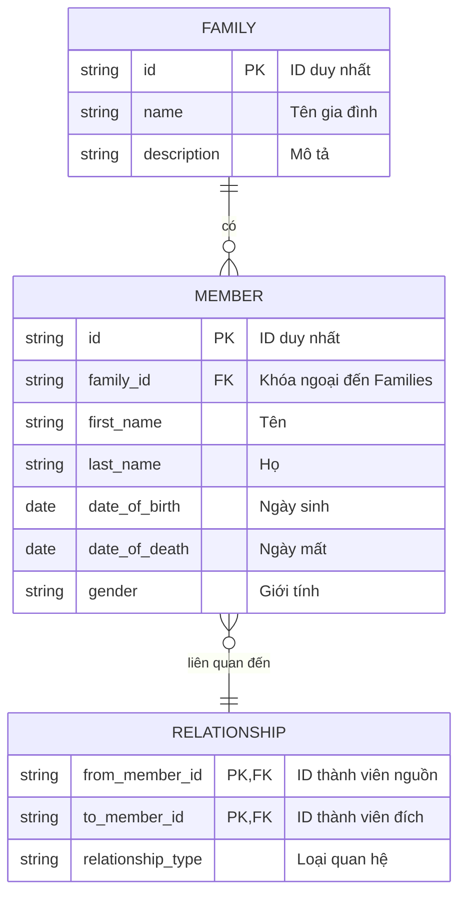

# Mô hình Dữ liệu và Schema Database

## Mục lục

- [1. Giới thiệu](#1-giới-thiệu)
- [2. Sơ đồ quan hệ thực thể (ERD)](#2-sơ-đồ-quan-hệ-thực-thể-erd)
- [3. Mô tả các bảng](#3-mô-tả-các-bảng)
  - [3.1. Bảng `Families`](#31-bảng-families)
  - [3.2. Bảng `Members`](#32-bảng-members)
  - [3.3. Bảng `Relationships`](#33-bảng-relationships)
- [4. Toàn vẹn và Ràng buộc Dữ liệu](#4-toàn-vẹn-và-ràng-buộc-dữ-liệu)
- [5. Hướng dẫn Mapping](#5-hướng-dẫn-mapping)
  - [5.1. Backend (Entity Framework Core)](#51-backend-entity-framework-core)
  - [5.2. Frontend (Vue.js)](#52-frontend-vuejs)
- [6. Ví dụ Dữ liệu JSON](#6-ví-dụ-dữ-liệu-json)

---

## 1. Giới thiệu

Tài liệu này mô tả chi tiết về mô hình dữ liệu, schema của database (MySQL), và các quy tắc ràng buộc nhằm đảm bảo tính nhất quán và toàn vẹn của dữ liệu trong hệ thống Cây Gia Phả.

## 2. Sơ đồ quan hệ thực thể (ERD)



## 3. Mô tả các bảng

### 3.1. Bảng `Families`

Lưu trữ thông tin về các gia đình hoặc dòng họ.

| Tên cột      | Kiểu dữ liệu | Ràng buộc | Mô tả                  |
| :------------ | :----------- | :-------- | :--------------------- |
| `id`          | `varchar(36)`| PK        | ID duy nhất của gia đình |
| `name`        | `varchar(100)`| NOT NULL  | Tên gia đình           |
| `description` | `text`       | NULL      | Mô tả về gia đình      |

- **Mối quan hệ**: Một `Family` có thể có nhiều `Member`.

### 3.2. Bảng `Members`

Lưu trữ thông tin chi tiết của từng thành viên.

| Tên cột         | Kiểu dữ liệu | Ràng buộc | Mô tả                   |
| :-------------- | :----------- | :-------- | :---------------------- |
| `id`            | `varchar(36)`| PK        | ID duy nhất của thành viên |
| `family_id`     | `varchar(36)`| FK, NOT NULL | ID của gia đình mà thành viên thuộc về |
| `first_name`    | `varchar(50)`| NOT NULL  | Tên                     |
| `last_name`     | `varchar(50)`| NOT NULL  | Họ                      |
| `date_of_birth` | `date`       | NULL      | Ngày sinh               |
| `date_of_death` | `date`       | NULL      | Ngày mất                |
| `gender`        | `varchar(10)`| NULL      | Giới tính (Male, Female, Other) |

- **Foreign Keys**:
  - `family_id`: tham chiếu đến `Families(id)`.
- **Mối quan hệ**: Một `Member` thuộc về một `Family` và có thể có nhiều `Relationship`.

### 3.3. Bảng `Relationships`

Lưu trữ các mối quan hệ giữa các thành viên.

| Tên cột             | Kiểu dữ liệu | Ràng buộc | Mô tả                        |
| :------------------ | :----------- | :-------- | :--------------------------- |
| `from_member_id`    | `varchar(36)`| PK, FK    | ID của thành viên nguồn        |
| `to_member_id`      | `varchar(36)`| PK, FK    | ID của thành viên đích       |
| `relationship_type` | `varchar(20)`| NOT NULL  | Loại quan hệ (PARENT, SPOUSE, SIBLING) |

- **Foreign Keys**:
  - `from_member_id`: tham chiếu đến `Members(id)`.
  - `to_member_id`: tham chiếu đến `Members(id)`.

## 4. Toàn vẹn và Ràng buộc Dữ liệu

- **ID duy nhất**: Tất cả các khóa chính (`id`) đều là `GUID` để đảm bảo tính duy nhất trên toàn hệ thống.
- **Ngày sinh/mất**: `date_of_death` phải lớn hơn `date_of_birth`.
- **Giới tính**: Trường `gender` nên được giới hạn trong một tập các giá trị cụ thể (ví dụ: `Male`, `Female`, `Other`).
- **Quan hệ**: Không cho phép một thành viên có quan hệ với chính mình.

## 5. Hướng dẫn Mapping

### 5.1. Backend (Entity Framework Core)

Các bảng được map sang các class Entity trong `Domain` layer. EF Core sử dụng Fluent API để cấu hình chi tiết các mối quan hệ.

```csharp
// trong ApplicationDbContext.cs
modelBuilder.Entity<Member>(builder =>
{
    builder.HasKey(m => m.Id);
    builder.Property(m => m.FirstName).IsRequired().HasMaxLength(50);
    builder.HasOne(m => m.Family)
           .WithMany(f => f.Members)
           .HasForeignKey(m => m.FamilyId);
});
```

### 5.2. Frontend (Vue.js)

Trong Frontend, dữ liệu từ API được map sang các interface/type trong thư mục `src/types`.

```typescript
// src/types/member.ts
export interface Member {
  id: string;
  familyId: string;
  fullName: string;
  gender?: 'Male' | 'Female' | 'Other';
  dateOfBirth?: string; // ISO 8601 format
  // ... các trường khác
}
```

## 6. Ví dụ Dữ liệu JSON

Đây là ví dụ về cách dữ liệu có thể được trả về từ API, FE có thể sử dụng để mock.

**Family:**

```json
{
  "id": "f7b3b3b3-3b3b-3b3b-3b3b-3b3b3b3b3b3b",
  "name": "Dòng họ Nguyễn",
  "description": "Dòng họ lớn ở Việt Nam"
}
```

**Member:**

```json
{
  "id": "m1b3b3b3-3b3b-3b3b-3b3b-3b3b3b3b3b3b",
  "familyId": "f7b3b3b3-3b3b-3b3b-3b3b-3b3b3b3b3b3b",
  "firstName": "Văn A",
  "lastName": "Nguyễn",
  "dateOfBirth": "1950-01-01T00:00:00Z",
  "gender": "Male"
}
```