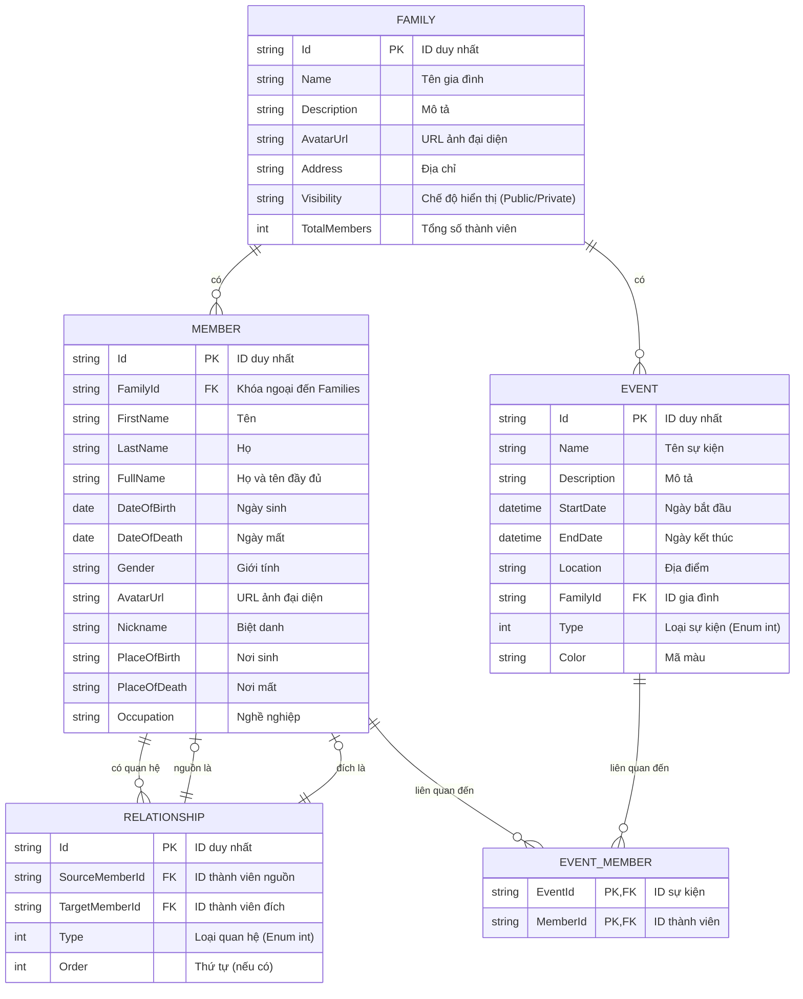

# Mô hình Dữ liệu và Schema Database

## Mục lục

- [1. Giới thiệu](#1-giới-thiệu)
- [2. Sơ đồ quan hệ thực thể (ERD)](#2-sơ-đồ-quan-hệ-thực-thể-erd)
- [3. Mô tả các bảng](#3-mô-tả-các-bảng)
  - [3.1. Bảng `Families`](#31-bảng-families)
  - [3.2. Bảng `Members`](#32-bảng-members)
  - [3.3. Bảng `Relationships`](#33-bảng-relationships)
- [4. Toàn vẹn và Ràng buộc Dữ liệu](#4-toàn-vẹn-và-ràng-buộc-dữ-liệu)
- [5. Hướng dẫn Mapping](#5-hướng-dẫn-mapping)
  - [5.1. Backend (Entity Framework Core)](#51-backend-entity-framework-core)
  - [5.2. Frontend (Vue.js)](#52-frontend-vuejs)
- [6. Ví dụ Dữ liệu JSON](#6-ví-dụ-dữ-liệu-json)

---

## 1. Giới thiệu

Tài liệu này mô tả chi tiết về mô hình dữ liệu, schema của database (MySQL), và các quy tắc ràng buộc nhằm đảm bảo tính nhất quán và toàn vẹn của dữ liệu trong hệ thống Cây Gia Phả.

## 2. Sơ đồ quan hệ thực thể (ERD)


## 3. Mô tả các bảng

### 3.1. Bảng `Families` (updated after refactor)

Lưu trữ thông tin về các gia đình hoặc dòng họ.

| Tên cột      | Kiểu dữ liệu | Ràng buộc | Mô tả                  |
| :------------ | :----------- | :-------- | :--------------------- |
| `Id`          | `varchar(36)`| PK        | ID duy nhất của gia đình |
| `Name`        | `varchar(100)`| NOT NULL  | Tên gia đình           |
| `Description` | `text`       | NULL      | Mô tả về gia đình      |
| `AvatarUrl`   | `longtext`   | NULL      | URL ảnh đại diện của gia đình |
| `Address`     | `longtext`   | NULL      | Địa chỉ của gia đình   |
| `Visibility`  | `varchar(20)`| NOT NULL  | Chế độ hiển thị (Public, Private) |
| `TotalMembers`| `int`        | NOT NULL  | Tổng số thành viên trong gia đình |

- **Mối quan hệ**: Một `Family` có thể có nhiều `Member` và nhiều `Event`.

### 3.2. Bảng `Members` (updated after refactor)

Lưu trữ thông tin chi tiết của từng thành viên. Các mối quan hệ giữa các thành viên được quản lý thông qua bảng `Relationships`.

| Tên cột         | Kiểu dữ liệu | Ràng buộc | Mô tả                   |
| :-------------- | :----------- | :-------- | :---------------------- |
| `Id`            | `varchar(36)`| PK        | ID duy nhất của thành viên |
| `FamilyId`      | `varchar(36)`| FK, NOT NULL | ID của gia đình mà thành viên thuộc về |
| `FirstName`     | `varchar(250)`| NOT NULL  | Tên                     |
| `LastName`      | `varchar(250)`| NOT NULL  | Họ                      |
| `FullName`      | `varchar(100)`| NOT NULL  | Họ và tên đầy đủ (tự động tạo) |
| `DateOfBirth`   | `date`       | NULL      | Ngày sinh               |
| `DateOfDeath`   | `date`       | NULL      | Ngày mất                |
| `Gender`        | `varchar(10)`| NULL      | Giới tính (Male, Female, Other) |
| `AvatarUrl`     | `longtext`   | NULL      | URL ảnh đại diện của thành viên |
| `Nickname`      | `varchar(100)`| NULL      | Biệt danh               |
| `PlaceOfBirth`  | `varchar(200)`| NULL      | Nơi sinh                |
| `PlaceOfDeath`  | `varchar(200)`| NULL      | Nơi mất                 |
| `Occupation`    | `varchar(100)`| NULL      | Nghề nghiệp             |

- **Foreign Keys**:
  - `FamilyId`: tham chiếu đến `Families(Id)`.
- **Mối quan hệ**: Một `Member` thuộc về một `Family`. Các mối quan hệ giữa các thành viên (cha, mẹ, vợ/chồng, v.v.) được định nghĩa và lưu trữ trong bảng `Relationships`.

### 3.3. Bảng `Events` (updated after refactor)

Lưu trữ thông tin về các sự kiện quan trọng của gia đình.

| Tên cột         | Kiểu dữ liệu | Ràng buộc | Mô tả                   |
| :-------------- | :----------- | :-------- | :---------------------- |
| `Id`            | `varchar(36)`| PK        | ID duy nhất của sự kiện |
| `Name`          | `varchar(200)`| NOT NULL  | Tên sự kiện             |
| `Description`   | `text`       | NULL      | Mô tả chi tiết          |
| `StartDate`     | `datetime`   | NOT NULL  | Ngày bắt đầu            |
| `EndDate`       | `datetime`   | NULL      | Ngày kết thúc           |
| `Location`      | `varchar(200)`| NULL      | Địa điểm diễn ra        |
| `FamilyId`      | `varchar(36)`| FK, NULL  | ID của gia đình liên quan |
| `Type`          | `int`        | NOT NULL  | Loại sự kiện (Birth, Marriage, Death, Other) |
| `Color`         | `varchar(20)`| NULL      | Mã màu để hiển thị      |

- **Foreign Keys**:
  - `FamilyId`: tham chiếu đến `Families(Id)`.
- **Mối quan hệ**: Một `Event` có thể liên quan đến một `Family`.

### 3.4. Bảng `Relationships` (updated after refactor)

Lưu trữ các mối quan hệ giữa các thành viên (ví dụ: cha, mẹ, vợ/chồng, con cái).

| Tên cột         | Kiểu dữ liệu | Ràng buộc | Mô tả                   |
| :-------------- | :----------- | :-------- | :---------------------- |
| `Id`            | `varchar(36)`| PK        | ID duy nhất của mối quan hệ |
| `SourceMemberId`| `varchar(36)`| FK, NOT NULL | ID của thành viên nguồn (ví dụ: cha/mẹ/vợ/chồng) |
| `TargetMemberId`| `varchar(36)`| FK, NOT NULL | ID của thành viên đích (ví dụ: con/vợ/chồng) |
| `Type`          | `int`        | NOT NULL  | Loại mối quan hệ (ví dụ: Parent, Child, Spouse) |
| `Order`         | `int`        | NULL      | Thứ tự của mối quan hệ (nếu có) |

- **Foreign Keys**:
  - `SourceMemberId`: tham chiếu đến `Members(Id)`.
  - `TargetMemberId`: tham chiếu đến `Members(Id)`.
- **Mối quan hệ**: Một `Member` có thể là `SourceMember` hoặc `TargetMember` trong nhiều `Relationship`.

## 4. Toàn vẹn và Ràng buộc Dữ liệu (updated after refactor)

Để đảm bảo tính chính xác và nhất quán của dữ liệu, hệ thống áp dụng các ràng buộc và quy tắc toàn vẹn dữ liệu sau:

*   **ID duy nhất**: Tất cả các khóa chính (`Id`) đều là `GUID` (Globally Unique Identifier) để đảm bảo tính duy nhất trên toàn hệ thống và dễ dàng trong việc phân tán dữ liệu.
*   **Khóa ngoại (Foreign Keys)**: Đảm bảo tính toàn vẹn tham chiếu giữa các bảng. Ví dụ, `FamilyId` trong bảng `Members` phải tồn tại trong bảng `Families`. Tương tự, `SourceMemberId` và `TargetMemberId` trong bảng `Relationships` phải tồn tại trong bảng `Members`.
*   **Ngày sinh/mất**: 
    *   `DateOfDeath` (nếu có) phải lớn hơn `DateOfBirth`.
    *   `DateOfBirth` và `DateOfDeath` không được ở trong tương lai.
*   **Giới tính**: Trường `Gender` nên được giới hạn trong một tập các giá trị cụ thể (ví dụ: `Male`, `Female`, `Other`) để đảm bảo tính nhất quán.
*   **Tên và Họ**: Các trường `FirstName` và `LastName` là bắt buộc (`NOT NULL`) để đảm bảo mỗi thành viên có thông tin cơ bản đầy đủ.
*   **Chế độ hiển thị (Visibility)**: Trường `Visibility` trong bảng `Families` nên được giới hạn trong các giá trị như `Public` hoặc `Private`.
*   **Loại sự kiện (Event Type)**: Trường `Type` trong bảng `Events` nên được giới hạn trong các giá trị cụ thể (ví dụ: `Birth`, `Marriage`, `Death`, `Other`).
*   **Loại mối quan hệ (Relationship Type)**: Trường `Type` trong bảng `Relationships` nên được giới hạn trong các giá trị cụ thể (ví dụ: `Parent`, `Child`, `Spouse`, `Sibling`).


## 5. Hướng dẫn Mapping

### 5.1. Backend (Entity Framework Core) (updated after refactor)

Các bảng được map sang các class Entity trong `Domain` layer. EF Core sử dụng Fluent API trong `ApplicationDbContext` để cấu hình chi tiết các mối quan hệ và thuộc tính của Entity.

```csharp
// trong ApplicationDbContext.cs (phương thức OnModelCreating)

modelBuilder.Entity<Family>(builder =>
{
    builder.Property(f => f.Name).HasMaxLength(100).IsRequired();
    builder.Property(f => f.Description).HasMaxLength(1000);
    builder.Property(f => f.AvatarUrl); // longtext
    builder.Property(f => f.Address); // longtext
    builder.Property(f => f.Visibility).HasConversion<string>().HasMaxLength(20).IsRequired();
    builder.Property(f => f.TotalMembers).IsRequired();
});

modelBuilder.Entity<Member>(builder =>
{
    builder.Property(m => m.FirstName).HasMaxLength(250).IsRequired();
    builder.Property(m => m.LastName).HasMaxLength(250).IsRequired();
    builder.Property(m => m.FullName).HasMaxLength(100).IsRequired();
    builder.Property(m => m.Gender).HasConversion<string>().HasMaxLength(10);
    builder.Property(m => m.AvatarUrl); // longtext
    builder.Property(m => m.Nickname).HasMaxLength(100);
    builder.Property(m => m.PlaceOfBirth).HasMaxLength(200);
    builder.Property(m => m.PlaceOfDeath).HasMaxLength(200);
    builder.Property(m => m.Occupation).HasMaxLength(100);

    // Mối quan hệ với Family
    builder.HasOne(m => m.Family)
           .WithMany(f => f.Members)
           .HasForeignKey(m => m.FamilyId)
           .IsRequired();
});

modelBuilder.Entity<Event>(builder =>
{
    builder.Property(e => e.Name).HasMaxLength(200).IsRequired();
    builder.Property(e => e.Description).HasMaxLength(1000);
    builder.Property(e => e.Location).HasMaxLength(200);
    builder.Property(e => e.Type).IsRequired(); // Stored as int
    builder.Property(e => e.Color).HasMaxLength(20);

    // Mối quan hệ với Family
    builder.HasOne(e => e.Family)
           .WithMany(f => f.Events)
           .HasForeignKey(e => e.FamilyId)
           .IsRequired(false); // Sự kiện có thể không thuộc về một Family cụ thể
});

// Cấu hình bảng Relationships
modelBuilder.Entity<Relationship>(builder =>
{
    builder.HasKey(r => r.Id);

    builder.Property(r => r.Type).IsRequired(); // Stored as int
    builder.Property(r => r.Order);

    builder.HasOne(r => r.SourceMember)
           .WithMany()
           .HasForeignKey(r => r.SourceMemberId)
           .OnDelete(DeleteBehavior.Restrict)
           .IsRequired();

    builder.HasOne(r => r.TargetMember)
           .WithMany()
           .HasForeignKey(r => r.TargetMemberId)
           .OnDelete(DeleteBehavior.Restrict)
           .IsRequired();
});

// Cấu hình bảng trung gian cho mối quan hệ nhiều-nhiều giữa Event và Member
modelBuilder.Entity<EventMember>(builder =>
{
    builder.HasKey(em => new { em.EventId, em.MemberId });

    builder.HasOne(em => em.Event)
           .WithMany(e => e.EventMembers)
           .HasForeignKey(em => em.EventId);

    builder.HasOne(em => em.Member)
           .WithMany(m => m.EventMembers)
           .HasForeignKey(em => m.MemberId);
});
```

### 5.2. Frontend (Vue.js)

Trong Frontend, dữ liệu từ API được map sang các interface/type trong thư mục `src/types`. Điều này giúp đảm bảo tính nhất quán về kiểu dữ liệu giữa Frontend và Backend.

```typescript
// src/types/family/family.ts
export interface Family {
  id: string;
  name: string;
  description?: string;
  avatarUrl?: string;
  address?: string;
  visibility?: 'Public' | 'Private';
  totalMembers?: number;
}

// src/types/family/member.ts
export interface Member {
  id: string;
  lastName: string;
  firstName: string;
  fullName?: string;
  familyId: string;
  gender?: 'Male' | 'Female' | 'Other';
  dateOfBirth?: Date | null;
  dateOfDeath?: Date | null;
  birthDeathYears?: string;
  avatarUrl?: string;
  nickname?: string;
  placeOfBirth?: string;
  placeOfDeath?: string;
  occupation?: string;
  biography?: string;
}

// src/types/event/event.ts
export interface Event {
  id: string;
  name: string;
  description?: string;
  startDate: Date;
  endDate?: Date | null;
  location?: string;
  familyId?: string | null;
  type: 'Birth' | 'Marriage' | 'Death' | 'Other';
  color?: string;
  relatedMembers?: string[]; // Chỉ chứa IDs của các thành viên liên quan
}
```

## 6. Ví dụ Dữ liệu JSON

Đây là ví dụ về cách dữ liệu có thể được trả về từ API, Frontend có thể sử dụng để mock hoặc hiểu cấu trúc dữ liệu.

#### Family:

```json
{
  "id": "f7b3b3b3-3b3b-4b3b-8b3b-3b3b3b3b3b3b",
  "name": "Dòng họ Nguyễn",
  "description": "Dòng họ lớn ở Việt Nam với nhiều chi nhánh.",
  "address": "Số 1, Đường ABC, Quận XYZ, TP.HCM",
  "avatarUrl": "https://example.com/avatars/nguyen_family.png",
  "visibility": "Public",
  "totalMembers": 150
}
```

#### Member:

```json
{
  "id": "m1b3b3b3-3b3b-4b3b-8b3b-3b3b3b3b3b3b",
  "familyId": "f7b3b3b3-3b3b-4b3b-8b3b-3b3b3b3b3b3b",
  "firstName": "Văn A",
  "lastName": "Nguyễn",
  "fullName": "Nguyễn Văn A",
  "gender": "Male",
  "dateOfBirth": "1950-01-01T00:00:00Z",
  "dateOfDeath": "2020-12-31T00:00:00Z",
  "birthDeathYears": "1950-2020",
  "avatarUrl": "https://example.com/avatars/nguyen_van_a.png",
  "nickname": "Ông Cả",
  "placeOfBirth": "Hà Nội",
  "placeOfDeath": "TP.HCM",
  "occupation": "Kỹ sư",
  "fatherId": "m2c4c4c4-4c4c-4c4c-8c4c-4c4c4c4c4c4c",
  "motherId": "m3d5d5d5-5d5d-4d5d-8d5d-5d5d5d5d5d5d",
  "spouseId": "m4e6e6e6-6e6e-4e6e-8e6e-6e6e6e6e6e6e",
  "biography": "Nguyễn Văn A là một kỹ sư tài năng..."
}
```

#### Event:

```json
{
  "id": "e1f7f7f7-7f7f-4f7f-8f7f-7f7f7f7f7f7f",
  "name": "Lễ giỗ Tổ",
  "description": "Lễ giỗ Tổ hàng năm của dòng họ Nguyễn.",
  "startDate": "2024-03-10T00:00:00Z",
  "endDate": "2024-03-10T23:59:59Z",
  "location": "Nhà thờ Tổ",
  "familyId": "f7b3b3b3-3b3b-4b3b-8b3b-3b3b3b3b3b3b",
  "type": "Other",
  "color": "#FF5733",
  "relatedMembers": [
    "m1b3b3b3-3b3b-4b3b-8b3b-3b3b3b3b3b3b",
    "m2c4c4c4-4c4c-4c4c-8c4c-4c4c4c4c4c4c"
  ]
}
```