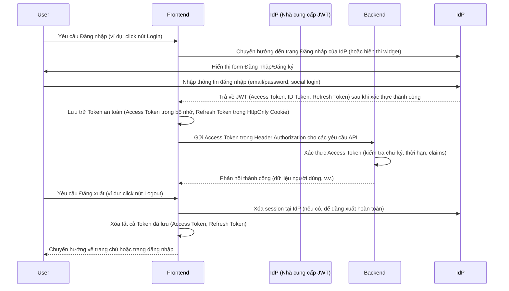

# Hướng dẫn Bảo mật và Kiểm soát Truy cập

## Mục lục

- [1. Giới thiệu](#1-giới-thiệu)
- [2. Xác thực (Authentication)](#2-xác-thực-authentication)
  - [2.1. Cơ chế JWT](#21-cơ-chế-jwt)
  - [2.2. Lưu trữ Token an toàn](#22-lưu-trữ-token-an-toàn)
  - [2.3. Tích hợp Auth0 (Provider-agnostic)](#23-tích-hợp-auth0-provider-agnostic)
  - [2.4. Luồng Đăng nhập/Đăng xuất](#24-luồng-đăng-nhậpđăng-xuất)
- [3. Phân quyền (Authorization)](#3-phân-quyền-authorization)
  - [3.1. Cơ chế RBAC](#31-cơ-chế-rbac)
  - [3.2. Bảo vệ Endpoint (Backend)](#32-bảo-vệ-endpoint-backend)
  - [3.3. Kiểm tra quyền (Frontend)](#33-kiểm-tra-quyền-frontend)
- [4. Các biện pháp bảo mật khác](#4-các-biện-pháp-bảo-mật-khác)
  - [4.1. HTTPS](#41-https)
  - [4.2. CORS (Cross-Origin Resource Sharing)](#42-cors-cross-origin-resource-sharing)
  - [4.3. Input Validation](#43-input-validation)
  - [4.4. Password Hashing](#44-password-hashing)
  - [4.5. Rate Limiting](#45-rate-limiting)
  - [4.6. Logging cho Audit](#46-logging-cho-audit)
  - [4.7. Monitoring Security Events](#47-monitoring-security-events)
- [5. Kiểm thử Bảo mật](#5-kiểm-thử-bảo-mật)

---

## 1. Giới thiệu

Bảo mật là yếu tố tối quan trọng trong mọi hệ thống phần mềm, đặc biệt là với các ứng dụng xử lý dữ liệu cá nhân như Cây Gia Phả. Dự án này áp dụng các nguyên tắc bảo mật cốt lõi như **Zero Trust** (không tin tưởng bất kỳ ai/thứ gì mặc định, luôn xác minh) và **Least Privilege** (cấp quyền tối thiểu cần thiết cho người dùng và hệ thống) để bảo vệ dữ liệu người dùng khỏi các mối đe dọa. Tài liệu này mô tả chi tiết các cơ chế xác thực (Authentication), phân quyền (Authorization) và các biện pháp bảo mật khác được triển khai để đảm bảo an toàn cho ứng dụng.

## 2. Xác thực (Authentication)

### 2.1. Cơ chế JWT

Hệ thống sử dụng **JSON Web Tokens (JWT)** để xác thực người dùng. JWT là một tiêu chuẩn mở (RFC 7519) định nghĩa một cách nhỏ gọn và tự chứa để truyền thông tin an toàn giữa các bên dưới dạng một đối tượng JSON. Thông tin này có thể được xác minh và tin cậy vì nó được ký điện tử.

#### Cấu trúc của JWT

Một JWT bao gồm ba phần, được phân tách bằng dấu chấm (`.`):

1.  **Header**: Chứa thông tin về loại token (JWT) và thuật toán mã hóa được sử dụng (ví dụ: HS256, RS256).
    ```json
    {
      "alg": "HS256",
      "typ": "JWT"
    }
    ```
2.  **Payload (Claims)**: Chứa các "claims" (tuyên bố) về người dùng và các dữ liệu bổ sung. Các claims có thể là:
    *   **Registered claims**: Các claims tiêu chuẩn (ví dụ: `iss` - issuer, `exp` - expiration time, `sub` - subject).
    *   **Public claims**: Các claims tùy chỉnh được định nghĩa công khai.
    *   **Private claims**: Các claims tùy chỉnh được sử dụng giữa các bên tham gia.
    ```json
    {
      "sub": "1234567890",
      "name": "John Doe",
      "admin": true,
      "iat": 1516239022
    }
    ```
3.  **Signature**: Được tạo bằng cách mã hóa Header, Payload và một khóa bí mật (secret key) bằng thuật toán đã chỉ định trong Header. Chữ ký này được sử dụng để xác minh rằng token không bị giả mạo và được gửi từ nguồn đáng tin cậy.

#### Vai trò của JWT trong xác thực

*   **Access Token**: Dùng để truy cập các tài nguyên được bảo vệ. Có thời gian sống ngắn (ví dụ: 15 phút đến 1 giờ) để giảm thiểu rủi ro nếu token bị lộ.
*   **Refresh Token**: Dùng để lấy Access Token mới khi Access Token hiện tại hết hạn mà không yêu cầu người dùng đăng nhập lại. Có thời gian sống dài hơn và được lưu trữ an toàn hơn (thường là trong `HttpOnly Cookie`).

### 2.2. Lưu trữ Token an toàn

Việc lưu trữ JWT một cách an toàn là rất quan trọng để ngăn chặn các cuộc tấn công như XSS (Cross-Site Scripting) và CSRF (Cross-Site Request Forgery).

*   **Access Token**: 
    *   Nên được lưu trữ trong bộ nhớ (in-memory) của Frontend (ví dụ: trong một biến JavaScript hoặc Pinia store) thay vì `localStorage` hoặc `sessionStorage`.
    *   Lý do: Giảm thiểu rủi ro XSS. Nếu một script độc hại được inject vào trang, nó sẽ khó truy cập vào Access Token nếu nó không được lưu trữ trong DOM hoặc `localStorage`.
    *   Thời gian sống ngắn của Access Token cũng giúp giảm thiểu tác động nếu nó bị lộ.

*   **Refresh Token**: 
    *   Nên được lưu trữ trong `HttpOnly Cookie`.
    *   Lý do: `HttpOnly Cookie` không thể truy cập được bằng JavaScript, giúp chống lại các cuộc tấn công XSS.
    *   Cookie cũng nên được đánh dấu `Secure` (chỉ gửi qua HTTPS) và `SameSite=Lax` hoặc `Strict` để chống CSRF.
    *   Refresh Token có thời gian sống dài hơn Access Token và được sử dụng để lấy Access Token mới khi Access Token hết hạn.

### 2.3. Tích hợp Nhà cung cấp JWT (Provider-agnostic)

Hệ thống được thiết kế với một lớp trừu tượng cho dịch vụ xác thực, cho phép dễ dàng thay đổi nhà cung cấp (Identity Provider - IdP) như Auth0, Keycloak, Firebase Auth mà không ảnh hưởng đến logic nghiệp vụ cốt lõi của Backend.

*   **Backend**: Backend đọc cấu hình JWT từ `JwtSettings` (được cấu hình trong tệp `src/backend/.env`) và sử dụng `IClaimsTransformation` để xử lý các claims từ token. Backend sử dụng `ExternalId` (ID người dùng từ nhà cung cấp xác thực) để liên kết với `UserProfile` nội bộ.
*   **Frontend**: Sử dụng SDK của nhà cung cấp (ví dụ: Auth0 SDK) để quản lý luồng đăng nhập/đăng ký và lấy token. Frontend sẽ gửi token này đến Backend.

**Lợi ích**: Tăng tính linh hoạt, giảm sự phụ thuộc vào một nhà cung cấp cụ thể, giúp dễ dàng chuyển đổi hoặc hỗ trợ nhiều IdP trong tương lai.

### 2.4. Luồng Đăng nhập/Đăng xuất

Luồng đăng nhập và đăng xuất được thiết kế để đảm bảo an toàn và trải nghiệm người dùng tốt nhất:



**Giải thích:**

*   **Đăng nhập**: Người dùng được chuyển hướng đến IdP để xác thực. Sau khi thành công, IdP trả về các token cho Frontend. Frontend lưu trữ các token này và sử dụng Access Token để gọi API Backend.
*   **Đăng xuất**: Frontend yêu cầu IdP xóa session và xóa tất cả các token đã lưu trữ cục bộ. Điều này đảm bảo người dùng không còn được xác thực.

## 3. Phân quyền (Authorization)

Hệ thống áp dụng một cơ chế phân quyền mạnh mẽ, kết hợp giữa **Role-Based Access Control (RBAC)** truyền thống và **phân quyền theo ngữ cảnh (Context-based Authorization)**, đặc biệt là phân quyền theo từng gia đình (Family-specific roles). Điều này đảm bảo rằng người dùng chỉ có thể truy cập và thao tác trên dữ liệu mà họ có quyền, dựa trên vai trò của họ trong hệ thống và trong từng gia đình cụ thể.

### 3.1. Các khái niệm chính về Phân quyền

*   **Người dùng (Users)**: Các cá nhân hoặc hệ thống tương tác với ứng dụng.
*   **Vai trò (Roles)**: Các chức danh hoặc nhóm chức năng trong hệ thống. Hệ thống định nghĩa hai loại vai trò chính:
    *   **Vai trò toàn cục (Global Roles)**: Áp dụng cho toàn bộ hệ thống (ví dụ: `Administrator`).
    *   **Vai trò theo gia đình (Family Roles)**: Áp dụng cho người dùng trong ngữ cảnh của một gia đình cụ thể (ví dụ: `Manager`, `Viewer` trong một `Family`).
*   **Quyền hạn (Permissions)**: Các hành động cụ thể mà người dùng có thể thực hiện (ví dụ: `family:create`, `member:edit`, `event:delete`). Quyền hạn được gán cho các vai trò.

### 3.2. Triển khai Phân quyền theo Gia đình

Hệ thống sử dụng thực thể `FamilyUser` để định nghĩa mối quan hệ giữa một `UserProfile` và một `Family`, đồng thời gán một `FamilyRole` cụ thể cho mối quan hệ đó. Điều này cho phép một người dùng có các vai trò khác nhau trong các gia đình khác nhau.

#### Enum `FamilyRole`

`FamilyRole` là một enum được định nghĩa trong `backend/src/Domain/Enums/FamilyRole.cs`, xác định các cấp độ quyền hạn của người dùng trong một gia đình:

```csharp
namespace backend.Domain.Enums;

public enum FamilyRole
{
    /// <summary>
    /// User has full management rights over the family.
    /// </summary>
    Manager = 0,

    /// <summary>
    /// User can view family data but cannot modify it.
    /// </summary>
    Viewer = 1,
}
```

*   **`Manager`**: Người dùng có vai trò này có toàn quyền quản lý gia đình, bao gồm thêm/sửa/xóa thành viên, sự kiện, mối quan hệ, và quản lý các thành viên khác trong gia đình.
*   **`Viewer`**: Người dùng có vai trò này chỉ có thể xem dữ liệu của gia đình nhưng không thể thực hiện bất kỳ thay đổi nào.

#### Dịch vụ Ủy quyền (`IAuthorizationService`)

`IAuthorizationService` là một interface quan trọng (`backend/src/Application/Common/Interfaces/IAuthorizationService.cs`) cung cấp các phương thức để kiểm tra quyền hạn của người dùng một cách tập trung và nhất quán trong toàn bộ ứng dụng Backend. Các phương thức này giúp xác định xem người dùng hiện tại có quyền thực hiện một hành động cụ thể hay truy cập một tài nguyên nhất định hay không.

```csharp
namespace backend.Application.Common.Interfaces;

public interface IAuthorizationService
{
    /// <summary>
    /// Checks if the current user is an Admin.
    /// </summary>
    bool IsAdmin();

    /// <summary>
    /// Retrieves the current user's UserProfile, including their family associations and ExternalId.
    /// </summary>
    Task<UserProfile?> GetCurrentUserProfileAsync(CancellationToken cancellationToken = default);

    /// <summary>
    /// Checks if the current user has access (Manager or Viewer) to a specific family.
    /// </summary>
    bool CanAccessFamily(Guid familyId, UserProfile userProfile);

    /// <summary>
    /// Checks if the current user has management rights (Manager role) for a specific family.
    /// </summary>
    bool CanManageFamily(Guid familyId, UserProfile userProfile);

    /// <summary>
    /// Checks if the current user has a specific role within a family.
    /// </summary>
    bool HasFamilyRole(Guid familyId, UserProfile userProfile, FamilyRole requiredRole);
}
```

**Mô tả các phương thức:**

*   `IsAdmin()`: Kiểm tra xem người dùng hiện tại có vai trò `Administrator` toàn cục hay không.
*   `GetCurrentUserProfileAsync()`: Lấy thông tin `UserProfile` của người dùng hiện tại, bao gồm cả `ExternalId` và các gia đình mà họ liên kết và vai trò của họ trong đó.
*   `CanAccessFamily(Guid familyId, UserProfile userProfile)`: Kiểm tra xem `userProfile` có quyền truy cập (ít nhất là `Viewer`) vào `familyId` đã cho hay không.
*   `CanManageFamily(Guid familyId, UserProfile userProfile)`: Kiểm tra xem `userProfile` có quyền quản lý (vai trò `Manager`) đối với `familyId` đã cho hay không.
*   `HasFamilyRole(Guid familyId, UserProfile userProfile, FamilyRole requiredRole)`: Kiểm tra xem `userProfile` có vai trò `requiredRole` hoặc cao hơn trong `familyId` đã cho hay không.

### 3.3. Bảo vệ Endpoint (Backend)

Trong ASP.NET Core, việc bảo vệ các endpoint API được thực hiện bằng cách sử dụng attribute `[Authorize]` trên các Controller hoặc trên từng action method cụ thể. Điều này cho phép bạn định nghĩa các yêu cầu xác thực và phân quyền cho từng phần của API.

#### Ví dụ cơ bản

*   **Bảo vệ toàn bộ Controller**: Áp dụng `[Authorize]` trên class Controller để yêu cầu xác thực cho tất cả các action trong Controller đó.

    ```csharp
    // backend/src/Web/Controllers/FamilyController.cs
    [Authorize] // Yêu cầu xác thực cho tất cả các action trong FamilyController
    [ApiController]
    [Route("api/[controller]")]
    public class FamilyController : ApiControllerBase
    {
        // ...
    }
    ```

*   **Bảo vệ từng Action**: Áp dụng `[Authorize]` trên một action method cụ thể.

    ```csharp
    // backend/src/Web/Controllers/MemberController.cs
    [HttpGet("{id}")]
    [Authorize] // Chỉ yêu cầu xác thực cho action này
    public async Task<ActionResult<Result<MemberDto>>> GetMemberById(Guid id)
    {
        // ...
    }
    ```

#### Phân quyền theo vai trò toàn cục (Global Role-based Authorization)

Sử dụng `Roles` parameter trong `[Authorize]` để chỉ định những vai trò toàn cục nào được phép truy cập.

```csharp
// backend/src/Web/Controllers/AdminController.cs
[ApiController]
[Route("api/[controller]")]
public class AdminController : ApiControllerBase
{
    [HttpGet("users")]
    [Authorize(Roles = Roles.Administrator)] // Chỉ người dùng có vai trò Administrator mới được truy cập
    public async Task<ActionResult<Result<List<UserDto>>>> GetUsers()
    {
        // ...
    }
}
```

#### Phân quyền dựa trên chính sách (Policy-based Authorization)

Sử dụng `Policy` parameter trong `[Authorize]` để áp dụng các chính sách phân quyền phức tạp hơn, được định nghĩa trong `Program.cs`. Các chính sách này có thể tích hợp `IAuthorizationService` để kiểm tra quyền theo ngữ cảnh.

```csharp
// backend/src/Web/Program.cs (trong AddAuthorization)
builder.Services.AddAuthorization(options =>
{
    options.AddPolicy(Policies.CanPurge, policy => policy.RequireRole(Roles.Administrator));
    // Ví dụ về chính sách kiểm tra quyền quản lý gia đình
    options.AddPolicy(Policies.CanManageFamily, policy =>
        policy.Requirements.Add(new FamilyRoleRequirement(FamilyRole.Manager)));
});

// Sử dụng trong Controller
[HttpPost]
[Authorize(Policy = Policies.CanPurge)] // Chỉ người dùng thỏa mãn chính sách CanPurge mới được truy cập
public async Task<IActionResult> PurgeData([FromBody] PurgeDataCommand command)
{
    // ...
}

// Sử dụng chính sách kiểm tra quyền quản lý gia đình
[HttpPut("{familyId}/member/{memberId}")]
[Authorize(Policy = Policies.CanManageFamily)] // Chỉ người dùng có quyền quản lý gia đình mới được truy cập
public async Task<IActionResult> UpdateMemberInFamily(Guid familyId, Guid memberId, [FromBody] UpdateMemberCommand command)
{
    // ...
}
```

### 3.4. Kiểm tra quyền (Frontend)

Frontend cần kiểm tra vai trò hoặc quyền của người dùng để điều chỉnh giao diện người dùng (UI) và trải nghiệm người dùng (UX). Điều này bao gồm việc ẩn/hiện các nút, menu, hoặc các phần tử UI khác mà người dùng không có quyền truy cập. Thông tin về vai trò và quyền hạn của người dùng sẽ được Backend cung cấp (thường là một phần của JWT Payload hoặc một endpoint riêng).

#### Ví dụ trong Vue component (sử dụng Pinia Store)

```typescript
// frontend/src/stores/auth.store.ts (ví dụ về một auth store)
import { defineStore } from 'pinia';

interface UserFamilyRole {
  familyId: string;
  role: 'Manager' | 'Viewer';
}

interface UserProfile {
  id: string;
  email: string;
  globalRoles: string[]; // Danh sách các vai trò toàn cục của người dùng
  familyRoles: UserFamilyRole[]; // Danh sách các vai trò theo gia đình của người dùng
}

export const useAuthStore = defineStore('auth', {
  state: () => ({
    user: null as UserProfile | null,
    isAuthenticated: false,
  }),
  actions: {
    setUser(profile: UserProfile) {
      this.user = profile;
      this.isAuthenticated = true;
    },
    logout() {
      this.user = null;
      this.isAuthenticated = false;
      // Xóa token và chuyển hướng
    },
  },
  getters: {
    isAdmin: (state) => state.user?.globalRoles.includes('Administrator'),
    canManageFamily: (state) => (familyId: string) => {
      return state.user?.familyRoles.some(fr => fr.familyId === familyId && fr.role === 'Manager');
    },
    canViewFamily: (state) => (familyId: string) => {
      return state.user?.familyRoles.some(fr => fr.familyId === familyId && (fr.role === 'Manager' || fr.role === 'Viewer'));
    },
  },
});

// frontend/src/components/FamilyManagementPanel.vue
<script setup lang="ts">
import { useAuthStore } from '@/stores/auth.store';
import { computed } from 'vue';

const authStore = useAuthStore();
const currentFamilyId = 'some-family-uuid'; // Lấy từ route hoặc context

const isAdmin = computed(() => authStore.isAdmin);
const canManageCurrentFamily = computed(() => authStore.canManageFamily(currentFamilyId));
</script>

<template>
  <div v-if="isAdmin || canManageCurrentFamily">
    <h2>Bảng điều khiển Quản lý Gia đình</h2>
    <button v-if="canManageCurrentFamily">Thêm thành viên mới</button>
    <!-- Các chức năng quản lý khác -->
  </div>
  <div v-else>
    <p>Bạn không có quyền quản lý gia đình này.</p>
  </div>
</template>
```

**Giải thích:**

*   Frontend nhận thông tin về vai trò toàn cục và vai trò theo gia đình của người dùng từ Backend.
*   Thông tin này được lưu trữ trong một Pinia store (ví dụ: `auth.store.ts`).
*   Các `computed property` và `getter` trong Vue component được sử dụng để kiểm tra quyền hạn và điều chỉnh hiển thị UI một cách linh hoạt, cho phép kiểm tra cả vai trò toàn cục và vai trò cụ thể theo gia đình.

## 4. Các biện pháp bảo mật khác

Ngoài xác thực và phân quyền, dự án còn áp dụng nhiều biện pháp bảo mật khác để tăng cường khả năng phòng thủ của hệ thống.

### 4.1. HTTPS

*   **Vì sao cần**: HTTPS (Hypertext Transfer Protocol Secure) mã hóa tất cả lưu lượng mạng giữa client và server. Điều này ngăn chặn các cuộc tấn công nghe lén (eavesdropping), giả mạo (tampering) và tấn công Man-in-the-Middle (MitM), đảm bảo rằng dữ liệu truyền tải là riêng tư và toàn vẹn.
*   **Best Practices**: 
    *   Luôn sử dụng HTTPS trong môi trường production.
    *   Cấu hình server để tự động chuyển hướng (redirect) tất cả các yêu cầu HTTP sang HTTPS.
    *   Sử dụng HSTS (HTTP Strict Transport Security) để buộc trình duyệt chỉ kết nối qua HTTPS.

### 4.2. CORS (Cross-Origin Resource Sharing)

*   **Vì sao cần**: CORS là một cơ chế bảo mật của trình duyệt, ngăn chặn các website độc hại thực hiện các yêu cầu cross-origin (yêu cầu từ một domain khác) trái phép đến API của chúng ta. Nếu không cấu hình đúng, ứng dụng có thể bị tấn công CSRF hoặc bị lộ dữ liệu.
*   **Best Practices**: 
    *   Cấu hình CORS chặt chẽ trên Backend, chỉ cho phép các origin (domain) được tin cậy truy cập API.
    *   Tránh sử dụng `AllowAnyOrigin()` trong môi trường production.

    **Ví dụ cấu hình trong ASP.NET Core (`Program.cs`):**

    ```csharp
    // backend/src/Web/Program.cs
    builder.Services.AddCors(options =>
    {
        options.AddPolicy("AllowFrontend",
            policyBuilder =>
            {
                var corsOrigins = builder.Configuration["CORS_ORIGINS"];
                if (!string.IsNullOrEmpty(corsOrigins))
                {
                    policyBuilder.WithOrigins(corsOrigins.Split(',', StringSplitOptions.RemoveEmptyEntries))
                                 .AllowAnyHeader()
                                 .AllowAnyMethod();
                }
            });
    });

    // Sử dụng policy trong pipeline
    app.UseCors("AllowFrontend");
    ```

### 4.3. Input Validation

*   **Vì sao cần**: Input Validation là tuyến phòng thủ đầu tiên chống lại nhiều loại tấn công, bao gồm SQL Injection, XSS (Cross-Site Scripting), Command Injection, và Buffer Overflow. Bằng cách xác thực dữ liệu đầu vào, chúng ta đảm bảo rằng ứng dụng chỉ xử lý dữ liệu hợp lệ và an toàn.
*   **Best Practices**: 
    *   Validate dữ liệu ở cả Frontend (để cải thiện UX) và Backend (để đảm bảo an toàn).
    *   Sử dụng các thư viện validation mạnh mẽ (ví dụ: FluentValidation trong Backend, VeeValidate/Zod trong Frontend).
    *   Không tin tưởng bất kỳ dữ liệu nào đến từ client.

### 4.4. Password Hashing

*   **Vì sao cần**: Bảo vệ mật khẩu người dùng ngay cả khi database bị lộ. Không bao giờ lưu trữ mật khẩu dưới dạng plaintext. Nếu mật khẩu bị lộ, kẻ tấn công có thể sử dụng chúng để truy cập tài khoản người dùng.
*   **Best Practices**: 
    *   Sử dụng các thuật toán hashing mạnh mẽ, có salt và chậm (ví dụ: bcrypt, Argon2, PBKDF2) thay vì các thuật toán nhanh và yếu như MD5 hoặc SHA-1.
    *   Không tự triển khai thuật toán hashing mà nên sử dụng các thư viện đã được kiểm chứng.

### 4.5. Rate Limiting

*   **Vì sao cần**: Ngăn chặn các cuộc tấn công brute-force (thử mật khẩu liên tục), DDoS (Distributed Denial of Service) và lạm dụng API bằng cách giới hạn số lượng request mà một client hoặc một IP có thể gửi trong một khoảng thời gian nhất định.
*   **Best Practices**: 
    *   Áp dụng rate limiting cho các endpoint nhạy cảm như đăng nhập, đăng ký, reset mật khẩu.
    *   Cấu hình rate limiting ở tầng Gateway (ví dụ: Nginx) hoặc trong Backend.

### 4.6. Logging cho Audit

*   **Vì sao cần**: Ghi lại các hoạt động quan trọng của người dùng và hệ thống để phục vụ mục đích kiểm toán (audit), phát hiện và điều tra sự cố bảo mật. Log audit giúp theo dõi ai đã làm gì, khi nào và ở đâu.
*   **Best Practices**: 
    *   Ghi log các sự kiện quan trọng: đăng nhập/đăng xuất, thay đổi quyền, truy cập dữ liệu nhạy cảm, các thao tác CRUD quan trọng.
    *   Đảm bảo log được bảo vệ khỏi việc giả mạo và không chứa thông tin nhạy cảm (mật khẩu, PII).
    *   Sử dụng các hệ thống quản lý log tập trung.

### 4.7. Monitoring Security Events

*   **Vì sao cần**: Phát hiện sớm các hành vi bất thường hoặc các cuộc tấn công đang diễn ra. Monitoring liên tục giúp phản ứng nhanh chóng với các mối đe dọa bảo mật.
*   **Best Practices**: 
    *   Tích hợp với các công cụ SIEM (Security Information and Event Management) hoặc các hệ thống cảnh báo để theo dõi log và metrics liên quan đến bảo mật.
    *   Thiết lập cảnh báo cho các sự kiện như đăng nhập thất bại liên tục, truy cập trái phép, thay đổi cấu hình bảo mật.

## 5. Kiểm thử Bảo mật

Kiểm thử bảo mật là một phần không thể thiếu để đảm bảo ứng dụng an toàn và vững chắc trước các mối đe dọa. Dự án áp dụng nhiều phương pháp kiểm thử bảo mật khác nhau:

#### 1. Unit Tests

*   **Mục đích**: Kiểm tra các hàm và module liên quan đến bảo mật một cách riêng lẻ. Ví dụ: kiểm tra các hàm hashing mật khẩu, các hàm kiểm tra quyền hạn, các hàm mã hóa/giải mã dữ liệu.
*   **Phạm vi**: Tập trung vào các đơn vị code nhỏ, đảm bảo logic bảo mật hoạt động đúng như thiết kế.

#### 2. Integration Tests

*   **Mục đích**: Kiểm tra luồng xác thực và phân quyền qua các endpoint API. Đảm bảo rằng các cơ chế bảo mật hoạt động chính xác khi các thành phần tương tác với nhau.
*   **Phạm vi**: Kiểm tra các kịch bản như đăng nhập, truy cập tài nguyên được bảo vệ, truy cập tài nguyên không được phép, v.v.

#### 3. Penetration Testing (PenTest)

*   **Mục đích**: Mô phỏng một cuộc tấn công thực tế vào hệ thống để tìm kiếm các lỗ hổng bảo mật mà các phương pháp kiểm thử khác có thể bỏ sót.
*   **Thực hiện**: Thường được thực hiện bởi các chuyên gia bảo mật độc lập định kỳ hoặc sau các thay đổi lớn của hệ thống.

#### 4. Sử dụng công cụ quét lỗ hổng tự động (Automated Vulnerability Scanners)

*   **Mục đích**: Tự động quét code hoặc ứng dụng đang chạy để phát hiện các lỗ hổng bảo mật phổ biến.
*   **Công cụ ví dụ**: 
    *   **SAST (Static Application Security Testing)**: Phân tích mã nguồn mà không cần chạy ứng dụng (ví dụ: SonarQube, Snyk).
    *   **DAST (Dynamic Application Security Testing)**: Quét ứng dụng đang chạy để tìm lỗ hổng (ví dụ: OWASP ZAP, Burp Suite).

#### 5. Code Review tập trung vào bảo mật

*   **Mục đích**: Trong quá trình code review, các thành viên trong nhóm sẽ đặc biệt chú ý đến các khía cạnh bảo mật của code, tìm kiếm các lỗ hổng tiềm ẩn hoặc các vi phạm best practices về bảo mật.