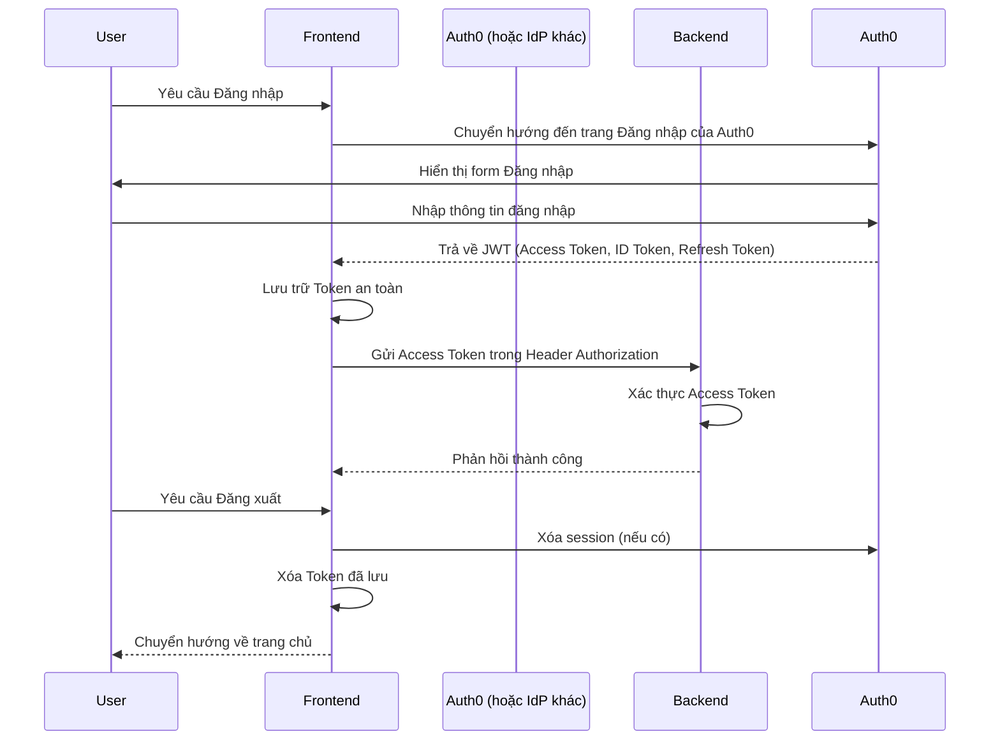

# Hướng dẫn Bảo mật và Kiểm soát Truy cập

## Mục lục

- [1. Giới thiệu](#1-giới-thiệu)
- [2. Xác thực (Authentication)](#2-xác-thực-authentication)
  - [2.1. Cơ chế JWT](#21-cơ-chế-jwt)
  - [2.2. Lưu trữ Token an toàn](#22-lưu-trữ-token-an-toàn)
  - [2.3. Tích hợp Auth0 (Provider-agnostic)](#23-tích-hợp-auth0-provider-agnostic)
  - [2.4. Luồng Đăng nhập/Đăng xuất](#24-luồng-đăng-nhậpđăng-xuất)
- [3. Phân quyền (Authorization)](#3-phân-quyền-authorization)
  - [3.1. Cơ chế RBAC](#31-cơ-chế-rbac)
  - [3.2. Bảo vệ Endpoint (Backend)](#32-bảo-vệ-endpoint-backend)
  - [3.3. Kiểm tra quyền (Frontend)](#33-kiểm-tra-quyền-frontend)
- [4. Các biện pháp bảo mật khác](#4-các-biện-pháp-bảo-mật-khác)
  - [4.1. HTTPS](#41-https)
  - [4.2. CORS (Cross-Origin Resource Sharing)](#42-cors-cross-origin-resource-sharing)
  - [4.3. Input Validation](#43-input-validation)
  - [4.4. Password Hashing](#44-password-hashing)
  - [4.5. Rate Limiting](#45-rate-limiting)
  - [4.6. Logging cho Audit](#46-logging-cho-audit)
  - [4.7. Monitoring Security Events](#47-monitoring-security-events)
- [5. Kiểm thử Bảo mật](#5-kiểm-thử-bảo-mật)

---

## 1. Giới thiệu

Bảo mật là yếu tố tối quan trọng trong mọi hệ thống. Dự án Cây Gia Phả áp dụng các nguyên tắc bảo mật như **Zero Trust** (không tin tưởng bất kỳ ai/thứ gì mặc định) và **Least Privilege** (cấp quyền tối thiểu cần thiết) để bảo vệ dữ liệu người dùng. Tài liệu này mô tả các cơ chế xác thực, phân quyền và các biện pháp bảo mật khác được triển khai.

## 2. Xác thực (Authentication)

### 2.1. Cơ chế JWT

Hệ thống sử dụng **JSON Web Tokens (JWT)** để xác thực người dùng. JWT là một chuỗi JSON được mã hóa, chứa thông tin về người dùng (claims) và được ký điện tử để đảm bảo tính toàn vẹn. Khi người dùng đăng nhập thành công, server sẽ trả về một JWT.

-   **Access Token**: Dùng để truy cập các tài nguyên được bảo vệ. Có thời gian sống ngắn.
-   **Refresh Token**: Dùng để lấy Access Token mới khi Access Token hết hạn. Có thời gian sống dài hơn và được lưu trữ an toàn hơn.

### 2.2. Lưu trữ Token an toàn

-   **Access Token**: Nên được lưu trữ trong bộ nhớ (in-memory) của Frontend để giảm thiểu rủi ro XSS (Cross-Site Scripting).
-   **Refresh Token**: Nên được lưu trữ trong `HttpOnly Cookie` để chống lại các cuộc tấn công XSS, đồng thời được đánh dấu `Secure` để chỉ gửi qua HTTPS.

### 2.3. Tích hợp Auth0 (Provider-agnostic)

Hệ thống được thiết kế với một lớp trừu tượng cho dịch vụ xác thực, cho phép dễ dàng thay đổi nhà cung cấp (Auth0, Keycloak, Firebase Auth) mà không ảnh hưởng đến logic nghiệp vụ cốt lõi.

-   **Backend**: Chỉ tương tác với các interface xác thực chung.
-   **Frontend**: Sử dụng SDK của nhà cung cấp (ví dụ: Auth0 SDK) để quản lý luồng đăng nhập/đăng ký và lấy token.

### 2.4. Luồng Đăng nhập/Đăng xuất



## 3. Phân quyền (Authorization)

### 3.1. Cơ chế RBAC

Hệ thống sử dụng **Role-Based Access Control (RBAC)** để quản lý quyền truy cập. Mỗi người dùng được gán một hoặc nhiều vai trò, và mỗi vai trò có một tập hợp các quyền hạn nhất định.

-   **Roles**: `Admin`, `FamilyAdmin`, `Member`.
-   **Claims trong JWT**: Vai trò của người dùng được mã hóa thành claims trong JWT. Backend sẽ đọc các claims này để kiểm tra quyền.

### 3.2. Bảo vệ Endpoint (Backend)

Sử dụng `[Authorize]` attribute trong ASP.NET Core để bảo vệ các controller hoặc action.

```csharp
[ApiController]
[Route("api/[controller]")]
public class FamiliesController : ControllerBase
{
    [HttpGet]
    [Authorize(Roles = "Admin,FamilyAdmin")] // Chỉ Admin và FamilyAdmin mới có quyền truy cập
    public async Task<IActionResult> GetFamilies()
    {
        // ...
    }

    [HttpPost]
    [Authorize(Policy = "CanCreateFamily")] // Sử dụng Policy-based Authorization
    public async Task<IActionResult> CreateFamily([FromBody] CreateFamilyCommand command)
    {
        // ...
    }
}
```

### 3.3. Kiểm tra quyền (Frontend)

Frontend có thể kiểm tra vai trò hoặc quyền của người dùng để điều chỉnh giao diện (ví dụ: ẩn/hiện nút, menu).

```typescript
// Ví dụ trong Vue component
import { useAuthStore } from '@/stores/auth.store';
import { computed } from 'vue';

export default {
  setup() {
    const authStore = useAuthStore();
    const isAdmin = computed(() => authStore.user?.roles.includes('Admin'));
    const canEditFamily = computed(() => authStore.user?.permissions.includes('family:edit'));

    return { isAdmin, canEditFamily };
  },
};
```

## 4. Các biện pháp bảo mật khác

### 4.1. HTTPS

-   **Vì sao cần**: Mã hóa tất cả lưu lượng mạng giữa client và server, ngăn chặn nghe lén và tấn công Man-in-the-Middle.
-   **Best Practices**: Luôn sử dụng HTTPS trong môi trường production. Redirect tất cả HTTP traffic sang HTTPS.

### 4.2. CORS (Cross-Origin Resource Sharing)

-   **Vì sao cần**: Ngăn chặn các website độc hại thực hiện các yêu cầu cross-origin trái phép đến API của chúng ta.
-   **Best Practices**: Cấu hình CORS chặt chẽ, chỉ cho phép các origin được tin cậy truy cập API.

### 4.3. Input Validation

-   **Vì sao cần**: Bảo vệ ứng dụng khỏi các cuộc tấn công như SQL Injection, XSS, và Buffer Overflow bằng cách đảm bảo dữ liệu đầu vào hợp lệ.
-   **Best Practices**: Validate dữ liệu ở cả Frontend và Backend. Sử dụng các thư viện validation mạnh mẽ (ví dụ: FluentValidation trong Backend).

### 4.4. Password Hashing

-   **Vì sao cần**: Bảo vệ mật khẩu người dùng ngay cả khi database bị lộ. Không bao giờ lưu trữ mật khẩu dưới dạng plaintext.
-   **Best Practices**: Sử dụng các thuật toán hashing mạnh mẽ và có salt (ví dụ: bcrypt, Argon2) thay vì MD5 hoặc SHA-1.

### 4.5. Rate Limiting

-   **Vì sao cần**: Ngăn chặn các cuộc tấn công brute-force, DDoS bằng cách giới hạn số lượng request mà một client có thể gửi trong một khoảng thời gian nhất định.
-   **Best Practices**: Áp dụng rate limiting cho các endpoint nhạy cảm như đăng nhập, đăng ký.

### 4.6. Logging cho Audit

-   **Vì sao cần**: Ghi lại các hoạt động quan trọng của người dùng và hệ thống để phục vụ mục đích kiểm toán, phát hiện và điều tra sự cố bảo mật.
-   **Best Practices**: Ghi log các sự kiện đăng nhập/đăng xuất, thay đổi quyền, truy cập dữ liệu nhạy cảm. Đảm bảo log được bảo vệ và không chứa thông tin nhạy cảm.

### 4.7. Monitoring Security Events

-   **Vì sao cần**: Phát hiện sớm các hành vi bất thường hoặc các cuộc tấn công đang diễn ra.
-   **Best Practices**: Tích hợp với các công cụ SIEM (Security Information and Event Management) hoặc các hệ thống cảnh báo để theo dõi log và metrics liên quan đến bảo mật.

## 5. Kiểm thử Bảo mật

-   **Unit Tests**: Kiểm tra các hàm xác thực, phân quyền riêng lẻ.
-   **Integration Tests**: Kiểm tra luồng xác thực/phân quyền qua các endpoint API.
-   **Penetration Testing (PenTest)**: Thực hiện định kỳ để phát hiện các lỗ hổng bảo mật.
-   **Sử dụng công cụ**: Sử dụng các công cụ quét lỗ hổng tự động (ví dụ: OWASP ZAP, SonarQube).