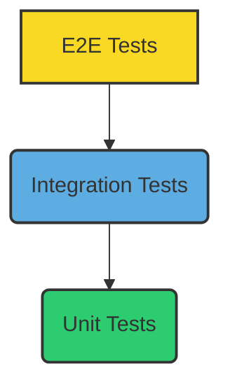

# Hướng dẫn Kiểm thử & QA

## Mục lục

- [1. Giới thiệu](#1-giới-thiệu)
- [2. Chiến lược Kiểm thử](#2-chiến-lược-kiểm-thử)
  - [2.1. Mô hình Kim tự tháp Kiểm thử](#21-mô-hình-kim-tự-tháp-kiểm-thử)
  - [2.2. Các loại Kiểm thử](#22-các-loại-kiểm-thử)
- [3. Cách chạy các loại Test](#3-cách-chạy-các-loại-test)
  - [3.1. Backend (.NET)](#31-backend-net)
  - [3.2. Frontend (Vue)](#32-frontend-vue)
  - [3.3. Code Coverage](#33-code-coverage)
- [4. Quy trình QA](#4-quy-trình-qa)
  - [4.1. Workflow CI/CD Test](#41-workflow-cicd-test)
  - [4.2. Thêm Test Case mới](#42-thêm-test-case-mới)
  - [4.3. Checklist QA cho Release](#43-checklist-qa-cho-release)
- [5. Báo cáo lỗi (Bug Reporting)](#5-báo-cáo-lỗi-bug-reporting)

---

## 1. Giới thiệu

Kiểm thử là một phần không thể thiếu trong quá trình phát triển phần mềm, đảm bảo chất lượng, độ tin cậy và hiệu suất của ứng dụng. Mục tiêu của chúng tôi là phát hiện lỗi sớm, giảm thiểu rủi ro và cải thiện khả năng bảo trì của hệ thống Cây Gia Phả.

## 2. Chiến lược Kiểm thử

### 2.1. Mô hình Kim tự tháp Kiểm thử

Chúng ta áp dụng mô hình **Kim tự tháp Kiểm thử (Test Pyramid)** để phân bổ nỗ lực kiểm thử một cách hiệu quả:



-   **Unit Tests**: Nhanh, rẻ, cô lập các đơn vị code nhỏ nhất.
-   **Integration Tests**: Kiểm tra sự tương tác giữa các thành phần.
-   **E2E Tests**: Kiểm tra luồng người dùng cuối trên toàn hệ thống.

### 2.2. Các loại Kiểm thử

-   **Unit Tests**: Kiểm tra các hàm, phương thức, class riêng lẻ.
-   **Integration Tests**: Kiểm tra sự kết hợp của nhiều unit, ví dụ: Controller với Service, Service với Repository.
-   **End-to-End (E2E) Tests**: Kiểm tra toàn bộ ứng dụng từ giao diện người dùng đến database.
-   **Mock Tests**: Sử dụng các đối tượng mock/stub để kiểm tra các thành phần phụ thuộc.
-   **Manual Tests**: Kiểm thử thủ công bởi QA team theo các kịch bản cụ thể.

## 3. Cách chạy các loại Test

### 3.1. Backend (.NET)

-   **Chạy tất cả các test**:

    ```bash
    dotnet test backend/backend.sln
    ```

-   **Chạy Unit Tests (theo project)**:

    ```bash
    dotnet test backend/tests/Application.UnitTests
    ```

-   **Chạy Integration Tests (theo project)**:

    ```bash
    dotnet test backend/tests/Infrastructure.IntegrationTests
    ```

-   **Chạy test theo Namespace**: Để chạy các test trong một namespace cụ thể (ví dụ: `FamilyTree.Application.UnitTests.Families`):

    ```bash
    dotnet test backend/backend.sln --filter "FullyQualifiedName~FamilyTree.Application.UnitTests.Families"
    ```

-   **Mock Database**: Trong Integration Tests, có thể sử dụng In-Memory Database (ví dụ: `Microsoft.EntityFrameworkCore.InMemory`) để cô lập database thật.

### 3.2. Frontend (Vue)

-   **Chạy Unit Tests**:

    ```bash
    npm run test:unit --prefix frontend
    ```

-   **Chạy test với Watch Mode**: Tự động chạy lại test khi có thay đổi code.

    ```bash
    npm run test --prefix frontend
    ```

-   **Chạy test với Debug Mode**: Cho phép debug test trong trình duyệt hoặc IDE.

    ```bash
    npm run test:debug --prefix frontend
    ```

### 3.3. Code Coverage

-   **Thu thập Coverage (Backend)**:

    ```bash
    dotnet test backend/backend.sln /p:CollectCoverage=true /p:CoverletOutputFormat=cobertura /p:CoverletOutput=./backend/artifacts/coverage/coverage.cobertura.xml
    ```

-   **Tạo báo cáo HTML (Backend)**:

    ```bash
    reportgenerator "-reports:./backend/artifacts/coverage/coverage.cobertura.xml" "-targetdir:./backend/coverage-report" -reporttypes:Html
    ```

-   **Thu thập Coverage (Frontend)**:

    ```bash
    npm run test:coverage --prefix frontend
    ```

## 4. Quy trình QA

### 4.1. Workflow CI/CD Test

1.  **Developer viết Test**: Mỗi tính năng/bugfix mới đều phải có unit/integration test tương ứng.
2.  **CI chạy Test**: Khi tạo Pull Request, GitHub Actions sẽ tự động chạy tất cả các test (unit, integration) và kiểm tra code coverage.
3.  **Merge PR**: Pull Request chỉ được merge khi tất cả các test đều pass và đạt ngưỡng coverage yêu cầu.
4.  **QA kiểm thử**: Trước mỗi release, QA team sẽ thực hiện kiểm thử thủ công (manual testing) theo các kịch bản đã định nghĩa.

### 4.2. Thêm Test Case mới

-   Các test case mới nên được ghi lại trong tài liệu [Kịch bản Kiểm thử](../project/test-cases.md) trước khi triển khai.
-   Tuân thủ cấu trúc và quy ước đặt tên test case đã định nghĩa.

### 4.3. Checklist QA cho Release

-   [ ] Tất cả các test tự động (unit, integration, E2E) đều pass.
-   [ ] Code coverage đạt ngưỡng yêu cầu (ví dụ: >= 80%).
-   [ ] Không có lỗi nghiêm trọng (critical bugs) nào được tìm thấy trong quá trình kiểm thử thủ công.
-   [ ] Tất cả các tính năng mới đã được kiểm thử đầy đủ.
-   [ ] Các vấn đề bảo mật đã được kiểm tra và khắc phục.
-   [ ] Hiệu năng hệ thống đáp ứng yêu cầu.

## 5. Báo cáo lỗi (Bug Reporting)

-   **Công cụ**: Sử dụng GitHub Issues để báo cáo lỗi.
-   **Định dạng**: Mỗi issue cần tuân thủ cấu trúc sau:

    -   **Tiêu đề**: Ngắn gọn, mô tả rõ lỗi (ví dụ: `[BUG] Lỗi đăng nhập khi mật khẩu có ký tự đặc biệt`).
    -   **Mức độ nghiêm trọng (Severity)**: `Critical`, `High`, `Medium`, `Low`.
    -   **Mức độ ưu tiên (Priority)**: `P0`, `P1`, `P2`, `P3`.
    -   **Các bước tái hiện (Steps to Reproduce)**:
        1.  Bước 1.
        2.  Bước 2.
        3.  ...
    -   **Kết quả mong đợi (Expected Result)**: Hành vi đúng của hệ thống.
    -   **Kết quả thực tế (Actual Result)**: Hành vi sai của hệ thống.
    -   **Ảnh chụp màn hình/Video**: (Nếu có) Đính kèm để minh họa rõ hơn.

**Ví dụ Issue:**

```markdown
**Tiêu đề:** [BUG] Lỗi không hiển thị cây gia phả khi có hơn 100 thành viên

**Severity:** High
**Priority:** P1

**Các bước tái hiện:**
1. Đăng nhập vào tài khoản có gia phả với 120 thành viên.
2. Truy cập trang "Cây Gia Phả".

**Kết quả mong đợi:** Cây gia phả hiển thị đầy đủ 120 thành viên, có thể cuộn và zoom.

**Kết quả thực tế:** Trang trắng hoặc chỉ hiển thị một phần nhỏ của cây gia phả, console log có lỗi "Maximum call stack size exceeded".

**Ảnh chụp màn hình/Video:** (Đính kèm ảnh/video tại đây)
```
