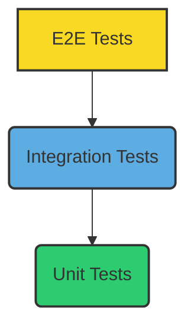

# Hướng dẫn Kiểm thử & QA

## Mục lục

- [1. Giới thiệu](#1-giới-thiệu)
- [2. Chiến lược Kiểm thử](#2-chiến-lược-kiểm-thử)
  - [2.1. Mô hình Kim tự tháp Kiểm thử](#21-mô-hình-kim-tự-tháp-kiểm-thử)
  - [2.2. Các loại Kiểm thử](#22-các-loại-kiểm-thử)
- [3. Cách chạy các loại Test](#3-cách-chạy-các-loại-test)
  - [3.1. Backend (.NET)](#31-backend-net)
  - [3.2. Frontend (Vue)](#32-frontend-vue)
  - [3.3. Code Coverage](#33-code-coverage)
- [4. Quy trình QA](#4-quy-trình-qa)
  - [4.1. Workflow CI/CD Test](#41-workflow-cicd-test)
  - [4.2. Thêm Test Case mới](#42-thêm-test-case-mới)
  - [4.3. Checklist QA cho Release](#43-checklist-qa-cho-release)
- [5. Báo cáo lỗi (Bug Reporting)](#5-báo-cáo-lỗi-bug-reporting)

---

## 1. Giới thiệu

Kiểm thử là một phần không thể thiếu và cực kỳ quan trọng trong quá trình phát triển phần mềm. Nó giúp đảm bảo chất lượng, độ tin cậy, hiệu suất và khả năng bảo trì của ứng dụng. Mục tiêu chính của việc kiểm thử trong dự án Cây Gia Phả là:

*   **Phát hiện lỗi sớm**: Tìm và sửa lỗi ngay từ các giai đoạn đầu của quá trình phát triển.
*   **Giảm thiểu rủi ro**: Đảm bảo các thay đổi mới không phá vỡ các chức năng hiện có (regression).
*   **Cải thiện khả năng bảo trì**: Code được kiểm thử tốt thường dễ hiểu và dễ thay đổi hơn.
*   **Tăng cường sự tự tin**: Mang lại sự tự tin cho đội ngũ phát triển và người dùng về tính ổn định của hệ thống.

Tài liệu này sẽ mô tả chiến lược kiểm thử, các loại kiểm thử được áp dụng, cách chạy chúng, và quy trình QA trong dự án.

## 2. Chiến lược Kiểm thử

### 2.1. Mô hình Kim tự tháp Kiểm thử

Chúng ta áp dụng mô hình **Kim tự tháp Kiểm thử (Test Pyramid)** để phân bổ nỗ lực kiểm thử một cách hiệu quả. Mô hình này khuyến nghị rằng nên có nhiều Unit Tests nhất, ít hơn Integration Tests, và số lượng E2E Tests là ít nhất.



*   **Unit Tests (Đáy kim tự tháp)**:
    *   **Mục đích**: Kiểm tra các đơn vị mã nguồn nhỏ nhất (hàm, phương thức, class) một cách cô lập.
    *   **Đặc điểm**: Nhanh, rẻ, dễ viết và dễ bảo trì. Phát hiện lỗi chính xác tại nguồn gốc.
    *   **Phạm vi**: Tập trung vào logic nghiệp vụ trong Domain và Application Layer.

*   **Integration Tests (Giữa kim tự tháp)**:
    *   **Mục đích**: Kiểm tra sự tương tác giữa các thành phần khác nhau của hệ thống (ví dụ: Controller với Service, Service với Repository, hoặc Backend với Database).
    *   **Đặc điểm**: Chậm hơn Unit Tests nhưng cung cấp độ tin cậy cao hơn về cách các thành phần hoạt động cùng nhau.
    *   **Phạm vi**: Tập trung vào Infrastructure Layer và các luồng dữ liệu giữa các lớp.

*   **End-to-End (E2E) Tests (Đỉnh kim tự tháp)**:
    *   **Mục đích**: Kiểm tra toàn bộ ứng dụng từ giao diện người dùng đến database, mô phỏng hành vi của người dùng cuối.
    *   **Đặc điểm**: Chậm nhất, tốn kém nhất để viết và bảo trì, nhưng cung cấp độ tin cậy cao nhất về trải nghiệm người dùng cuối.
    *   **Phạm vi**: Kiểm tra các luồng người dùng quan trọng và các kịch bản kinh doanh chính.

### 2.2. Các loại Kiểm thử

Ngoài ba loại kiểm thử chính trong Kim tự tháp, dự án còn sử dụng hoặc xem xét các loại kiểm thử khác:

*   **Unit Tests**: 
    *   **Mục đích**: Xác minh tính đúng đắn của các đơn vị code nhỏ nhất (hàm, phương thức, class) một cách độc lập.
    *   **Phạm vi**: Thường được viết cho Domain Layer và Application Layer.
    *   **Công cụ**: xUnit, Moq (cho Backend); Vitest, Vue Test Utils (cho Frontend).

*   **Integration Tests**: 
    *   **Mục đích**: Kiểm tra sự tương tác giữa các thành phần hoặc hệ thống con. Ví dụ: kiểm tra xem một Controller có gọi đúng Service không, hoặc Service có lưu dữ liệu vào Database thành công không.
    *   **Phạm vi**: Thường được viết cho Infrastructure Layer và các luồng qua API.
    *   **Công cụ**: xUnit, Testcontainers (cho Backend).

*   **End-to-End (E2E) Tests**: 
    *   **Mục đích**: Kiểm tra toàn bộ ứng dụng từ góc nhìn của người dùng cuối, mô phỏng các kịch bản sử dụng thực tế.
    *   **Phạm vi**: Bao gồm cả Frontend, Backend và Database.
    *   **Công cụ**: Playwright, Cypress (chưa triển khai).

*   **Mock Tests**: 
    *   **Mục đích**: Sử dụng các đối tượng mock (giả lập) hoặc stub để thay thế các phụ thuộc bên ngoài trong quá trình kiểm thử. Điều này giúp cô lập đơn vị code đang được test và kiểm soát hành vi của các phụ thuộc.
    *   **Công cụ**: Moq (cho C#), Vitest (cho JavaScript/TypeScript).

*   **Manual Tests**: 
    *   **Mục đích**: Kiểm thử thủ công bởi QA team hoặc các nhà phát triển để kiểm tra các khía cạnh không dễ tự động hóa (ví dụ: trải nghiệm người dùng, tính thẩm mỹ, các kịch bản phức tạp).
    *   **Thực hiện**: Dựa trên các kịch bản kiểm thử (test cases) đã được định nghĩa.

*   **Performance Tests (Kiểm thử hiệu năng)**: 
    *   **Mục đích**: Đánh giá hiệu suất, khả năng mở rộng và độ ổn định của ứng dụng dưới các tải khác nhau.
    *   **Công cụ**: JMeter, K6 (chưa triển khai).

## 3. Cách chạy các loại Test

### 3.1. Backend (.NET)

Các bài kiểm thử Backend được viết bằng xUnit và sử dụng Moq cho Unit Tests, Testcontainers cho Integration Tests.

*   **Chạy tất cả các test trong solution**:

    ```bash
    # Chạy từ thư mục gốc của project
    dotnet test backend/backend.sln
    ```

*   **Chạy Unit Tests (theo project)**:

    ```bash
    # Chạy từ thư mục gốc của project
    dotnet test backend/tests/Application.UnitTests
    ```

*   **Chạy Integration Tests (theo project)**:

    ```bash
    # Chạy từ thư mục gốc của project
    dotnet test backend/tests/Infrastructure.IntegrationTests --startup-project backend/src/Web
    ```

*   **Chạy test theo Namespace**: Để chạy các test trong một namespace cụ thể (ví dụ: `backend.Application.UnitTests.Families`):

    ```bash
    # Chạy từ thư mục gốc của project
    dotnet test backend/backend.sln --filter "FullyQualifiedName~backend.Application.UnitTests.Families"
    ```

*   **Mock Database trong Integration Tests**: Trong Integration Tests, chúng ta sử dụng In-Memory Database (ví dụ: `Microsoft.EntityFrameworkCore.InMemory`) hoặc Testcontainers (để tạo database thật trong Docker) để cô lập database thật, đảm bảo môi trường test sạch và độc lập.

### 3.2. Frontend (Vue)

Các bài kiểm thử Frontend được viết bằng Vitest và sử dụng Vue Test Utils để kiểm thử các component Vue.

*   **Chạy Unit Tests (bao gồm Component Tests và Store Tests)**:

    ```bash
    # Chạy từ thư mục gốc của project
    npm run test:unit --prefix frontend
    ```

*   **Chạy test với Watch Mode**: Tự động chạy lại test khi có thay đổi code, rất hữu ích trong quá trình phát triển.

    ```bash
    # Chạy từ thư mục gốc của project
    npm run test --prefix frontend
    ```

*   **Chạy test với Debug Mode**: Cho phép debug test trong trình duyệt hoặc IDE, giúp dễ dàng tìm và sửa lỗi trong test.

    ```bash
    # Chạy từ thư mục gốc của project
    npm run test:debug --prefix frontend
    ```

### 3.3. Code Coverage

Code Coverage là một chỉ số đo lường tỷ lệ phần trăm mã nguồn được thực thi bởi các bài kiểm thử. Coverage cao giúp tăng cường sự tự tin vào chất lượng mã nguồn, nhưng không phải là mục tiêu duy nhất. Chất lượng của các bài test quan trọng hơn số lượng.

#### 1. Thu thập Coverage (Backend - .NET)

*   **Công cụ**: `Coverlet` (tích hợp với `dotnet test`).
*   **Cách chạy**: 

    ```bash
    # Chạy test và thu thập coverage, xuất ra định dạng Cobertura XML
    dotnet test backend/backend.sln /p:CollectCoverage=true /p:CoverletOutputFormat=cobertura /p:CoverletOutput=./backend/artifacts/coverage/coverage.cobertura.xml
    ```

*   **Tạo báo cáo HTML**: Sử dụng `ReportGenerator` để chuyển đổi file XML thành báo cáo HTML dễ đọc.

    ```bash
    # Cài đặt ReportGenerator nếu chưa có
    # dotnet tool install -g dotnet-reportgenerator-globaltool
    
    # Chạy ReportGenerator (từ thư mục gốc của project)
    reportgenerator "-reports:./backend/artifacts/coverage/coverage.cobertura.xml" "-targetdir:./backend/coverage-report" -reporttypes:Html
    ```
    Báo cáo HTML sẽ được tạo trong thư mục `backend/coverage-report`.

#### 2. Thu thập Coverage (Frontend - Vue)

*   **Công cụ**: `Vitest` (tích hợp sẵn khả năng thu thập coverage).
*   **Cách chạy**: 

    ```bash
    # Chạy test và thu thập coverage
    npm run test:coverage --prefix frontend
    ```
    Báo cáo coverage thường được tạo ra trong thư mục `frontend/coverage`.

#### 3. Ngưỡng Coverage

*   **Best Practice**: Đặt mục tiêu coverage hợp lý (ví dụ: 80% cho logic nghiệp vụ quan trọng). Tuy nhiên, không nên coi coverage là mục tiêu duy nhất. Quan trọng hơn là các bài test phải có ý nghĩa và kiểm tra đúng các kịch bản quan trọng.

## 4. Quy trình QA

### 4.1. Workflow CI/CD Test

Quy trình kiểm thử được tích hợp chặt chẽ vào workflow CI/CD (Continuous Integration/Continuous Deployment) của dự án, sử dụng GitHub Actions để tự động hóa các bước kiểm thử.

1.  **Developer viết Test**: Mỗi khi phát triển một tính năng mới hoặc sửa lỗi, developer phải viết các Unit Tests và Integration Tests tương ứng để đảm bảo chất lượng code.
2.  **CI chạy Test**: Khi developer tạo một Pull Request (PR) hoặc push code lên branch `develop`, GitHub Actions sẽ tự động kích hoạt một workflow CI. Workflow này sẽ:
    *   Build code của cả Backend và Frontend.
    *   Chạy tất cả các Unit Tests và Integration Tests.
    *   Thu thập và kiểm tra Code Coverage.
    *   Chạy các công cụ Linting và Code Formatting.
3.  **Phản hồi nhanh**: Kết quả của các bài test và kiểm tra chất lượng code sẽ được báo cáo trực tiếp trên Pull Request. Điều này giúp developer và reviewer nhanh chóng nhận biết các vấn đề.
4.  **Merge PR**: Pull Request chỉ được phép merge vào branch `develop` khi tất cả các bài test đều pass, đạt ngưỡng coverage yêu cầu, và không có lỗi linting/format.
5.  **QA kiểm thử**: Trước mỗi release, QA team sẽ thực hiện kiểm thử thủ công (manual testing) theo các kịch bản đã định nghĩa để đảm bảo chất lượng tổng thể của ứng dụng.

### 4.2. Thêm Test Case mới

Khi phát triển tính năng mới hoặc sửa lỗi, việc thêm các test case mới là rất quan trọng. Quy trình thêm test case mới như sau:

1.  **Xác định kịch bản**: Đầu tiên, xác định rõ các kịch bản (scenarios) cần kiểm thử cho tính năng hoặc lỗi đang xử lý.
2.  **Ghi lại Test Case**: Các test case mới nên được ghi lại trong tài liệu [Kịch bản Kiểm thử](../project/test-cases.md) trước khi triển khai code. Điều này giúp đảm bảo rằng các test case được thiết kế tốt và bao quát đủ các trường hợp.
3.  **Triển khai Test**: Viết code test (Unit Test, Integration Test) tương ứng với các kịch bản đã ghi lại.
4.  **Tuân thủ quy ước**: Đảm bảo test case tuân thủ cấu trúc và quy ước đặt tên test case đã định nghĩa trong dự án.

### 4.3. Checklist QA cho Release

Trước mỗi bản phát hành (release), QA team và đội ngũ phát triển cần rà soát checklist sau để đảm bảo chất lượng sản phẩm:

*   [ ] **Tất cả các test tự động (unit, integration, E2E) đều pass**: Đảm bảo không có lỗi nào trong các bài kiểm thử tự động.
*   [ ] **Code coverage đạt ngưỡng yêu cầu (ví dụ: >= 80%)**: Xác nhận rằng phần lớn code đã được kiểm thử.
*   [ ] **Không có lỗi nghiêm trọng (critical bugs) nào được tìm thấy trong quá trình kiểm thử thủ công**: Các lỗi P0, P1 phải được khắc phục.
*   [ ] **Tất cả các tính năng mới đã được kiểm thử đầy đủ**: Đảm bảo các tính năng mới hoạt động đúng theo yêu cầu.
*   [ ] **Các vấn đề bảo mật đã được kiểm tra và khắc phục**: Đảm bảo không có lỗ hổng bảo mật đã biết.
*   [ ] **Hiệu năng hệ thống đáp ứng yêu cầu**: Kiểm tra thời gian phản hồi, khả năng chịu tải của ứng dụng.
*   [ ] **Tài liệu đã được cập nhật**: Đảm bảo tài liệu kỹ thuật và tài liệu người dùng phản ánh đúng trạng thái hiện tại của ứng dụng.
*   [ ] **Khả năng tương thích trình duyệt/thiết bị**: Kiểm tra ứng dụng trên các trình duyệt và thiết bị phổ biến.
*   [ ] **Kiểm tra khả năng phục hồi (Resilience)**: Đảm bảo ứng dụng có thể phục hồi sau các lỗi hoặc sự cố.

## 5. Báo cáo lỗi (Bug Reporting)

Việc báo cáo lỗi một cách rõ ràng và đầy đủ là rất quan trọng để giúp đội ngũ phát triển nhanh chóng hiểu, tái hiện và khắc phục lỗi. Dự án sử dụng GitHub Issues để quản lý các lỗi.

#### Định dạng báo cáo lỗi

Mỗi issue báo cáo lỗi cần tuân thủ cấu trúc sau:

*   **Tiêu đề**: Ngắn gọn, mô tả rõ lỗi. Nên bao gồm loại lỗi và tính năng bị ảnh hưởng (ví dụ: `[BUG] Lỗi đăng nhập khi mật khẩu có ký tự đặc biệt`).
*   **Mức độ nghiêm trọng (Severity)**: Đánh giá mức độ ảnh hưởng của lỗi đến hệ thống hoặc người dùng (`Critical`, `High`, `Medium`, `Low`).
*   **Mức độ ưu tiên (Priority)**: Đánh giá mức độ cần thiết phải khắc phục lỗi (`P0` - khẩn cấp, `P1` - cao, `P2` - trung bình, `P3` - thấp).
*   **Các bước tái hiện (Steps to Reproduce)**: Liệt kê các bước cụ thể, rõ ràng để tái hiện lỗi. Mỗi bước nên bắt đầu bằng một số.
*   **Kết quả mong đợi (Expected Result)**: Mô tả hành vi đúng của hệ thống nếu không có lỗi.
*   **Kết quả thực tế (Actual Result)**: Mô tả hành vi sai của hệ thống khi lỗi xảy ra.
*   **Ảnh chụp màn hình/Video**: (Nếu có) Đính kèm ảnh chụp màn hình hoặc video ngắn để minh họa rõ hơn về lỗi.
*   **Môi trường**: Thông tin về môi trường phát hiện lỗi (ví dụ: Trình duyệt, Hệ điều hành, Phiên bản ứng dụng).

#### Ví dụ Issue

```markdown
**Tiêu đề:** [BUG] Lỗi không hiển thị cây gia phả khi có hơn 100 thành viên

**Severity:** High
**Priority:** P1

**Các bước tái hiện:**
1. Đăng nhập vào tài khoản có gia phả với 120 thành viên.
2. Truy cập trang "Cây Gia Phả" (URL: http://localhost:5173/family-tree).
3. Quan sát màn hình.

**Kết quả mong đợi:** Cây gia phả hiển thị đầy đủ 120 thành viên, có thể cuộn và zoom mượt mà.

**Kết quả thực tế:** Trang trắng hoặc chỉ hiển thị một phần nhỏ của cây gia phả, console log có lỗi "Maximum call stack size exceeded".

**Ảnh chụp màn hình/Video:** (Đính kèm ảnh/video tại đây)

**Môi trường:**
- Trình duyệt: Chrome 120.0.6099.109 (Official Build) (arm64)
- Hệ điều hành: macOS Sonoma 14.1.2
- Phiên bản ứng dụng: v1.0.0-beta
```
