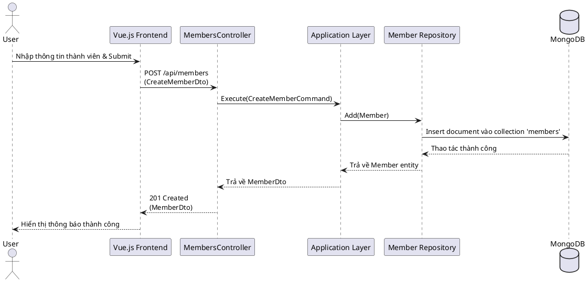

# Tài liệu Thiết kế Hệ thống (System Design)

Tài liệu này mô tả kiến trúc tổng thể, các thành phần chính, và luồng dữ liệu của hệ thống Quản lý Gia Phả.

## 1. Kiến trúc tổng quan

Hệ thống được xây dựng dựa trên kiến trúc **Clean Architecture** kết hợp với **Microservices-oriented approach** (mặc dù hiện tại đang là một Monolith có thể tách rời). Kiến trúc này giúp hệ thống dễ dàng bảo trì, mở rộng và kiểm thử.

-   **Frontend:** Là một ứng dụng Single Page Application (SPA) được xây dựng bằng Vue.js và Vuetify, chịu trách nhiệm cho toàn bộ giao diện người dùng.
-   **Backend:** Là một API service được xây dựng bằng ASP.NET Core, cung cấp dữ liệu và xử lý logic nghiệp vụ.
-   **Database:** Sử dụng MongoDB, một cơ sở dữ liệu NoSQL linh hoạt, phù hợp với việc lưu trữ dữ liệu gia phả có cấu trúc đa dạng.

### Sơ đồ Kiến trúc Tổng thể (Component Diagram)

```plantuml
@startuml
!include https://raw.githubusercontent.com/plantuml-stdlib/C4-PlantUML/master/C4_Component.puml

LAYOUT_WITH_LEGEND()

Container_Boundary(c1, "Hệ thống Quản lý Gia Phả") {
    Component(frontend, "Frontend (Vue.js)", "SPA", "Cung cấp giao diện người dùng")
    Component(backend, "Backend API (.NET)", "REST API", "Xử lý nghiệp vụ và cung cấp dữ liệu")
    ContainerDb(database, "Database (MongoDB)", "NoSQL", "Lưu trữ dữ liệu gia phả")
}

System_Ext(user, "Người dùng", "Người quản lý gia phả, thành viên")

Rel(user, frontend, "Sử dụng", "HTTPS")
Rel(frontend, backend, "Gọi API", "HTTPS/JSON")
Rel(backend, database, "Đọc/Ghi dữ liệu")

@enduml
```

## 2. Kiến trúc Backend (Clean Architecture)

Backend được chia thành 4 lớp (layers) chính:

-   **Domain:** Chứa các entities (thực thể), value objects, và domain events. Đây là lớp lõi, không phụ thuộc vào bất kỳ lớp nào khác.
-   **Application:** Chứa logic nghiệp vụ (use cases), các DTOs (Data Transfer Objects), và các interfaces cho repositories. Lớp này điều phối luồng dữ liệu giữa Domain và Infrastructure.
-   **Infrastructure:** Chịu trách nhiệm triển khai các thành phần bên ngoài như database (repositories), hệ thống file, dịch vụ email, v.v.
-   **Web (API):** Là điểm vào của hệ thống, chứa các controllers, middleware, và cấu hình. Lớp này nhận request từ client và trả về response.

### Sơ đồ Luồng dữ liệu (Sequence Diagram) - Ví dụ: Thêm thành viên



## 3. Thiết kế Cơ sở dữ liệu (Database Schema)

Sử dụng MongoDB với các collection chính sau:

### a. `families`
Lưu trữ thông tin về các dòng họ hoặc gia đình lớn.
```json
{
  "_id": "ObjectId",
  "name": "String", // Tên dòng họ
  "description": "String", // Lịch sử, mô tả
  "avatarUrl": "String",
  "createdAt": "DateTime",
  "updatedAt": "DateTime"
}
```

### b. `members`
Lưu trữ thông tin chi tiết của từng thành viên.
```json
{
  "_id": "ObjectId",
  "familyId": "ObjectId", // Tham chiếu đến collection 'families'
  "fullName": "String",
  "gender": "String (Male/Female/Other)",
  "avatarUrl": "String",
  "dateOfBirth": "DateTime",
  "dateOfDeath": "DateTime",
  "placeOfBirth": "String",
  "biography": "String", // Tiểu sử
  "generation": "Number", // Thế hệ thứ mấy
  "contact": {
    "email": "String",
    "phone": "String"
  },
  "metadata": "Object" // Các thông tin khác
}
```

### c. `relationships`
Lưu trữ các mối quan hệ giữa các thành viên.
```json
{
  "_id": "ObjectId",
  "familyId": "ObjectId",
  "sourceMemberId": "ObjectId", // Thành viên gốc
  "targetMemberId": "ObjectId", // Thành viên đích
  "type": "String (SPOUSE, PARENT, CHILD)", // Loại quan hệ
  "startDate": "DateTime",
  "endDate": "DateTime"
}
```