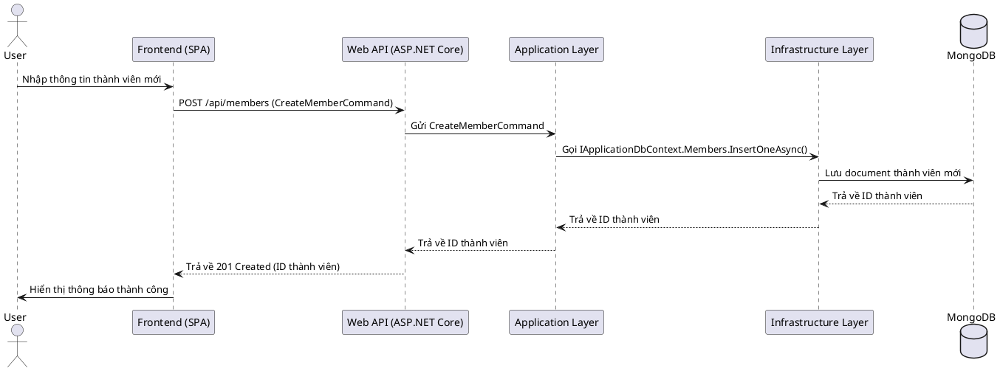

# Thiết Kế Hệ Thống

## 1. Kiến trúc tổng quan
Hệ thống Cây Gia Phả được thiết kế theo kiến trúc Clean Architecture, phân tách rõ ràng các lớp trách nhiệm:
- **Domain Layer**: Chứa các thực thể (Entities), giá trị đối tượng (Value Objects), và các quy tắc nghiệp vụ cốt lõi.
- **Application Layer**: Chứa các trường hợp sử dụng (Use Cases), lệnh (Commands), truy vấn (Queries), và các giao diện (Interfaces) cho các dịch vụ bên ngoài.
- **Infrastructure Layer**: Chứa các triển khai cụ thể của các giao diện được định nghĩa trong Application Layer, bao gồm truy cập cơ sở dữ liệu (MongoDB), dịch vụ Identity, và các dịch vụ bên ngoài khác.
- **Web Layer (API)**: Điểm vào của ứng dụng, xử lý các yêu cầu HTTP, ánh xạ chúng tới các lệnh/truy vấn trong Application Layer, và trả về phản hồi.

## 2. Sơ đồ kiến trúc (PlantUML)
```plantuml
@startuml
!include https://raw.githubusercontent.com/plantuml-stdlib/C4-PlantUML/master/C4_Container.puml

Person(user, "End User", "Người dùng cuối")
System_Boundary(c1, "Hệ thống Cây Gia Phả") {
    Container(spa, "Single-Page App", "Vue.js + Vuetify", "Giao diện người dùng")
    Container(api, "Web API", "ASP.NET Core", "Xử lý logic nghiệp vụ")
    ContainerDb(db, "Database", "MongoDB", "Lưu trữ dữ liệu gia phả")
}

Rel(user, spa, "Sử dụng", "HTTPS")
Rel(spa, api, "Gọi API", "HTTPS/JSON")
Rel(api, db, "Đọc/Ghi dữ liệu", "TCP")

@enduml
```

## 3. Sơ đồ Database (MongoDB Schema)
Dữ liệu được lưu trữ trong MongoDB, một cơ sở dữ liệu NoSQL linh hoạt. Dưới đây là thiết kế schema cơ bản cho các collection chính:

### `families` Collection
Lưu trữ thông tin về các dòng họ hoặc gia đình.
```json
{
  "_id": "ObjectId",        // ID duy nhất của dòng họ/gia đình
  "name": "string",         // Tên dòng họ/gia đình (ví dụ: "Nguyễn Gia Tộc")
  "address": "string",      // Địa chỉ hoặc quê quán
  "logoUrl": "string",      // URL đến logo hoặc hình đại diện của dòng họ
  "description": "string",  // Mô tả lịch sử hoặc thông tin khác
  "createdAt": "Date",      // Thời gian tạo bản ghi
  "updatedAt": "Date"       // Thời gian cập nhật gần nhất
}
```
**Indexes:**
- `name`: text index for search
- `address`: text index for search

### `members` Collection
Lưu trữ thông tin chi tiết của từng thành viên.
```json
{
  "_id": "ObjectId",        // ID duy nhất của thành viên
  "familyId": "ObjectId",   // ID của dòng họ/gia đình mà thành viên thuộc về
  "fullName": "string",     // Họ và tên đầy đủ
  "givenName": "string",    // Tên gọi (nếu có)
  ""dob": "Date",           // Ngày sinh
  "dod": "Date",            // Ngày mất (nếu đã mất)
  "status": "string",       // Trạng thái (ví dụ: "alive", "deceased")
  "avatarUrl": "string",    // URL đến ảnh đại diện
  "contact": {              // Thông tin liên lạc
    "email": "string",
    "phone": "string"
  },
  "generation": "number",   // Thế hệ thứ mấy trong dòng họ
  "orderInFamily": "number",// Thứ tự con trong gia đình (ví dụ: con thứ 1, thứ 2)
  "description": "string",  // Mô tả về cuộc đời, sự nghiệp (có thể là rich-text)
  "metadata": "object",     // Các trường dữ liệu mở rộng khác
  "createdAt": "Date",      // Thời gian tạo bản ghi
  "updatedAt": "Date"       // Thời gian cập nhật gần nhất
}
```
**Indexes:**
- `fullName`: text index for search
- `familyId`: ascending index for filtering members by family
- `generation`: ascending index for filtering members by generation
- `contact.email`: ascending index for searching by email

### `relationships` Collection
Lưu trữ các mối quan hệ giữa các thành viên.
```json
{
  "_id": "ObjectId",        // ID duy nhất của mối quan hệ
  "familyId": "ObjectId",   // ID của dòng họ/gia đình mà mối quan hệ thuộc về
  "memberId": "ObjectId",   // ID của thành viên gốc
  "relationType": "string", // Loại quan hệ (ví dụ: "parent", "spouse", "child")
  "targetMemberId": "ObjectId", // ID của thành viên có quan hệ với memberId
  "startDate": "Date",      // Ngày bắt đầu mối quan hệ (ví dụ: ngày kết hôn)
  "endDate": "Date",        // Ngày kết thúc mối quan hệ (ví dụ: ngày ly hôn, ngày mất của vợ/chồng)
  "metadata": "object",     // Các trường dữ liệu mở rộng khác
  "createdAt": "Date",      // Thời gian tạo bản ghi
  "updatedAt": "Date"       // Thời gian cập nhật gần nhất
}
```
**Indexes:**
- `familyId`: ascending index for filtering relationships by family
- `memberId`: ascending index for filtering relationships by member
- `targetMemberId`: ascending index for filtering relationships by target member
- `relationType`: ascending index for filtering relationships by type

## 4. Sơ đồ Sequence (Ví dụ: Tạo thành viên mới)


## 5. Sơ đồ Component
```plantuml
@startuml
!include https://raw.githubusercontent.com/plantuml-stdlib/C4-PlantUML/master/C4_Component.puml

Container(spa, "Single-Page App", "Vue.js + Vuetify", "Giao diện người dùng")
Container(api, "Web API", "ASP.NET Core", "Xử lý logic nghiệp vụ")
ContainerDb(db, "Database", "MongoDB", "Lưu trữ dữ liệu gia phả")

Component_Boundary(api, "Web API") {
  Component(controllers, "Controllers", "ASP.NET Core MVC", "Xử lý HTTP requests")
  Component(mediatr, "MediatR", "Thư viện MediatR", "Xử lý Commands và Queries")
}

Component_Boundary(application, "Application Layer") {
  Component(commands, "Commands", "C# Classes", "Định nghĩa các hành động ghi dữ liệu")
  Component(queries, "Queries", "C# Classes", "Định nghĩa các hành động đọc dữ liệu")
  Component(handlers, "Handlers", "C# Classes", "Xử lý Commands và Queries")
  Component(interfaces, "Interfaces", "C# Interfaces", "Định nghĩa hợp đồng cho Infrastructure")
}

Component_Boundary(infrastructure, "Infrastructure Layer") {
  Component(mongodb_repo, "MongoDB Repository", "C# Classes", "Triển khai truy cập MongoDB")
  Component(identity_service, "Identity Service", "C# Classes", "Triển khai quản lý người dùng và phân quyền")
}

spa --> controllers: Gọi REST API
controllers --> mediatr: Gửi Commands/Queries
mediatr --> handlers: Điều phối
handlers --> interfaces: Gọi qua Interfaces
interfaces <.left. mongodb_repo: Triển khai
interfaces <.left. identity_service: Triển khai
mongodb_repo --> db: Truy cập dữ liệu
identity_service --> db: Truy cập dữ liệu Identity

@enduml
```
```plantuml
@startuml
!include https://raw.githubusercontent.com/plantuml-stdlib/C4-PlantUML/master/C4_Deployment.puml

Deployment_Node("Docker Host", "Production Server") {
  Container(nginx, "Nginx", "Web Server", "Reverse Proxy, Static Files")
  Container(frontend_app, "Frontend App", "Vue.js Application", "Single-Page Application")
  Container(backend_api, "Backend API", "ASP.NET Core API", "Business Logic, Data Access")
  Container(mongodb, "MongoDB", "Database", "Persistent Data Storage")

  nginx --> frontend_app: Serves static files
  nginx --> backend_api: Proxies API requests
  frontend_app --> backend_api: Calls API (via Nginx proxy)
  backend_api --> mongodb: Reads/Writes data
}

@enduml
```
```plantuml
@startuml
!include https://raw.githubusercontent.com/plantuml-stdlib/C4-PlantUML/master/C4_Context.puml

Person(user, "Người dùng cuối", "Người dùng tương tác với hệ thống để quản lý gia phả.")

System_Boundary(family_tree_system, "Hệ thống Cây Gia Phả") {
  Container(frontend, "Ứng dụng Web Frontend", "Vue.js, Vuetify", "Cung cấp giao diện người dùng để quản lý và xem cây gia phả.")
  Container(backend, "API Backend", "ASP.NET Core", "Xử lý logic nghiệp vụ, quản lý dữ liệu và xác thực người dùng.")
  Container(database, "Cơ sở dữ liệu", "MongoDB", "Lưu trữ tất cả dữ liệu về dòng họ, thành viên và mối quan hệ.")
}

Rel(user, frontend, "Sử dụng")
Rel(frontend, backend, "Gọi API", "JSON/HTTPS")
Rel(backend, database, "Đọc/Ghi dữ liệu", "MongoDB Driver")

@enduml
```